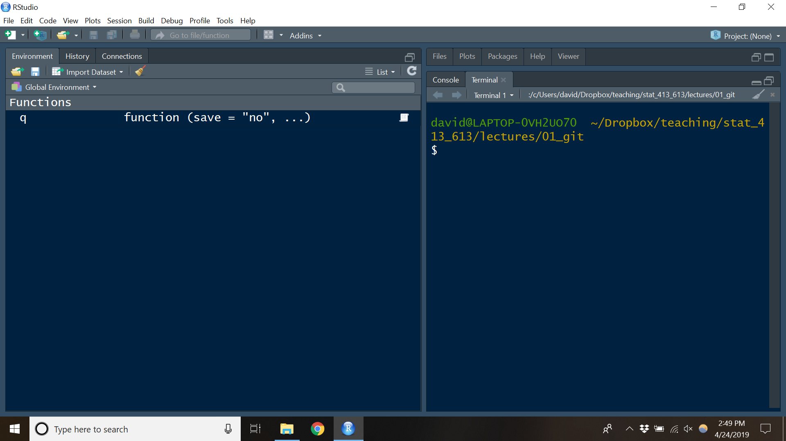

```{r setup, include=FALSE}
knitr::opts_chunk$set(echo = TRUE)
```

# Learning Objectives

- Open up the terminal in R Studio.
- Basic shell commands.
- Chapter 4 of [Git for Scientists](https://milesmcbain.github.io/git_4_sci/).

# The Command Line

- The **command line** is like the R command prompt: you insert code, hit enter,
  and then the computer executes your command.
  
- However, instead of inserting R code, you insert [Shell Script](https://en.wikipedia.org/wiki/Shell_script).
  
- In this class, we will use the command line primarily for two things:
    - Moving around your file system.
    - Running git commands.
  
- Other words for command line: shell, terminal, command line interface (cli), and console.
    - These terms are technically slightly 
      [different](https://askubuntu.com/questions/506510/what-is-the-difference-between-terminal-console-shell-and-command-line).
    
- There are many types of shells, each with their own scripting language. We will use the 
  [bash scripting language ](https://en.wikipedia.org/wiki/Bash_(Unix_shell)) 
  for this class.
  
- A huge difference between R and bash is how commands/functions are called.
    - R: `f(x, y = 1)`
    - Bash: `f x --y=1`
    - Arguments that are "flags" use only one dash, like `f x -g` would
      incorporate the `g` flag.

- If you are using Linux or Mac, then you can keep going. If you are using Windows, 
  you need to first download and install git (and thus git bash) from here:
  <http://git-scm.com/download/win>. You might need to restart R Studio if you
  are already running it.
  
- The easiest way to open a terminal is within R Studio with "Tools > Terminal > New Terminal"

    \ 
    
- The terminal window should look like this:

    \
    
- All commands get placed after the dollar sign.

- The path before the dollar sign is the working directory of the terminal, 
  **not** R's working directory. It's where the shell will reference all files 
  from.
  
- The tilde "`~`" is shorthand for the "home directory". Each computer has
  a home directory that is the "default directory".
  
# Useful Commands:
  
- `pwd`: Print working directory. Show the current working directory. This is like `getwd()` in R.

    ```{bash}
    pwd
    ```
    
- `ls`: List the current files and folders in a directory.

    ```{bash}
    ls
    ```

- `cd`: Change directories. This is like `setwd()` in R. As when we specified 
  paths in R, using two periods mean "move back a folder". 
  
    ```{bash}
    cd ../
    pwd
    ```
    
    - If you use `cd` without specifying a folder to move to, it will move the 
      working directory to the home directory.
  
    ```{bash}
    cd
    pwd
    ```

    - OK, I'm going to move us back to the 01_git directory.  

    ```{bash, eval=FALSE}
    cd ./Dropbox/teaching/stat_413_613/lectures/01_git
    ```
    
- `man`: Read the manual of a command. Just like `help()` in R.

    ```{bash, eval=FALSE}
    man ls
    ```

    - This will open up the man page of `ls`. You can scroll through this page
      using the up and down arrows. You can exit this page by typing `q`.
      
- **Exercise**: What is your home directory? What files/folders exist in your 
  home directory? Navigate to it and then navigate back to your notes.
  
- **Exercise**: Where does the following command take you? How does it work?

    ```{bash, eval=FALSE}
    cd ~/../../..
    ```

- **Exercise**: Read the manual page of `ls`. What does the `a` flag do? 
  Try it out! 
  
# Other commands.

- `cp`: Copy a file.

    ```{bash}
    cp 01_basic_bash.Rmd hellobash.Rmd
    ls
    ```

- `mv`: Move/rename a file.

    ```{bash}
    mv hellobash.Rmd goodbyebash.Rmd
    ls
    ```

- `rm`: Remove a file.

    ```{bash}
    rm goodbyebash.Rmd
    ls
    ```

- `mkdir`: Make a directory/folder.

    ```{bash}
    mkdir tempdir
    ls
    ```

- `rmdir`: Remove a directory/folder.

    ```{bash}
    rmdir tempdir
    ls
    ```

- Play [Terminus](http://web.mit.edu/mprat/Public/web/Terminus/Web/main.html) 
  for more practice.


  
  

