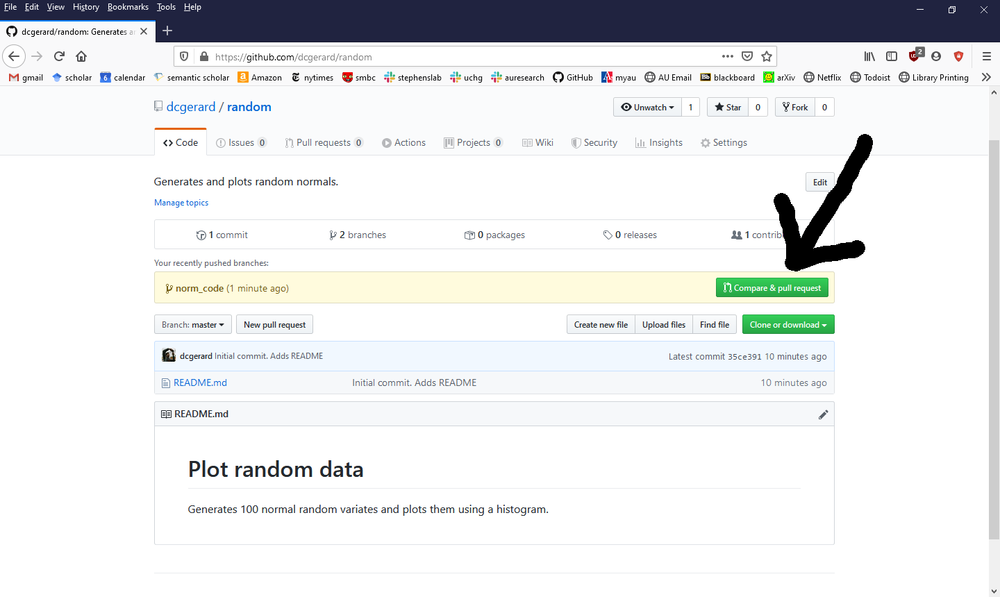
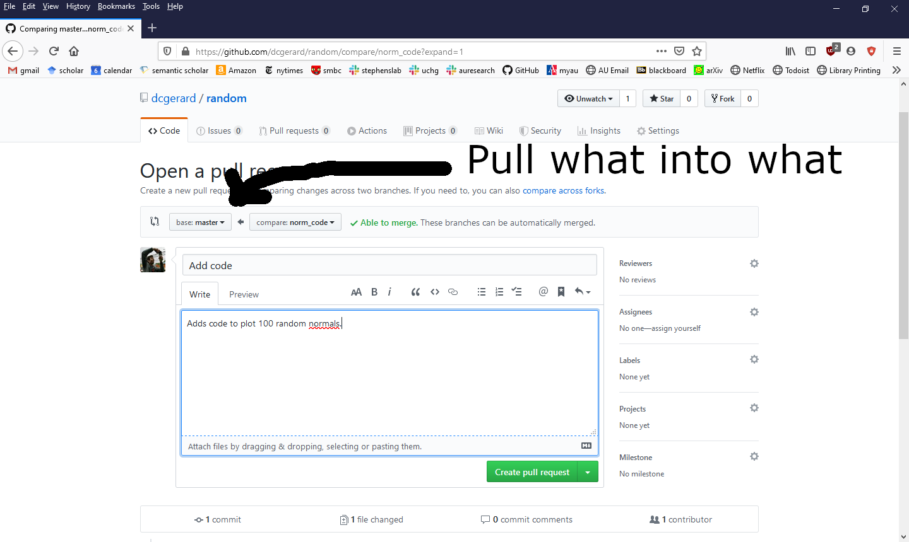

```{r setup, include=FALSE}
knitr::opts_chunk$set(echo       = TRUE, 
                      fig.height = 3, 
                      fig.width  = 6,
                      fig.align  = "center")
ggplot2::theme_set(ggplot2::theme_bw())
```

# Learning Objectives

- Learn the branch-commit-merge workflow for collaborative repos.
- [Understanding the GitHub flow](https://guides.github.com/introduction/flow/)
- [About branches](https://help.github.com/en/github/collaborating-with-issues-and-pull-requests/about-branches)
- [Resolving a merge conflict](https://help.github.com/en/github/collaborating-with-issues-and-pull-requests/resolving-a-merge-conflict-using-the-command-line)

# Motivation and Background

- We previously learned how to fork a repo. This allows you to collaborate
  on a repo that you don't own.

- You might also share a repo with someone. In this case, we use *branches*
  rather than forks.
  
- A branch is a copy of your repo where you experiment with new ideas
  (e.g. new data analyses, new data transformations, new statistical methods).
  
- The "master" branch (the default in GitHub) is your best draft. You should
  consider anything in "master" as the best thing you've got.
  
- The workflow using branches consists of
    1. Create a branch with an informative title describing its goal(s).
    2. Add commits to this new branch.
    3. Merge the commits to master
    
- Create a new folder with a "README.md" file. This README should contain the
  following information:
  
    ```
    # Plot random data
    
    Generates 100 normal random variates and plots them using a histogram.
    ```
    
- You can create this README in the terminal with

    ```{bash, eval = FALSE}
    touch README.md
    ```
    
    and then edit it with your favorite text editor (mine is Emacs).

- Initialize a git repository in this folder and commit the README file
  as your first commit.
  
    ```{bash, eval = FALSE}
    git init
    git add --all
    git commit -m "Initial commit. Adds README"
    ```
  
- Open up GitHub and add a new repo called "random". Add the GitHub
  repo to the remotes and push your changes. My code was this (but yours
  will be different)
  
    ```{bash, eval = FALSE}
    git remote add origin git@github.com:dcgerard/random.git
    git push -u origin master
    ```
  
# Create a branch

- You create a branch with

    ```{bash, eval = FALSE}
    git branch <branch>
    ```
    
- We will create a branch called "norm_code", where we will add code to generate
  random normal variables.

    ```{bash, eval = FALSE}
    git branch norm_code
    ```

- You can see the list of branches (and the current branch) with
    ```{bash, eval = FALSE}
    git branch
    ```

# Move between branches

- You switch between branches with:

    ```{bash, eval = FALSE}
    git checkout <branch>
    ```
    
- Move to the norm_code branch with

    ```{bash, eval = FALSE}
    git checkout norm_code
    ```


# Edit Branch

- When you are on a branch, you can edit and commit as usual. Do this
  now by adding R code (in a new R file called "script.R") 
  to generate 100 random normal variables and plot
  them in a histogram.
  
    ```{r, echo = FALSE}
    set.seed(1)
    ```
      
    ```{r, message=FALSE}
    library(tidyverse)
    df <- tibble(x = rnorm(100))
    ggplot(df, aes(x = x)) +
      geom_histogram(bins = 20)
    ```
  
- Commit these changes.

- After you have committed these changes, push them to github with

    ```{bash, eval = FALSE}
    git push origin norm_code
    ```
    
- The above says to push our changes from norm_code (the branch on our computer)
  to origin (on GitHub).

# Merge into master

- You can merge branches by the command line, but I would recommend
  doing this on GitHub. Click on the button "Compare & pull request".
  
    \

- Write an informative message. Then click "Create pull request".

- The following screen is a message board for discussing the pull request.
  After everyone is satisfied, you can click "Merge pull request".
    
    \
    
- You can instead pull changes from master to the branch (for example, if
  someone else made some updates to master) by editing the direction
  of the pull request:
  
    \
    
- You can pull the changes to master onto your local machine by going back
  to master and pulling:

    ```{bash, eval = FALSE}
    git checkout master
    git pull
    ```


# Resolving Merge Conflicts

- If two branches with incompatible histories try to merge, 
  then git does not merge them.

- Instead, it creates a "merge conflict", which you need to resolve.

- Instructions on resolving merge conflicts can be found here:
  <https://help.github.com/en/github/collaborating-with-issues-and-pull-requests/resolving-a-merge-conflict-using-the-command-line>
