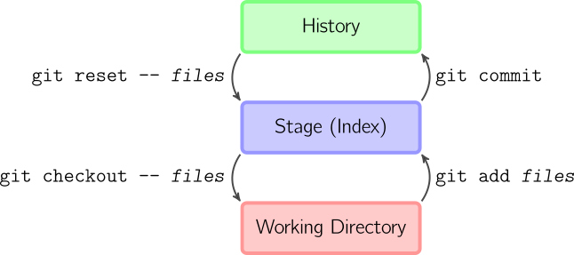
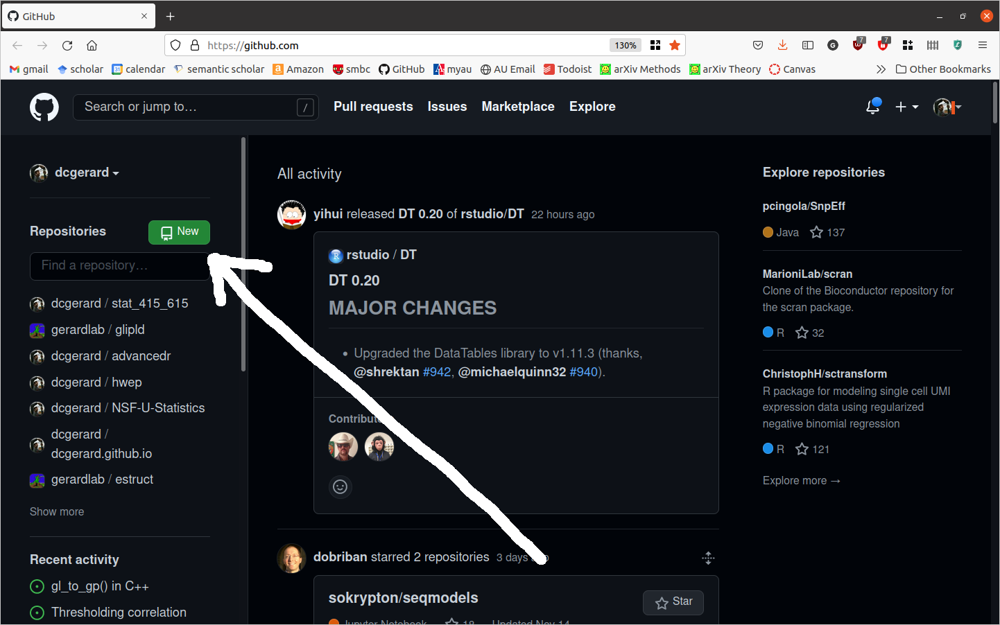
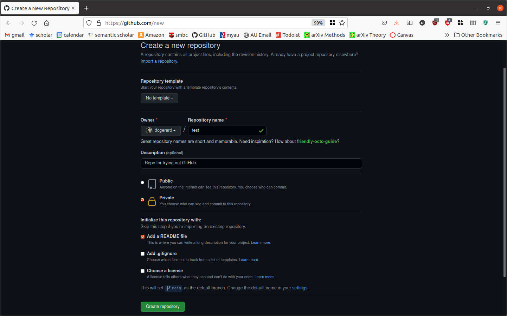
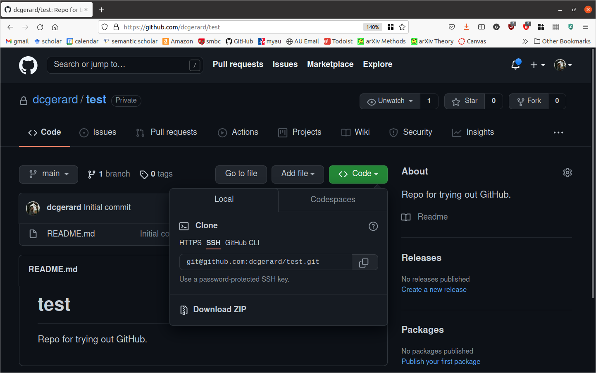

```{r setup, include=FALSE}
knitr::opts_chunk$set(echo       = TRUE, 
                      fig.align  = "center",
                      fig.height = 3, fig.width = 4)
ggplot2::theme_set(ggplot2::theme_bw() + ggplot2::theme(strip.background = ggplot2::element_rect(fill = "white")))
```

```{r klippy, echo=FALSE, include=TRUE}
klippy::klippy()
```

# Learning Objectives

- Version Control with git.
- Collaboration and software-hosting with GitHub.
- [Git Cheat Sheet](https://education.github.com/git-cheat-sheet-education.pdf)
- [Git Handbook](https://guides.github.com/introduction/git-handbook/)
- [Git Novice](https://swcarpentry.github.io/git-novice/)

# Initial Setup

- Make sure you have (i) git installed and (ii) you can connect to GitHub.

- To verify that you have git installed, open up the terminal and type
    ```{bash, eval = FALSE}
    git --version
    ```
    if git is installed, you will see something like
    
    ```
    git version 2.25.1
    ```

- To see if you can connect to GitHub:
    1. Enter the following in the terminal:
    
        ```{bash, eval = FALSE}
        ssh -T git@github.com
        ```
    
    2. Type "yes" if prompted to continue connecting.
    
    3. You are successful if you see something like
    
        ```
        Hi dcgerard! You've successfully authenticated, but GitHub does not provide shell access.
        ```
        
- If you have issues with either of these step, go to [Setting up Git and GitHub](./01_git_setup.html)

# Version Control: 

- **Version control system**: a program that tracks iterative changes of files. 
  Git is the most popular version control system.

- You can go back to previous versions of your code/text, then move forward to 
  the most recent version, or keep the old version.

- You can create copies of the code, change them, then merge these copies 
  together later.

## Motivation 1: Change code without the fear of breaking it
- You want to try out something new, but you aren't sure if it will work.

- Non-git solution: Copy the files
    - analysis.R, 
    - analysis2.R, 
    - analaysis3.R, 
    - analysis_final.R, 
    - analysis_final_final.R, 
    - analysis_absolute_final.R, 
    - analysis7.R
    - analysis8.R

- Issues: 
    - Difficult to remember differences of files.
    - Which files produced specific results?
    
- Git lets you change files, keeping track of old versions, and reverting 
  to old versions if you decide the new changes don't work.

## Motivation 2: Easy Collaboration

- In a group setting, your collaborators might suggest how to change your 
  analysis/code.
  
- First non-git solution: Email files back/forth. 

- Issues: 
    - You have to manually incorporate changes.
    - Only one person can work on the code at a time (otherwise multiple 
      changes might be incompatible).
      
- Second non-git solution: Share a Dropbox or Google Docs folder (a 
  "centralized" version control system).

- Issues:
    - Again, only one person can work on the code at a time.
    - Less user-friendly for tracking changes.

- Git let's each individual work on their own local repository and you can
  automatically incorporate changes. 

## Motivation 3: Great for job interviews

- In a [2021 Stack Overflow Survey](https://insights.stackoverflow.com/survey/2021#other-tools), 93.43% of developers say they use git.
  
- You can make your final-project repo public so prospective employers can
  view your work.
  
- You can host a website on GitHub, increasing your visibility. I host my 
  [personal website](http://dcgerard.github.io/) and 
  [teaching websites](https://dcgerard.github.io/advancedr/) 
  on GitHub.
  
# Basic Git

- A **repository** (or repo, for short) is a collection of files (in a folder and its subfolders) that are together under version control. In data analysis, each repository is typically one project (like a data analysis, a homework, or a collection of code that performs a similar task).

- The way git works (graphic from Mark Lodato):

    \ 

- **Working Directory**: To git, this means the current versions of the files. Changes to files that you haven't recorded only exist in the working directory and are not yet saved in the history.
- **Stage**: Files that are scheduled to be committed to the history, but not yet committed. Only files in the stage will be committed to the history.
- **History**: The timeline of snapshots of files. You commit a file to the history and then, even if you modify it later, you can always go back to that same file version.

- We'll focus on the right-hand-side of this diagram where your workflow is typically:
    1. Modify files in your working directory until you want a snapshot.
    2. Add these modified files to the staging area.
    3. Commit staged files to history, where they will be kept forever.

- The left-hand side of the diagram is used when you want to undo mistakes.  

- All git commands begin with `git` followed immediately by an argument for
  the type of command you want to execute.

- For the right-hand-side of the diagram, the following are the useful 
  git commands:
    - `git init`: Initialize a git repository. *Only do this once per project*.
    - `git status`: Show which files are staged in your working directory, and which
      are modified but not staged.
    - `git add`: Add modified files from your working directory to the stage.
    - `git diff`: Look at how files in the working directory have been
      modified.
    - `git diff --staged`: Look at how files in the stage have been modified.
    - `git commit -m "[descriptive message]"`: commit your staged content as a new 
      commit snapshot.
  
## Initialize a repository

- Git needs to be told that a folder is a repo. Otherwise, it won't keep files under version control.

- In this class, you won't need to tell git this (I'll tell git this), but in the real world you will. So we'll go over how to do this on GitHub and on the terminal.

### On the terminal

- Don't initialize on your local for this lecture. These are just the steps you would do if you needed to initialize on your local.

- Use `cd` to enter the folder that you would like to keep under version control.

- The use `git init`

    ```{bash, eval = FALSE}
    git init
    ```

- This will tell git that the folder is a single repo. 

- Your files are not yet tracked. You'll need to do the steps below to tell git which files to track. But at least git now knows that this is a repo where tracking is possible.

### On GitHub

- Git is a version control system, GitHub is a website that hosts git repositories. (so on your resume, say that you know git, not GitHub).

- You can create a git repo on GitHub (GitHub's server is called the "remote"), then download ("clone") the repo onto your computer (your computer is called the "local").

- On your GitHub homepage, click on "New"

    
    
- Fill out the form. The options are pretty self-explanatory, and GitHub does a good job of providing descriptions. For this lecture, make sure
    - Repository name is "test".
    - The repo is set to be "Private"
    - You check "Add a README File"
    
    
    
- Click on "Create Repository.

## Cloning

- "Cloning" is a fancy way to say download from GitHub.

- But it also means that your local copy is connected to the remote copy automatically.

- Enter the repo you want to clone, then click on the  Button

- Make sure that "SSH" is highlighted.

- Then click on the  button to copy the link.

    

- In the terminal, navigate to where you want to download the repo, then clone it with `git clone`

    ```{bash, eval = FALSE}
    git clone git@github.com:dcgerard/test.git
    ```
    
    Make sure to change the link to what you copied (don't use my link above).
    
- Then move into your new repo

    ```{bash, eval = FALSE}
    ls
    cd test
    ```

## Status

- Use `git_status` to see what files git is tracking and which
  are untracked.
  
    ```{bash, eval=FALSE}
    git status
    ```
    
- Git should tell you that everything is up-to-date

    ```
    On branch main
    Your branch is up to date with 'origin/main'.
    
    nothing to commit, working tree clean
    ```
    
- Edit the README.md file to include your name, so that it looks something like this:

    ```
    # test
    David Gerard
    
    Repo for trying out GitHub.
    ```
    Make sure to save your changes.
    
- Now check the status again.
    ```{bash, eval = FALSE}
    git status
    ```
    
- Git should be telling you that README.md has been modified, and the changes are not yet committed.

    ```
    On branch main
    Your branch is up to date with 'origin/main'.
    
    Changes not staged for commit:
      (use "git add <file>..." to update what will be committed)
      (use "git restore <file>..." to discard changes in working directory)
    	modified:   README.md
    
    no changes added to commit (use "git add" and/or "git commit -a")
    ```
    
- Add a new file, called "empty.txt" by

    ```{bash, eval = FALSE}
    touch empty.txt
    ```

- **Exercise**: Check the status again. What do you notice?

    ```{block, eval = FALSE, echo = FALSE}
    "empty.txt" is an unstaged file.
    ```

## Staging

- Use `git add` to add files to the stage.

    ```{bash, eval=FALSE}
    git add README.md
    ```
    
- Always check which files have been added:

    ```{bash, eval=FALSE}
    git status
    ```

- Useful flags for `git add`:
    - `--all` will stage all modified and untracked files.
    - `--update` will stage all modified files, but only if they are already
      being tracked.

## Committing

- Use `git commit` to commit files that are staged to the commit history.

    ```{bash, eval=FALSE}
    git commit -m "Add name to README.md."
    ```
    
- Your message (written after the `-m` argument) should be concise, and 
  describe what has been changed since the last commit.
  
- If you forget to add a message, git will open up your default text-editor
  where you can write down a message, save the file, and exit. The commit
  will occur after you exit the text editor.
  
- If your default text editor is vim, you can exit it using
  [this](https://stackoverflow.com/questions/11828270/how-to-exit-the-vim-editor).
    
- `git status` should no longer have README.md as a modified file.

    ```{bash, eval=FALSE}
    git status
    ```
    
## History of Changes

- You can use `git log` to see what commits you have done.

    ```{bash, eval = FALSE}
    git log
    ```
    
- There should be only two commits right now. One from GitHub and one from adding the name to README.md.
    
    ```
    commit 0301eeaf74062f0b80fdb3c27a60cc5ac6f28ca7 (HEAD -> main)
    Author: dcgerard <gerard.1787@gmail.com>
    Date:   Tue Nov 16 10:53:42 2021 -0500
    
        Add name to README.md
    
    commit fefbaffe03e0b074c33aa215d1135e6f8b68701d (origin/main, origin/HEAD)
    Author: David Gerard <gerard.1787@gmail.com>
    Date:   Tue Nov 16 10:04:47 2021 -0500
    
        Initial commit
    ```
    
- **Exercise**: Add the following line of text to "empty.txt"

    ```
    blah blah blah
    ```
    
    Save the output. Now stage and commit the changes.
    
    ```{bash, eval = FALSE, echo = FALSE}
    git add empty.txt
    git commit -m "blah blah blah to empty.txt"
    ```

## Looking at differences

- Add the following lines of text to README.md

    ```
    Never and never, my girl riding far and near
    In the land of the hearthstone tales, and spelled asleep,
    Fear or believe that the wolf in a sheep white hood
    Loping and bleating roughly and blithely leap,
    My dear, my dear,
    Out of a lair in the flocked leaves in the dew dipped year
    To eat your heart in the house in the rosy wood.
    ```
    
    And delete the line
    
    ```
    Repo for trying out GitHub.
    ```

- Use `git diff` to see changes in all modified files.

    ```{bash, eval=FALSE}
    git diff
    ```
    
- Lines after a "`+`" are being added. Lines after a "`-`" are being removed.

- You can exit `git diff` by hitting `q`.

- `git diff` won't check for changes in the staged files by default. But you
  can see the differences using `git diff --staged`.
  
    ```{bash, eval=FALSE}
    git diff
    git diff --staged
    ```
    
- **Exercise**: Stage and commit your changes.

    ```{bash, eval = FALSE, echo = FALSE}
    git add --all
    git commit -m "Dylan Thomas poem"
    ```

## Pushing

- Use `git push` to push commits to GitHub.

    ```{bash, eval=FALSE}
    git push origin main
    ```
    
    Do this now.
    
- "origin" is the name of the remote.

- "main" is the name of the branch we are pushing to remote.

- You can see what the remote is named by typing

    ```{bash, eval = FALSE}
    git remote -v
    ```
    
- You can see what branch you are on by

    ```{bash, eval = FALSE}
    git branch
    ```

## Pulling

- If a colleague has pushed changes to GitHub, you'll need to pull those changes ontol your local before you can push anything to GitHub.

- This is different than cloning. "Cloning" downloads a repo that wasn't on your local machine. "Pulling" updates your local machine with the changes on the remote.

- Use `git pull` to pull changes.

    ```{bash, eval = FALSE}
    git pull origin main
    ```

- "origin" is the name of the remote.

- "main" is the name of the branch we are pulling to.

- If there are no changes on the remote, you'll get the following message

    ```
    From github.com:dcgerard/test
     * branch            main       -> FETCH_HEAD
    Already up to date.
    ```

## Branching

- A branch is an "alternative universe" of your project, where you can experiment with new ideas (e.g. new data analyses, new data transformations, new statistical methods). After experimenting, you can then "merge" your changes back into the main branch.

- Branching isn't just for group collaborations, you can use branching to collaborate with yourself, e.g., if you have a new idea you want to play with but do not want to have that idea in main yet.
  
- The "main" branch (the default in GitHub) is your best draft. You should consider anything in "main" as the best thing you've got.
  
- The workflow using branches consists of
    1. Create a branch with an informative title describing its goal(s).
    2. Add commits to this new branch.
    3. Merge the commits to main
    
### Create a branch

- You create a branch with the name `<branch>` by

    ```{bash, eval = FALSE}
    git branch <branch>
    ```

- Suppose we wanted to calculate some summary statistics, but we are not sure if we want to include these in the report. Let's create a branch where we explore these summary statistics.

    ```{bash, eval=FALSE}
    git branch sumstat
    ```

- You can see the list of branches (and the current branch) with

    ```{bash, eval = FALSE}
    git branch
    ```

### Move between branches

- You switch between branches with:

    ```{bash, eval = FALSE}
    git checkout <branch>
    ```
    
- Move to the sumstat branch with

    ```{bash, eval = FALSE}
    git checkout sumstat
    ```

### Edit Branch

- When you are on a branch, you can edit and commit as usual.
    
### Push branch to GitHub

- You can push your new branch to GitHub just like you can push your main branch to GitHub:

    ```{bash, eval=FALSE}
    git push origin <branch>
    ```
    
### Merge changes into main

- Suppose you are satisfied with your changes in your new branch, then you'll want to merge these into the main branch. You can do this on GitHub ([see here](https://docs.github.com/en/pull-requests/collaborating-with-pull-requests/proposing-changes-to-your-work-with-pull-requests/about-pull-requests)). If you do so, then don't forget to pull the changes from main back into your local machine.

    ```{bash, eval=FALSE}
    git pull origin main
    ```

- Alternatively, you can merge the changes in your local machine. First, checkout the main branch.

    ```{bash, eval=FALSE}
    git checkout main
    ```

- Then use `merge` to merge the changes from `<branch>` into main.

    ```{bash, eval=FALSE}
    git merge sumstat
    ```

- Don't forget to push your changes to GitHub

    ```{bash, eval=FALSE}
    git push origin main
    ```

### Resolving Merge Conflicts

- If two branches with incompatible histories try to merge, 
  then git does not merge them.

- Instead, it creates a "merge conflict", which you need to resolve.

- Instructions on resolving merge conflicts can be found [here](https://help.github.com/en/github/collaborating-with-issues-and-pull-requests/resolving-a-merge-conflict-using-the-command-line).

# List of git commands

- `git init`: Initialize a git repository. *Only do this once per project*.
- `git status`: Show which files are staged in your working directory, and which are modified but not staged.
- `git add`: Add modified files from your working directory to the stage.
- `git diff`: Look at how files in the working directory have been modified.
- `git diff --staged`: Look at how files in the stage have been modified.
- `git commit -m "[descriptive message]"`: commit your staged content as a new commit snapshot.
- `git clone <url>`: Download a fresh copy of a remote repository onto your local machine.
- `git remote add <remote> <url>`: Link a local repository with a remote repository. The nickname of the remote repository is `<remote>`.
- `git push <remote> <branch>`: Push the changes from branch `<branch>` to the remote repository named `<remote>`
- `git pull <remote> <branch>`: Pull any modifications from `<remote>` into your local machine in branch `<branch>`.
- `git branch <branch>`: Create a branch called `<branch>`. Note that the default branch is called `main` or `master`.
- `git checkout <branch>`: Move to the `<branch>` branch.
- `git merge <branch>`: Merge the changes in `<branch>` into the current branch.

# Vocabulary List ([Blischak et. al., 2016](https://doi.org/10.1371/journal.pcbi.1004668))

- **Version Control System** (VCS): (*noun*) a program that tracks changes to specified files over time and maintains a library of all past versions of those files
- **Git**: (*noun*) a version control system
- **repository** (**repo**): (*noun*) folder containing all tracked files as well as the version control history
- **commit**: (*noun*) a snapshot of changes made to the staged file(s); (*verb*) to save a snapshot of changes made to the staged file(s)
- **stage**: (*noun*) the staging area holds the files to be included in the next commit; (*verb*) to mark a file to be included in the next commit
- **track**: (*noun*) a tracked file is one that is recognized by the Git repository
- **branch**: (*noun*) a parallel version of the files in a repository
- **local**: (*noun*) the version of your repository that is stored on your personal computer
- **remote**: (*noun*) the version of your repository that is stored on a remote server; for instance, on GitHub
- **clone**: (*verb*) to create a local copy of a remote repository on your personal computer
- **fork**: (*noun*) a copy of another user’s repository on GitHub; (*verb*) to copy a repository; for instance, from one user’s GitHub account to your own
- **merge**: (*verb*) to update files by incorporating the changes introduced in new commits
- **pull**: (*verb*) to retrieve commits from a remote repository and merge them into a local repository
- **push**: (*verb*) to send commits from a local repository to a remote repository
- **pull request**: (*noun*) a message sent by one GitHub user to merge the commits in their remote repository into another user’s remote repository
