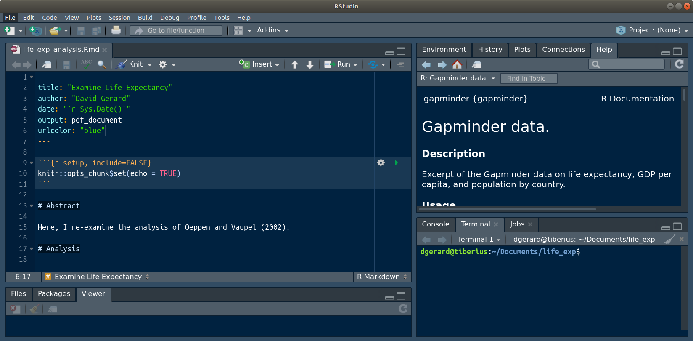
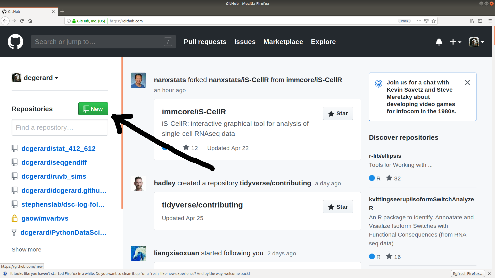
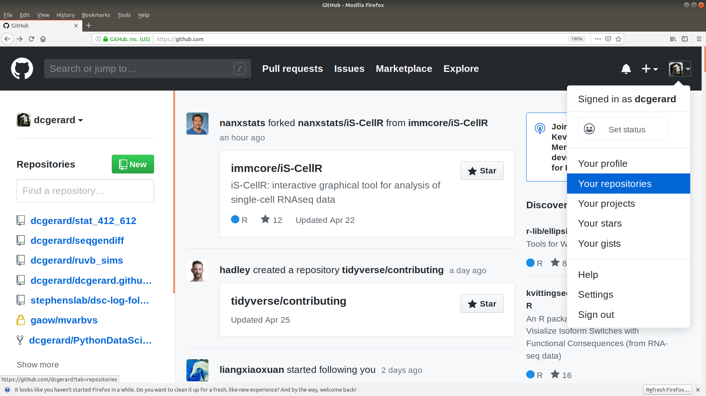
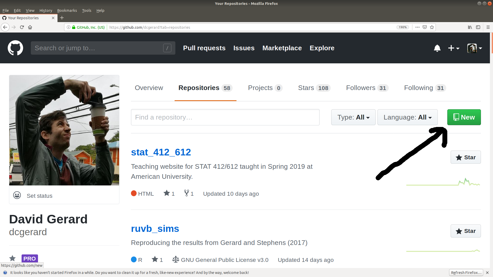
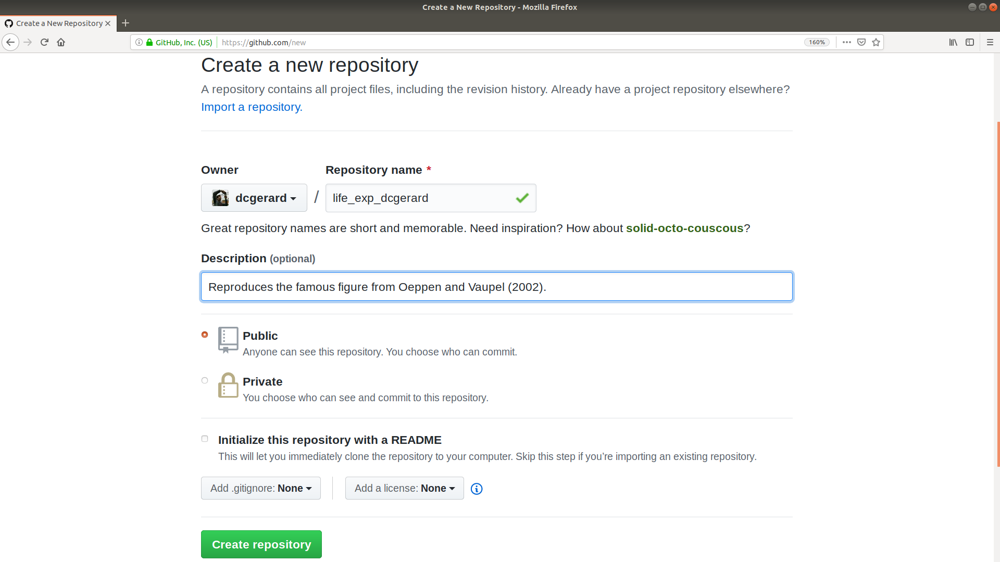
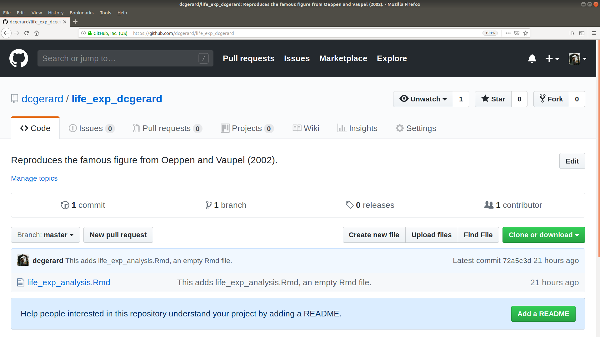
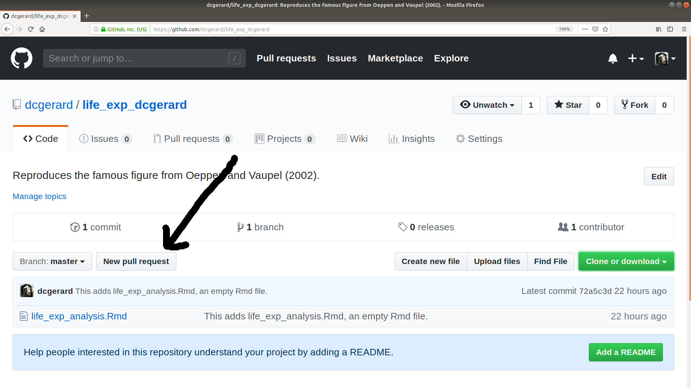
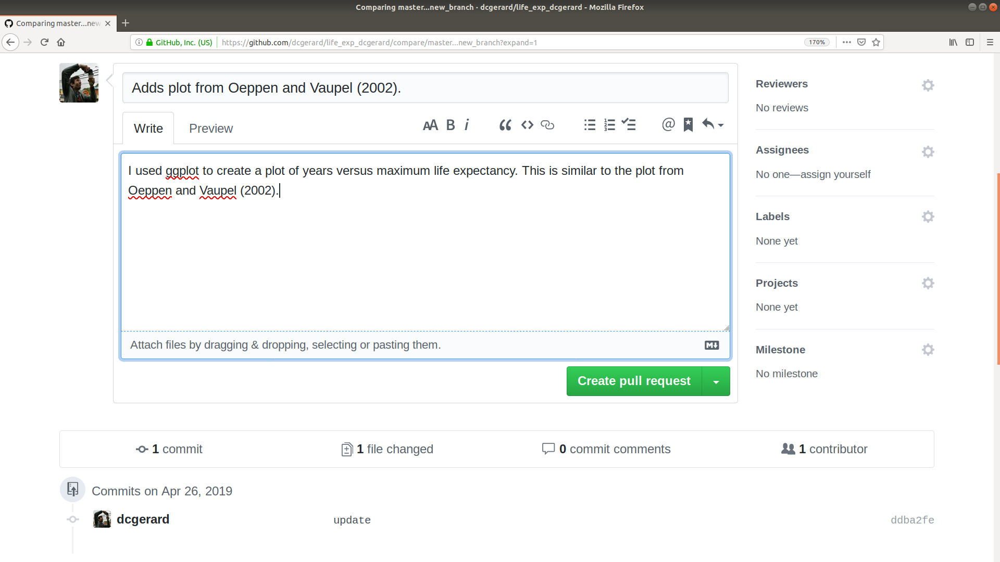
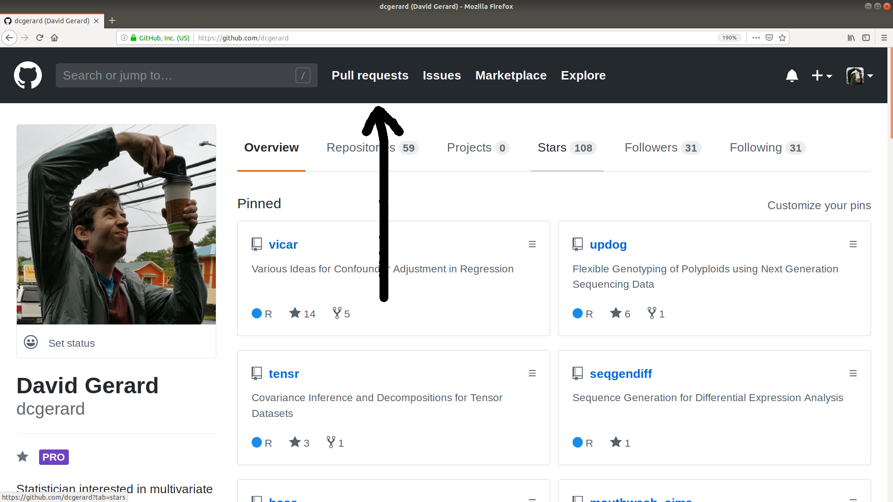
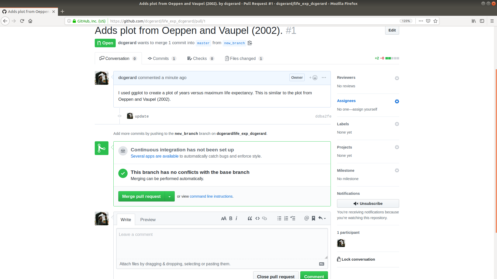

```{r setup, include=FALSE}
knitr::opts_chunk$set(echo       = TRUE, 
                      fig.height = 3, 
                      fig.width  = 6,
                      fig.align  = "center")
ggplot2::theme_set(ggplot2::theme_bw())
```

# Learning Objectives

- Version Control with git.
- Collaboration and software-hosting with GitHub.
- [Git cheat sheet](https://education.github.com/git-cheat-sheet-education.pdf)
- Required Reading:
    - [A Quick Introduction to Version Control with Git and GitHub](https://doi.org/10.1371/journal.pcbi.1004668).
    - [Setting up GitHub Classroom](https://github.com/jfiksel/github-classroom-for-students)
- Additional Resources:
    - [Git and GitHub Chapter from R Packages](http://r-pkgs.had.co.nz/git.html).
    - Chapters 6 and 7 from [Git for Scientists](https://milesmcbain.github.io/git_4_sci/).
    - [Oh s**t, git!](https://ohshitgit.com/).

# Set-up: Do this before class

1. Install git:
    - Windows: <http://git-scm.com/download/win>.
    - OS X: <http://git-scm.com/download/mac>.
    - Debian/Ubuntu: `sudo apt-get install git-core`.
    - Other Linux distros: <http://git-scm.com/download/linux>.

2. Create an account on GitHub: <https://github.com/>
    - A free plan is fine. Use the same email address you used above.
    - When you choose your username, remember that you might use this for
      professional purposes. So I would recommend something related to your name 
      (e.g. my handle is "dcgerard"). I would recommend against something like 
      "david_awesome_david_yolo_hahaha".
      
3. (You can wait for class for this step if you want) 
   Tell git your name and email address. Open up a terminal and type:

    ```{bash, eval = FALSE}
    git config --global user.name "YOUR FULL NAME"
    git config --global user.email "YOUR EMAIL ADDRESS"
    ```
    
    If you are worried about email privacy, follow GitHub's instructions
    [here](https://help.github.com/en/articles/setting-your-commit-email-address-on-github).
    
### Extra Setup Step for Windows Users

- To use the git bash terminal in R Studio in Windows, you'll need to 
  make sure it is set as the default.
    1. Go to Tools > Global Options... > Terminal. 
    2. Make sure you have "New terminals open with: Git Bash".
    3. Exit out of the old terminal. Restart R Studio.
    4. Then do Tools > Terminal > New Terminal.
    
# List of git commands

- `git init`: Initialize a git repository. *Only do this once per project*.
- `git status`: Show which files are staged in your working directory, and which are modified but not staged.
- `git add`: Add modified files from your working directory to the stage.
- `git diff`: Look at how files in the working directory have been modified.
- `git diff --staged`: Look at how files in the stage have been modified.
- `git commit -m "[descriptive message]"`: commit your staged content as a new commit snapshot.
- `git clone <url>`: Download a fresh copy of a remote repository onto your local machine.
- `git remote add <remote> <url>`: Link a local repository with a remote repository. The nickname of the remote repository is `<remote>`.
- `git push <remote> <branch>`: Push the changes from branch `<branch>` to the remote repository named `<remote>`
- `git pull <remote> <branch>`: Pull any modifications from `<remote>` into your local machine in branch `<branch>`.
- `git branch <branch>`: Create a branch called `<branch>`. Note that the default branch is called `master`.
- `git checkout <branch>`: Move to the `<branch>` branch.
- `git merge <branch>`: Merge the changes in `<branch>` into the current branch.

# Version Control: 

- **Version control system**: a program that tracks iterative changes of files. 
  Git is the most popular version control system.

- You can go back to previous versions of your code/text, then move forward to 
  the most recent version, or keep the old version.

- You can create copies of the code, change them, then merge these copies 
  together later.

## Motivation 1: Change code without the fear of breaking it
- You want to try out something new, but you aren't sure if it will work.

- Non-git solution: Copy the files
    - analysis.R, 
    - analysis2.R, 
    - analaysis3.R, 
    - analysis_final.R, 
    - analysis_final_final.R, 
    - analysis_absolute_final.R, 
    - analysis7.R
    - analysis8.R

- Issues: 
    - Difficult to remember differences of files.
    - Which files produced specific results?
    
- Git lets you change files, keeping track of old versions, and reverting 
  to old versions if you decide the new changes don't work.

## Motivation 2: Easy Collaboration

- In a group setting, your collaborators might suggest how to change your 
  analysis/code.
  
- First non-git solution: Email files back/forth. 

- Issues: 
    - You have to manually incorporate changes.
    - Only one person can work on the code at a time (otherwise multiple 
      changes might be incompatible).
      
- Second non-git solution: Share a Dropbox or Google Docs folder (a 
  "centralized" version control system).

- Issues:
    - Again, only one person can work on the code at a time.
    - Less user-friendly for tracking changes.

- Git let's each individual work on their own local repository and you can
  automatically incorporate changes. 

## Motivation 3: Great for job interviews

- In a [Kaggle Survey](https://www.kaggle.com/surveys/2017), 58.5% of data
  scientists say they primarily use git for sharing code.
  
- You can make your final-project repo public so prospective employers can
  view your work.
  
- You can host a website on GitHub, increasing your visibility. I host my 
  [personal website](http://dcgerard.github.io/) and 
  [teaching websites](https://data-science-master.github.io/lectures/) 
  on GitHub.
  
# Git Overview

- The way git works (graphic from Mark Lodato):

    \ 


- **Working Directory**: The folder where your shell thinks it is. To git, this
  means the current versions of the files. Changes to files that you haven't
  recorded only exist in the working directory and are not yet saved in the history.
- **Stage**: Files that are scheduled to be committed to the history, but not
  yet committed. Only files in the stage will be committed to the history.
- **History**: The timeline of snapshots of files. You commit a file to the 
  history and then, even if you modify it later, you can always go back to 
  that same file version.

- We'll focus on the right-hand-side of this diagram where your workflow is typically:
    1. Modify files in your working directory until you want a snapshot.
    2. Add these modified files to the staging area.
    3. Commit staged files to history, where they will be kept forever.

- The left-hand side of the diagram is used when you want to undo mistakes.  

- All git commands begin with `git` followed immediately by an argument for
  the type of command you want to execute.

- For the right-hand-side of the diagram, the following are the useful 
  git commands:
    - `git init`: Initialize a git repository. *Only do this once per project*.
    - `git status`: Show which files are staged in your working directory, and which
      are modified but not staged.
    - `git add`: Add modified files from your working directory to the stage.
    - `git diff`: Look at how files in the working directory have been
      modified.
    - `git diff --staged`: Look at how files in the stage have been modified.
    - `git commit -m "[descriptive message]"`: commit your staged content as a new 
      commit snapshot.

# Git Basics

- We'll use git while we examine a topic from the famous paper of @oeppen2002broken.
  This will give you an opportunity to review your tidyverse skills while
  learning how to use git in a research environment.
  
- @oeppen2002broken found perhaps the strongest association in social science: 
  a linear relationship between year and the maximum life expectancy, at birth,
  where the maximum is taken over countries. We'll examine this relationship
  for ourselves.
  
- The data we'll use is the `gapminder_unfiltered` data frame from the 
  gapminder library. The variables in this data frame are:
    - `country`: The name of the country.
    - `continent`: The continent of the country.
    - `year`: The year of the measurement. From 1952 to 2007.
    - `lifeExp`: The life-expectancy of at birth, in years, of an individual.
    - `pop`: Population.
    - `gdpPercap`: GDP per capita (US$, inflation-adjusted).
  
- Create a folder called "life_exp" somewhere in your computer. 

- Then create a R Markdown file called "life_exp_analysis.Rmd" within
  the life_exp folder. Your Rmd might look something like this for now:
  
    ```{r, comment="", echo=FALSE}
    writeLines(readLines("life_exp_analysis.Rmd"))
    ```

- Save `life_exp_analysis.Rmd".

- A **repository** (or repo, for short) is a collection of files (in a folder
  and its subfolders) that are together under version control. In data analysis,
  each repository is typically one project (like a data analysis, a homework, 
  or a collection of code that performs a similar task).

### Initialization

- Use `git init` to create a repository.

- Open up a terminal and make sure the working directory is "life_exp". If it's 
  not, then navigate to "life_exp". Your R Studio should look something like
  this.
  
    \ 

- Now type in the terminal  
    ```{bash, eval = FALSE}
    git init
    ```
    
- You've just created a git repository! What that means is that there is a
  `.git` hidden folder tracking all of the changes you specify.
  
    ```{bash, eval=FALSE}
    ls -a
    ```

- However, git won't track any files until you tell it to. 

### Status
  
- Use `git_status` to see what files git is tracking and which
  are untracked.
  
    ```{bash, eval=FALSE}
    git status
    ```
    
- The output should tell you that `life_exp_analysis.Rmd` is not tracked. And 
  in fact we have no tracked files.

### Staging

- Use `git add` to add files to the stage.

    ```{bash, eval=FALSE}
    git add life_exp_analysis.Rmd
    ```
    
- Always check which files have been added:

    ```{bash, eval=FALSE}
    git status
    ```

- Useful flags for `git add`:
    - `--all` will stage all modified and untracked files.
    - `--update` will stage all modified files, but only if they are already
      being tracked.

### Committing

- Use `git commit` to commit files that are staged to the commit history.

    ```{bash, eval=FALSE}
    git commit -m "This adds life_exp_analysis.Rmd, an empty Rmd file."
    ```
    
- Your message (written after the `-m` argument) should be concise, and 
  describe what has been changed since the last commit.
  
- If you forget to add a message, git will open up your default text-editor
  where you can write down a message, save the file, and exit. The commit
  will occur after you exit the text editor.
  
- If your default text editor is vim, you can exit it using
  [this](https://stackoverflow.com/questions/11828270/how-to-exit-the-vim-editor).
    
- `git status` should now be clear because there are no modified files:
    ```{bash, eval=FALSE}
    git status
    ```
    
- You can see all of your commits using `git log`.
    ```{bash, eval=FALSE}
    git log
    ```

- **Exercise**: As a next step in the analysis of the `gapminder_unfiltered` data
  frame, add code in life_exp_analysis.Rmd that
    1. Loads the `gapminder_unfiltered` data frame into R, and
    2. Calculates the maximum life expectancy each year and the corresponding 
       country that had that maximum life expectancy. Hint: There are
       multiple ways to do this, but the easiest involves `group_by()` and
       `filter()`.
       
    Also, change the header from "Analysis" to "Life Expectancy Analysis".
    Then save life_exp_analysis.Rmd.
    
    ```{r, echo=FALSE, eval=TRUE, message = FALSE}
    library(tidyverse)
    library(gapminder)
    data("gapminder_unfiltered")
    gapminder_unfiltered %>%
      group_by(year) %>%
      filter(lifeExp == max(lifeExp)) %>%
      ungroup() %>%
      select(year, country, lifeExp) %>%
      arrange(year) ->
      sumdat
    ```

### Look at changes
- Use `git diff` to see changes in all modified files.

    ```{bash, eval=FALSE}
    git diff
    ```
    
- Lines after a "`+`" are being added. Lines after a "`-`" are being removed.

- You can exit `git diff` by hitting `q`.

- **Exercise**: Check the status of your modified files. Then stage your
  modified files, but don't commit yet. Recheck your status.

    ```{bash, eval=FALSE, echo=FALSE}
    git status
    git add life_exp_analysis.Rmd
    git status
    ```
    
- `git diff` won't check for changes in the staged files by default. But you
  can see the differences using `git diff --staged`.
  
    ```{bash, eval=FALSE}
    git diff
    git diff --staged
    ```
  
- **Exercise**: Commit your changes. Use a nice commit message.

# Share Code Using GitHub

- GitHub is a website that hosts git repositories. Only noobs confuse git with GitHub. So when you write up your resume, you should say you know git, *not* GitHub.
  
- To host a repository on GitHub you need to
    1. Create a repo on GitHub.
    2. Tell git where GitHub is going to host your repo.
    3. Tell git to move your commits ("push") to GitHub.


### Create a Repository on GitHub

- Create a repo on GitHub by selecting "New" on the homepage:

    \ 
    
- **Or** go to the "Repositories" tab and select "New"

    \
    
    \
    
- Tell GitHub the name of your repo. In general, it can be a different name
  than the repo on your local machine. For this class, name it
  "life_exp_USERNAME" where "USERNAME" is your GitHub username.
  
- Make a small description, then click "Create Repository".
  
    \

### Tell git where GitHub will host your repository.

- Use `git remote add` to tell git where we will host our repo.
    ````{bash, eval=FALSE}
    git remote add origin https://github.com/dcgerard/life_exp_dcgerard.git
    ```
    
- In the above command, "`origin`" is just a nickname we gave to location
  that is hosting our repo. We could have used "`github`" or "`deep_space_nine`" 
  instead, but "`origin`" is traditional.
  
- The URL is the location of the repo. It is generally of the form 
  "https://github.com/dcgerard/GitHubRepoName.git" where "GitHubRepoName"
  is whatever you chose to name the repo on GitHub. You should have a 
  different GitHubRepoName than the one I used.
  
### Push your repo to GitHub

- Use `git push` to push commits to GitHub.

- If you are pushing to a brand new repo on GitHub, you need to use:
    ```{bash, eval=FALSE}
    git push -u origin master
    ```
    
- Otherwise, you can just type:
    ```{bash, eval=FALSE}
    git push
    ```
    
- The terminal should ask you for your GitHub username and password.

- When the push is complete, your code is now up on GitHub.

    \ 
    
- **Exercise**: Add some comments before your code chunk in life_exp.Rmd
  describing what the code is doing. Then save the file, stage the file for commit,
  commit the changes, then push the changes to GitHub.
  
# Collaborate Using GitHub

- There are two workflows for collaborating depending on the nature of the collaboration:
    1. [Branching](https://git-scm.com/book/en/v2/Git-Branching-Basic-Branching-and-Merging): for group projects.
    2. [Forking](https://docs.github.com/en/github/getting-started-with-github/fork-a-repo): for contributing to someone else's project.
    
## Branching workflow for collaboration

- A branch is an "alternative universe" of your project, where you can experiment with new ideas (e.g. new data analyses, new data transformations, new statistical methods). After experimenting, you can then "merge" your changes back into the master branch.

- Branching isn't just for group collaborations, you can use branching to collaborate with yourself, e.g., if you have a new idea you want to play with but do not want to have that idea in master yet.
  
- The "master" branch (the default in GitHub) is your best draft. You should consider anything in "master" as the best thing you've got.
  
- The workflow using branches consists of
    1. Create a branch with an informative title describing its goal(s).
    2. Add commits to this new branch.
    3. Merge the commits to master

### Create a branch

- You create a branch with the name `<branch>` by

    ```{bash, eval = FALSE}
    git branch <branch>
    ```

- Suppose we wanted to calculate some summary statistics, but we are not sure if we want to include these in the report. Let's create a branch where we explore these summary statistics.

    ```{bash, eval=FALSE}
    git branch sumstat
    ```

- You can see the list of branches (and the current branch) with
    ```{bash, eval = FALSE}
    git branch
    ```

### Move between branches

- You switch between branches with:

    ```{bash, eval = FALSE}
    git checkout <branch>
    ```
    
- Move to the sumstat branch with

    ```{bash, eval = FALSE}
    git checkout sumstat
    ```

### Edit Branch

- When you are on a branch, you can edit and commit as usual. Do this now with the following exercise:

- **Exercise**: Calculate the average life expectancy (averaging over countries) in 2000. Add this to life_exp_analysis.Rmd. Commit your changes.

    ```{r, eval = FALSE, echo = FALSE}
    gapminder_unfiltered %>%
      filter(year == 2000) %>%
      summarize(meanlife = mean(lifeExp))
    ```
    
### Push branch to GitHub

- You can push your new branch to GitHub just like you can push your master branch to GitHub:
    ```{bash, eval=FALSE}
    git push origin <branch>
    ```
    
### Merge changes into master

- Suppose you are satisfied with your changes in your new branch, then you'll want to merge these into the master branch. You can do this on GitHub ([see here](./01_git_branch.html)). If you do so, then don't forget to pull the changes from master back into your local machine.
    ```{bash, eval=FALSE}
    git pull origin master
    ```

- Alternatively, you can merge the changes in your local machine. First, checkout the master branch.

    ```{bash, eval=FALSE}
    git checkout master
    ```

- Then use `merge` to merge the changes from `<branch>` into master.

    ```{bash, eval=FALSE}
    git merge sumstat
    ```

- Don't forget to push your changes to GitHub

    ```{bash, eval=FALSE}
    git push origin master
    ```

### Resolving Merge Conflicts

- If two branches with incompatible histories try to merge, 
  then git does not merge them.

- Instead, it creates a "merge conflict", which you need to resolve.

- Instructions on resolving merge conflicts can be found here:
  <https://help.github.com/en/github/collaborating-with-issues-and-pull-requests/resolving-a-merge-conflict-using-the-command-line>

## Forking workflow for collaboration

- "Forking" is another form of collaboration, where you contribute to a repo that you do not own.

- "Forking" means to create a copy of a repo. 

- The steps to collaborate in the forking pipeline is:
  1. Fork a repo to your GitHub account.
  2. Clone your forked repo to your local machine.
  3. Edit-stage-commit the files.
  4. Push the files back to your forked repo.
  5. Request the original owner to pull your changes into their repo (a "pull request").

- Let's use the forking pipeline to extend each-other's code to finalize the plot.

### Fork

- Pair-up and exchange your GitHub username. Search for that person on GitHub, and go to their "life_exp_USERNAME" repository. The url should be something like "https://github.com/PARTNERNAME/life_exp_PARTNERNAME" where "PARTNERNAME" is your partner's username.
  
- At the top right, click the "Fork" button. 

- This will create a version of your partner's repo on your own GitHub page.

### Clone

- If there is a repo already up on GitHub, you can clone a copy to your local machine.

- Use `git clone` to create a local version of a repo on GitHub.

- Navigate to a directory (outside of your own git repo) where you would like to place your partner's git repo.
  
- Clone the forked version of your partner's repo to your local machine:

    ```{bash, eval=FALSE}
    git clone https://github.com/USERNAME/life_exp_PARTNERNAME.git
    ```
    
- You should be able to see the new repo:

    ```{bash, eval=FALSE}
    ls
    ```
    
- *Note*: You can clone not just repos that you've forked, but *any* git repo that you have access to online (e.g. public repos).
  
### Edit, commit, push

- Enter the new repo (the forked version of your partner's repo).

- **Exercise**: In your partner's file, create a scatterplot of year versus maximum life expectancy. Color code by country, and add a single OLS line. Your plot should look like this:
  
    ```{r, eval=TRUE, echo=FALSE, message=FALSE}
    sumdat %>%
      ggplot(aes(x = year, y = lifeExp)) +
      geom_point(aes(color = country)) +
      geom_point(pch = 1) + 
      theme_bw() +
      geom_smooth(method = "lm", se = FALSE) +
      xlab("Year") +
      ylab("Maximum Life Expectancy") +
      scale_color_discrete(name = "Country")
    ```
    
- **Exercise**: Save the modified file, then stage and commit the changes. Finally, push the changes to your forked repo.

### Submit pull request

- A "pull request" is a request for your partner to incorporate the changes that you made in your forked version of their repository.

- Navigate to your forked version of your partner's repo up on GitHub. Then click on "New pull request".
  
    \ 
    
- Write an informative title and message on what your code does, then click "Create pull request".
  
    \ 
  
### Accept pull request

- You can view all pull requests that folks have sent you from the "Pull requests" tab.
  
    \ 
    
- After you navigate to the pull request your partner sent you, you can see the changes that they made under the "Files changed" tab. You can write comments --- for example asking them to change the code before you accept the merge request. Or you can can just accept the merge request by hitting "Merge pull request".
  
    \

### Pull changes to your local machine.

- Use `git pull` whenever there are modifications on GitHub and you want to bring your local repo up-to-date.
  
    ```{bash, eval=FALSE}
    git pull
    ```
    
# Best Practices

- Commit fairly frequently. On the homework, 
  **you should commit each time you complete a homework question.**
  
- Usually, you should only commit plain text. The reason for this is that  git is actually tracking **changes** in files, not the files themselves. This is very efficient for plain text files. But for non-plain text files the whole file is usally changed when you change a component, so git ends up saving the whole file each each time you change it.

# Parting Wisdom from [XKCD](https://xkcd.com/1597/)

  \ 

# References


