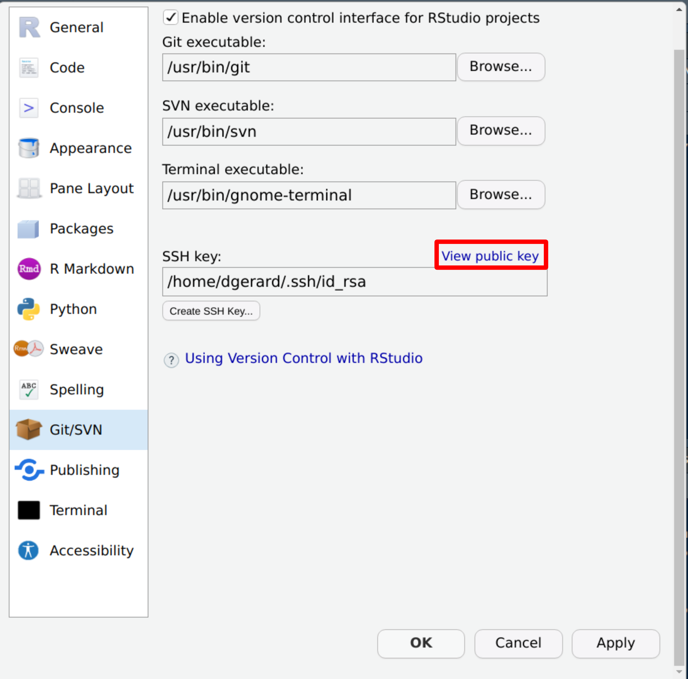

```{r setup, include=FALSE}
knitr::opts_chunk$set(echo       = TRUE, 
                      fig.align  = "center",
                      fig.height = 3, fig.width = 4)
ggplot2::theme_set(ggplot2::theme_bw() + ggplot2::theme(strip.background = ggplot2::element_rect(fill = "white")))
```

```{r klippy, echo=FALSE, include=TRUE}
klippy::klippy()
```

# Learning Objectives

- Installing git
- Setting up GitHub
- [Connecting to GitHub with SSH](https://docs.github.com/en/authentication/connecting-to-github-with-ssh)

# Installing Git

1. Install git:
    - Windows: <http://git-scm.com/download/win>.
    - OS X: <http://git-scm.com/download/mac>.
    - Debian/Ubuntu: `sudo apt-get install git-core`.
    - Other Linux distros: <http://git-scm.com/download/linux>.

2. Create an account on GitHub: <https://github.com/>
    - A free plan is fine. Use the same email address you used above.
    - When you choose your username, remember that you might use this for
      professional purposes. So I would recommend something related to your name 
      (e.g. my handle is "dcgerard"). I would recommend against something like 
      "david_awesome_david_yolo_hahaha".
      
3. Tell git your name and email address. Open up a terminal and type:

    ```{bash, eval = FALSE}
    git config --global user.name "YOUR FULL NAME"
    git config --global user.email "YOUR EMAIL ADDRESS"
    ```
    
    If you are worried about email privacy, then use "\<username\>@users.noreply.github.com" as your email address (where you have replaced \<username\> with your GitHub username), then follow the instructions [here](https://help.github.com/en/articles/setting-your-commit-email-address-on-github) to make your email address private on GitHub.
    
4. Choose your favorite editor to be your default
    - Nano (a simple text editor): 
    
        ```{bash, eval = FALSE}
        git config --global core.editor "nano -w"
        ```
        
    - Notepad (Windows only): 
    
        ```{bash, eval = FALSE}
        git config --global core.editor "c:/Windows/System32/notepad.exe"
        ```
        
    - Emacs (for the brave) if it is already installed:
    
        ```{bash, eval = FALSE}
        git config --global core.editor "emacs"
        ```

# Authentication

- To integrate GitHub (the website) with git (the command-line program), you have to set up the proper authorization.

- If you can already integrate with GitHub through the command line then you can skip the rest of these notes. If you are not sure, then please continue.

- GitHub now requires you to use either [Personal Access Tokens](https://docs.github.com/en/authentication/keeping-your-account-and-data-secure/creating-a-personal-access-token) or [SSH Keys](https://docs.github.com/en/authentication/connecting-to-github-with-ssh) for interfacing. For this class, we'll use SSH Keys since its implementation is slightly easier.

- An alternative setup using personal access tokens can be found [here](https://usethis.r-lib.org/articles/git-credentials.html).

- SSH uses what's called a [key pair](https://en.wikipedia.org/wiki/Public-key_cryptography) where GitHub has a "public key" (a very long publicly known password) and you have on your computer a "private key" (a very long privately known password). 

- Think about the public key as a padlock, and the private key as the key. You have to use to private key to unlock the public key.

- You need to generate a new private key, and go through the below steps, for each computer for which you intend to use git.

## Generate Key Pair on R Studio

- R Studio makes it easy to generate a key pair.

- Check to see if you already have an SSH key pair by running the following in R
    ```{r, eval = FALSE}
    file.exists("~/.ssh/id_rsa.pub")
    ```
    It will return `FALSE` if you do not have a key pair.

- Open up Tools > Global Options... > Git/SVN.

- If you do not have an SSH key pair, then click on "Create SSH Key..." and follow the prompts.

    

- Click on "View public key"
    
    
    
- Copy the entire text that shows up. This is your public key.

- Go to [Add Public Key to GitHub](./01_git_setup.html#add-public-key-to-github) to continue authentication setup.

## Generate Key Pair on the Terminal

- If the R Studio pipeline does not work, then try generating your key pair on the terminal with the following instructions.

### Check for existing SSH Keys

- In the terminal run

    ```{bash, eval = FALSE}
    ls -al ~/.ssh
    ```
    
- This will say something like "ls: cannot access '/c/Users/Vlad Dracula/.ssh': No such file or directory" if you don't have any public/private key pairs.
    
- This will list out files names like "id_rsa.pub", "id_ecdsa.pub", or "id_ed25519.pub" if you do have a public/private key pair.
    
### Generate a new SSH key

- If you **do** have an SSH key, go to the next section ("Add an SSH key to the ssh-agent")

- If you **don't** have an SSH key, follow the below steps. 

- In the terminal, run 

    ```{bash, eval = FALSE}
    ssh-keygen -t ed25519 -C "your_email@example.com"
    ```
    
- Press enter if prompted where to save the key to accept the default location.

- At the prompt, type a password that you can remember.

### Add an SSH key to the ssh-agent

1. In the terminal, run the following to start the ssh-agent in the background.

    ```{bash, eval = FALSE}
    eval "$(ssh-agent -s)"
    ```
    
2. In the terminal, run the following to add your SSH private key to the ssh-agent:

    ```{bash, eval = FALSE}
    ssh-add ~/.ssh/id_ed25519
    ```

### Copy Public Key

1. Run the following in the terminal to show the contents of "id_ed25519.pub".

    ```{bash, eval = FALSE}
    cat ~/.ssh/id_ed25519.pub
    ```

2. Highlight the output using your mouse and copy the contents.

## Add Public Key to GitHub

1. On [GitHub](https://github.com/settings/keys), in the upper right corner, click on your profile photo and click on "Settings"

    
    
2. On the left sidebar, click on "SSH and GPG keys"
    
    
    
3. Click on "New SSH key"

    
    
4. In the title field, choose a descriptive title, like "Personal Laptop".

5. Paste your key into the "Key" field.

6. Click "Add SSH key" and confirm your GitHub password.

## Test to see if it worked

1. Enter the following in the terminal:

    ```{bash, eval = FALSE}
    ssh -T git@github.com
    ```

2. Type "yes" if prompted to continue connecting.

3. You are successful if you see something like

    ```
    Hi dcgerard! You've successfully authenticated, but GitHub does not provide shell access.
    ```
