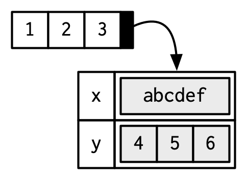

```{r setup, include=FALSE}
knitr::opts_chunk$set(echo       = TRUE, 
                      fig.align  = "center",
                      fig.height = 3, fig.width = 4)
ggplot2::theme_set(ggplot2::theme_bw() + ggplot2::theme(strip.background = ggplot2::element_rect(fill = "white")))
```

```{r klippy, echo=FALSE, include=TRUE}
klippy::klippy()
```

# Learning Objectives

- Understanding vectors, the fundamental objects in R.
- This is mostly a long list of facts about vectors that you should be aware of.
- Chapter 3 from [Advanced R](https://adv-r.hadley.nz/)
    - These lecture notes are mostly taken straight out of Hadley's book. Many thanks for making my life easier.
    - His images, which I use here, are licensed under <a rel="license" href="http://creativecommons.org/licenses/by-nc-sa/4.0/"></a>
- The topic should be mostly review, but we will go a little deeper.

# Vector Types

- Two types of vectors:
    - **Atomic**: All elements of same type.
    - **List** ("generic vectors"): Objects may be of different types.
    - (low-key third type) `NULL`: Absence of a vector.
    
    

## Atomic Vectors

- Four basic types:
    - Logical: Either `TRUE` or `FALSE`
    - Integer: 
        - Exactly an integer. Assign them by adding `L` behind it (for "long integer").
        - `-1L`, `0L`, `1L`, `2L`, `3L`, etc...
    - Double: 
        - Decimal numbers.
        - `1`, `1.0`, `1.01`, etc...
        - `Inf`, `-Inf`, and `NaN` are also doubles.
    - Character: 
        - Anything in quotes:
        - `"1"`, `"one"`, `"1 won one"`, etc...
        
- You create vectors with `c()` for "combine"
    ```{r}
    x <- c(TRUE, TRUE, FALSE, TRUE) ## logical
    x <- c(1L, 1L, 0L, 1L) ## integer
    x <- c(1, 1, 0, 1) ## double
    x <- c("1", "1", "0", "1") ## character
    ```
    
- There are no scalars in R. A "scalar" is just a vector length 1.

    ```{r}
    is.vector(TRUE)
    ```

- Integers and doubles are together called "numerics"

    
    
- You can determine the type with `typeof()`.

    ```{r}
    x <- c(TRUE, FALSE)
    typeof(x)
    x <- c(0L, 1L)
    typeof(x)
    x <- c(0, 1)
    typeof(x)
    x <- c("0", "1")
    typeof(x)
    ```
    
- The special values, `Inf`, `-Inf`, and `NaN` are doubles
    ```{r}
    typeof(c(Inf, -Inf, NaN))
    ```
    
- Determine the length of a vector using `length()`

    ```{r}
    length(x)
    ```

- Missing values are represented by `NA`.

- `NA` is technically is a logical value.

    ```{r}
    typeof(NA)
    ```

    - This rarely matters because logicals get coerced to other types when needed.
    
        ```{r}
        typeof(c(1L, NA))
        typeof(c(1, NA))
        typeof(c("1", NA))
        ```
    
    - But if you need missing values of other types, you can use
    
        ```{r, eval = FALSE}
        NA_integer_ ## integer NA
        NA_real_ ## double NA
        NA_character_ ## character NA
        ```
    
    - Never use `==` when testing for missingness. It will return `NA` since it is always unknown if two unknowns are equal. Use `is.na()`.
    
        ```{r}
        x <- c(NA, 1)
        x == NA
        is.na(x)
        ```
    
- You can check the type with `is.logical()`, `is.integer()`, `is.double()`, and `is.character()`.

    ```{r}
    is.logical(TRUE)
    is.integer(1L)
    is.double(1)
    is.character("1")
    ```

- Attempting to combine vectors of different types coerces them to the same type. The order of preference  is character > integer > double > logical.

    ```{r}
    typeof(c(1L, TRUE))
    typeof(c(1, 1L))
    typeof(c("1", 1))
    ```

- **Exercise** (from Advanced R): Predict the output:
    ```{r, eval = FALSE}
    c(1, FALSE)
    c("a", 1)
    c(TRUE, 1L)
    ```

- **Exercise** (from Advanced R): Explain these results:
    ```{r}
    1 == "1"
    -1 < FALSE
    "one" < 2
    ```

    ```{block, eval = FALSE, echo = FALSE}
    1. `1` is coerced to `"1"`, then tested for equality. So we get `TRUE`.
    
    2. `FALSE` is coerced to 0, so we get `-1 < 0` which is `TRUE`.
    
    3. `2` is coerced to `"2"`, which comes before `"one"` in the [ASCII order](https://en.wikipedia.org/wiki/ASCII#Character_order).
    ```
    
    ```{r, eval = FALSE, echo = FALSE}
    sort(c(letters, LETTERS, 0:9))
    ```

# Attributes

- Attributes are meta information applied to atomic vectors.

- Many common objects (like matrices, arrays, factors, date-times) are just atomic vectors with special attributes.

- You get and set attributes with `attr()`
    ```{r}
    a <- 1:3
    attr(a, "x") <- "abcdef" # sets x attribute of vector a to be "abcdef"
    attr(a, "x") # retrieve the x attribute of vector a
    ```

- You can see all attributes of a vector with `attributes()`.
    ```{r}
    attr(a, "y") <- 4:6
    attributes(a)
    ```

- You can set many attributes at the same time with `structure()`.

    ```{r}
    b <- structure(1:3,
                   x = "abcdef",
                   y = 4:6)
    attributes(b)
    ```

- Attributes are name-value pairs, and all of these attributes are associated with an object. Below, the vector `c(1, 2, 3)` points to attributes `x` and `y` that each have their own values.
    
    
    
- Most attributes are typically lost by most operations.

    ```{r}
    attributes(a[[1]])
    attributes(sum(a))
    ```

- **Exception**: Two attributes are not lost typically: **names** and **dim**.

## Names

- Names are a character vector the same length as the atomic vector. Each name corresponds to a single element.

- You could set names using `attr()`, but you should not.

    ```{r}
    x <- 1:3
    attr(x, "names") <- c("a", "b", "c")
    attributes(x)
    ```

- Names are so special, that there are special ways to create them and view them

    ```{r}
    x <- c(a = 1, b = 2, c = 3)
    names(x)
    
    x <- 1:3
    names(x) <- c("a", "b", "c")
    names(x)
    ```

- The proper way to think about names is like this:
    
    
    
    But each name corresponds to a specific element, so Hadley does it like this:
    
      
    
- Names stay with single bracket subsetting (not double bracket subsetting)

    ```{r}
    names(x[1])
    names(x[1:2])
    names(x[[1]])
    ```

- Names can be used for subsetting (more in Chapter 4)
    ```{r}
    x[["a"]]
    ```

- You can remove names with `unname()`.

    ```{r}
    unname(x)
    ```

# S3 Atomic Vectors

- The **class** of an object is an important attribute that controls R's S3 system for object oriented programming.

- The class of an object will determine its behavior when you use that class in a **generic** function such as `print()` or `summary()`.

    - A generic function is a function that has different behavior based on the class of the input.
    
- You can create your own S3 classes (chapter 13). 

- Here, we will talk about some S3 classes that come with R by default.

- You can determine the class of object with `class()`, and you can set the class to `NULL` by `unclass()`.

- Factors, Dates, and POSIXct (date-times)

    

- A **factor** is an integer vector with
    1. The `class` attribute `factor`, and
    2. A `levels` attribute describing the possible levels

    ```{r}
    x <- factor(c("a", "b", "b", "a"))
    x
    typeof(x)
    class(x)
    attributes(x)
    ```

    
    
- R also does some stuff under the hood for encoding factors (i.e. has a lot of methods specifically for factors).
    
- Factors are R's way of storing categorical variables, and are useful when a variable only has a certain number of possible values.

- Learn more about factors [here](https://dcgerard.github.io/stat_412_612/lectures/09_factors/09_factors.pdf).

- A **Date** is a double vector with class attribute `Date`.

    ```{r}
    today <- Sys.Date()
    typeof(today)
    attributes(today)
    class(today)
    ```
    
- Let's look at the underlying double to today:

    ```{r}
    unclass(today)
    ```

    - This is the number of days since January 1, 1970:

    ```{r}
    unclass(as.Date("1970-01-01"))
    ```
    
- Date-time classes are called either `POSIXct` (Portable Operating System Interface in Unix, Calendar Time) or `POSIXlt` (Portable Operating System Interface in Unix, Local Time).

- `POSIXct` shows up more often. It is a double representing the number of seconds since the beginning of 1970.

    ```{r}
    now <- Sys.time()
    typeof(now)
    class(now)
    unclass(now)
    ```

- `POSIXlt` is a named list of vectors with elements representing seconds, minutes, hours, days of the month, months, years, weekdays, etc...

    ```{r}
    ltvec <- as.POSIXlt(x = c("1980-10-10 01:11:01", 
                              "1970-01-11 10:15:22",
                              "2010-05-30 20:01:18"))
    typeof(ltvec)
    unclass(ltvec)
    ```

- You mostly interact with these date-time objects through the `{lubridate}` package, but base R has their own interfaces (which I think are more difficult to use).

- Learn more about dates and date-times [here](https://data-science-master.github.io/lectures/02_dates/02_dates.html).

- **Exercise** (From Advanced R): `table()` will take as input a vector or vectors and count how many observations have each value. What sort of object does `table()` return? What is its type? What attributes does it have? How does the dimensionality change as you tabulate more variables?

    ```{r, eval = FALSE, echo = FALSE}
    tab1 <- table(c("A", "A", "B"))
    tab1
    typeof(tab1) ## integer
    attributes(tab1) ## has dimnames like an array
    
    tab2 <- table(c("A", "A", "B"), c(1, 2, 3))
    tab2
    typeof(tab2) ## integer
    attributes(tab2) ## dimnames is a list of length 2 now
    ```

# Creating Empty Vectors

- In many applications, you will want to create empty vectors or vectors filled with missing values.

- Create an empty vector with `vector()`.

    ```{r}
    vector(mode = "character", length = 0)
    vector(mode = "double", length = 0)
    vector(mode = "integer", length = 0)
    vector(mode = "logical", length = 0)
    ```
    
- Shorthand for this is
    ```{r}
    character()
    double()
    integer()
    logical()
    ```

- Empty vectors often show up in defaults that are returned when folks ask for something of length 0. 

- E.g., in if you are simulating something, you might return a vector of length 0 if they ask for 0 elements.

    ```{r, eval = FALSE}
    f <- function(n) {
      sout <- double(n)
      for (i in seq_len(n)) {
        sout[[i]] <- simcode(...) ## put simulation code here
      }
      return(sout)
    }
    ```


- You often want to create an empty vector that you then fill in with values. I like to create this vector to be with missing values, so that I know I made a mistake if they are not all filled in.

    ```{r}
    n <- 100
    x <- rep(NA_character_, lenght.out = n)
    x <- rep(NA_integer_, lenght.out = n)
    x <- rep(NA_real_, lenght.out = n)
    x <- rep(NA, lenght.out = n)
    ```

- E.g. in a for-loop, you often fill in the elements of a vector. Let's suppose we are evaluating the performance of the mean in a simulation study.

    ```{r}
    nsim <- 1000 ## number of simulations
    nsamp <- 10 ## sample size
    mvec <- rep(NA_real_, length.out = nsim)
    true_mean <- 0
    for (i in seq_len(nsim)) {
      mvec[[i]] <- mean(rnorm(n = nsamp, mean = true_mean))
    }
    mean((mvec - true_mean)^2) ## mean squared error
    ```

- If you are filling in the values of a matrix, you need to be able to create a matrix with missing values. 

    ```{r}
    n <- 100
    p <- 3
    matval <- matrix(NA_character_, nrow = p, ncol = n)
    matval <- matrix(NA_real_, nrow = p, ncol = n)
    matval <- matrix(NA_integer_, nrow = p, ncol = n)
    matval <- matrix(NA, nrow = p, ncol = n)
    ```

# Lists

- Lists are like vectors except each element can be of any type.

- You create lists with `list()`.
    ```{r}
    lobj <- list(a = 1:3,
                 log_val = TRUE,
                 list(c = 10))
    ```

- You can view a list with `str()`.

    ```{r}
    str(lobj)
    ```
    
- `c()` will combine lists into a single list. If you use `c()` with a list and a vector, then it will first coerce the vector into a list where each element is a list.

    ```{r}
    l1 <- list(1:2,
               c("a", "b"))
    l2 <- list(c(TRUE, FALSE))
    c(l1, l2)
    c(l1, c("c", "d"))
    
    as.list(c("c", "d")) ## this is what it does before combining
    ```

- `typeof()` will return `"list"` and `is.list()` tests for a list.
    ```{r}
    typeof(l1)
    is.list(l1)
    ```

- Use `unlist()` to remove the list structure.

    ```{r}
    l1
    unlist(l1)
    ```

- The `dim` attribute can be applied to lists

    ```{r}
    lmat <- list(1:2,
                 3:10,
                 runif(4),
                 c("Hello", "world"))
    dim(lmat) <- c(2, 2)
    lmat
    lmat[[1, 2]]
    ```

# Data Frames

- Data Frames are lists where
    1. Each element is a vector.
    2. Each vector has the same length.
    
    
    
    ```{r}
    df <- data.frame(a = 4:6,
                     b = c("A", "B", "C"))
    typeof(df)
    attributes(df)
    ```
    
- Above, the "names" attribute are the columnames, and you can get them with `colnames()`
    ```{r}
    colnames(df)
    names(df)
    ```
    
    
- The row.names are the row names, and you can obtain them with `row.names()` or `rownames()`.
    - `row.names()` are specifically for data frames, whereas `rownames()` was designed for extracting dimnames and was also altered to work with data frames.

    ```{r}
    row.names(df)
    rownames(df)
    ```

- Those row names are automatically generated, but you can set them with `rownames()`.

    ```{r}
    rownames(df) <- c("h", "i", "j")
    df
    ```

- `tibbles`, from the package `{tibble}` are tidyverse data frames. The main differences are:
    1. Tibbles do not automatically coerce data (such as from strings to factors). Data frames used to do this in older versions of R.
        ```{r}
        data.frame(x = c("a", "b", "c"), 
                   stringsAsFactors = FALSE) ## needed to be safe for older versions of R
        tibble::tibble(x = c("a", "b", "c"))
        ```
    2. Tibbles do not change names if they happen to be non-syntactic (e.g. have spaces in them)
        ```{r}
        data.frame(`hello world` = c(1, 2, 3))
        tibble::tibble(`hello world` = c(1, 2, 3))
        ```
    3. Tibbles will only recycle vectors of length 1.
        ```{r, error = TRUE}
        data.frame(x = c(1, 2, 3, 4),
                   y = c(1, 2))
        tibble::tibble(x = c(1, 2, 3, 4),
                       y = c(1, 2))
        ```
    4. `{tibbles}` do not reduce to vectors when you subset one column. Folks disagree on whether this is good or bad.
        ```{r}
        df <- data.frame(`hello world` = c(1, 2, 3))
        tib <- tibble::tibble(`hello world` = c(1, 2, 3))
        attributes(df[, 1])
        attributes(tib[, 1])
        ```
    5. Data frames allow for row names, tibbles do not. Folks disagree on whether this is desirable (Hadley is extremely against it).
    6. Tibbles print differently than data frames. Tibbles only print 10 rows and only the columns that will fit. But I actually prefer the data frame method better, because pretty doesn't matter when you are doing data analysis, and it's better to see all columns.

- **Exercise**: Based on our discussion of making zero-length vectors, create a data frame with zero rows and columns `a`, and `b`. Both should be double columns.

    ```{r, eval = FALSE, echo = FALSE}
    data.frame(a = vector(mode = "double", length = 0),
               b = vector(mode = "double", length = 0))
    ```

- **Exercise**: What does `data.frame()` do without any arguments?

    ```{r, eval = FALSE, echo = FALSE}
    data.frame()
    ```

    ```{block, eval = FALSE, echo = FALSE}
    Create a data frame with 0 rows and 0 columns.
    ```

- **Exercise**: Use the `row.names` argument of `data.frame()` to create a data frame with 100 rows and no columns.

    ```{r, eval = FALSE, echo = FALSE}
    data.frame(row.names = 1:100)
    ```

# NULL

- `NULL` is its own data type, that always has length 0.

    ```{r}
    typeof(NULL)
    length(NULL)
    ```

- `NULL` is used to represent an empty vector.

    ```{r}
    c()
    ```

- `NULL` is often used as a default argument in a function for complicated arguments. The function operates one way unless a user specifies something for that argument. Look at `?ashr::ash.workhorse` for multiple examples.

    ```{r, eval = FALSE}
    f <- function(x = NULL) {
      if (is.null(x)) {
        ## do something
      } else {
        ## do something else
      }
    }
    ```
    
- E.g., let's create a function `wmean` that calculates a weighted mean if weights are provided, an the sample mean otherwise.

    ```{r}
    wmean <- function(x, w = NULL) {
      if (is.null(w)) {
        w <- rep(1 / length(x), length.out = length(x))
      } else {
        w <- w / sum(w)
      }
      return(sum(x * w))
    }
    
    x <- c(1, 2, 3)
    wmean(x)
    wmean(x, w = c(5, 1, 1))
    ```

- There are two alternative strategies to this. First, use `missingArg()` to test if an argument is missing.
    ```{r}
    wmean <- function(x, w) {
      if (missingArg(w)) {
        w <- rep(1 / length(x), length.out = length(x))
      } else {
        w <- w / sum(w)
      }
      return(sum(x * w))
    }
    
    x <- c(1, 2, 3)
    wmean(x)
    wmean(x, w = c(5, 1, 1))
    ```
    
    This works because of lazy evaluation (which we will learn about later).
    
    I don't like this because it is confusing to the user, who thinks `w` is a required argument.
    
- Second, you can include more complicated defaults.

    ```{r}
    wmean <- function(x, w = rep(1, length(x))) {
      w <- w / sum(w)
      return(sum(x * w))
    }
    
    x <- c(1, 2, 3)
    wmean(x)
    wmean(x, w = c(5, 1, 1))
    ```
    
    I don't like this because default arguments are evaluated inside the function, but user-provided arguments are evaluated outside the function (more on this later). This can lead to strange results.

- `NULL` is one of the ways R handle's missingness. The others are `NA` and `NaN`.
    - `NULL`: An empty object. Can be thought of as a zero-length vector.
    - `NA`: A missing value. Can be used as an element of a vector.
    - `NaN`: Undefined numeric values, such as the output of `0/0`.

# New Functions

- `typeof()`: Determine the type of an object (character, double, integer, or logical).
- `attr()`: Get or set an attribute.
- `attributes()`: View all attributes.
- `structure()`: Create an object with many attributes.
- `names()`: Get or set names attributes.
- `unname()`: Remove the names attribute.
- `dim()`: Get or set dim attributes.
- `class()`: Get or set class attributes.
- `unclass()`: Remove the class attribute.
