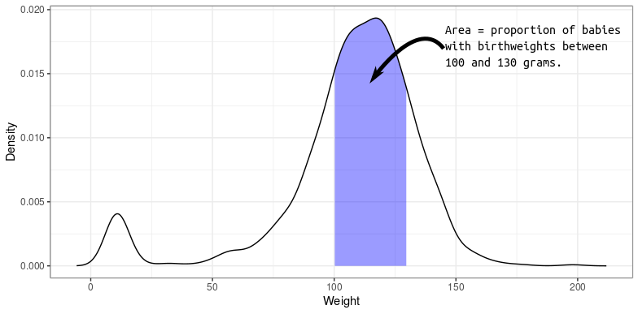
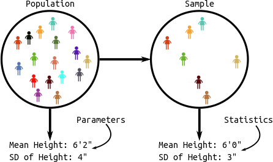

```{r setup, include=FALSE}
set.seed(1)
knitr::opts_chunk$set(echo       = TRUE, 
                      fig.height = 3, 
                      fig.width  = 6,
                      fig.align  = "center")
ggplot2::theme_set(ggplot2::theme_bw())
```

# Learning Objectives

- Review Intermediate Statistics (STAT 302/320/614)
- Probability Distributions in R
- P-values/Confidence Intervals
- $t$-tests for Means
- Proportion Tests

# A note

- This review assumes that you have had *some* basic statistics course 
  and have seen all of these concepts in the past.

- If you haven't taken a basic statistics course, you will find this review 
  **very** difficult and incomplete.

# Probability and Distributions in R.

- **Distribution**: The possible values of a variable and how often it takes
  those values. 
  
- A **density** describes the distribution of a *quantitative* variable. 
  You can think of it as approximating a histogram. It is a curve where
  - The area under the curve between any two points is approximately the
    probability of being between those two points.
  - The total area under the curve is 1 (something must happen).
  - The curve is never negative (can't have negative probabilities).
  
- The density of birthweights in America:

    \ 
  
- The distribution of many variables in Statistics approximate the 
  **normal distribution**.
    - If you know the mean and standard deviation of a normal distribution, then
      you know the whole distribution.
    - Larger standard deviation means more spread out (larger and smaller values
      are both more likely).
    - Mean determines where the data are centered.

- Normal densities with different means.
    ```{r, echo=FALSE}
    library(ggplot2)
    library(ggthemes)
    x <- seq(-10, 10, length = 100)
    y1 <- dnorm(x = x, mean = 0, sd = 2)
    y2 <- dnorm(x = x, mean = -4, sd = 2)
    y3 <- dnorm(x = x, mean = 4, sd = 2)
    dfdat <- data.frame(x = rep(x, 3), 
                        y = c(y1, y2, y3), 
                        z = factor(rep(c(1, 2, 3), each = length(x))))
    
    ggplot(data = dfdat, mapping = aes(x = x, y = y, color = z, lty = z)) +
      geom_line(lwd=1) + 
      ggthemes::scale_color_colorblind() +
      theme(legend.position="none") +
      ylab("f(x)") +
      xlab("x")
    ```

- Normal densities with different standard deviations
    ```{r, echo=FALSE}
    x <- seq(-10, 10, length = 100)
    y1 <- dnorm(x = x, mean = 0, sd = 1)
    y2 <- dnorm(x = x, mean = 0, sd = 2)
    y3 <- dnorm(x = x, mean = 0, sd = 4)
    dfdat <- data.frame(x = rep(x, 3), 
                        y = c(y1, y2, y3), 
                        z = factor(rep(c(1, 2, 3), each = length(x))))
    
    ggplot(data = dfdat, mapping = aes(x = x, y = y, color = z, lty = z)) +
      geom_line(lwd=1) + 
      ggthemes::scale_color_colorblind() +
      theme(legend.position="none") +
      ylab("f(x)") +
      xlab("x")
    ```
    
    
  
- Density Function (height of curve, **NOT** probability of a value).
    ```{r}
    dnorm(x = 2, mean = 1, sd = 1)
    ```
    
    ```{r, echo = FALSE}
    x <- seq(-2, 4, length = 100)
    y <- dnorm(x, mean = 1, sd = 1)
    qplot(x, y, geom = "line", ylab = "f(x)") +
      geom_segment(dat = data.frame(x = 2, xend = 2, y = 0, 
                                    yend = dnorm(x = 2, mean = 1, sd = 1)), 
                   aes(x = x, y = y, xend = xend, yend = yend), lty = 2, col = 2)
    ```
    
- Random Generation (generate samples from a given normal distribution).

    ```{r}
    samp <- rnorm(n = 1000, mean = 1, sd = 1)
    head(samp)
    ```
    
    ```{r, echo = FALSE}
    qplot(samp, geom = "histogram", fill = I("white"), color = I("black"), bins = 20)
    ```
  
- Cumulative Distribution Function (probability of being less than or equal 
  to some value).

    ```{r}
    pnorm(q = 2, mean = 1, sd = 1)
    ```
    
    ```{r, echo = FALSE}
    x <- seq(-2, 4, length = 500)
    y <- dnorm(x, mean = 1, sd = 1)
    polydf <- data.frame(x = c(min(x), x[x < 2], 2, 0), 
                         y = c(0, y[x < 2], 0, 0))
    qplot(x, y, geom = "line", ylab = "f(x)") +
      geom_polygon(data = polydf, mapping = aes(x = x, y = y), 
                   fill = "blue", alpha = 1/4)
    ```
    
- Quantile function (find value that has a given the probability of being less 
  than or equal to it).
  
    ```{r}
    qnorm(p = 0.8413, mean = 1, sd = 1)
    ```
    
    ```{r, echo = FALSE}
    x <- seq(-2, 4, length = 500)
    y <- dnorm(x, mean = 1, sd = 1)
    polydf <- data.frame(x = c(min(x), x[x < 2], 2, 0), 
                         y = c(0, y[x < 2], 0, 0))
    qplot(x, y, geom = "line", ylab = "f(x)") +
      geom_polygon(data = polydf, mapping = aes(x = x, y = y), 
                   fill = "blue", alpha = 1/4) +
      annotate(geom = "text", x = 0.5, y = 0.1, label = "0.8413", color = "black")
    ```  
    
- **Exercise**: Use `rnorm()` to generate 10,000 random draws from a normal 
  distribution with mean 5 and standard deviation 2. What proportion are
  less than 3? Can you think up a way to approximate this proportion using
  a different function?
  
    ```{r, eval=FALSE, echo=FALSE}
    samp <- rnorm(n = 10000, mean = 5, sd = 2)
    mean(samp < 3)
    pnorm(q = 3, mean = 5, sd = 2)
    ```
    
- The $t$-distribution shows up a lot in Statistics. 
    - It is also bell-curved but has "thicker tails" (more extreme observations 
      are more likely). 
    - It is always centered at 0. 
    - It only has one parameter, called the "degrees of freedom", which 
      determines how large the tails are.
    - Smaller degrees of freedom mean thicker tails, larger degrees of freedom
      means thinner tails.
    - If the degrees of freedom is large enough, the $t$-distribution
      is approximately the same as a normal distribution with mean 0
      and variance 1.
      
- $t$-distributions with different degrees of freedom:

    ```{r, echo=FALSE}
    x <- seq(-4, 4, length = 200)
    data.frame(df = as.factor(c(rep(1, length(x)), rep(5, length(x)), rep(Inf, length(x)))),
               x = c(x, x, x),
               y = c(dt(x = x, df = 1),
                     dt(x = x, df = 5),
                     dt(x = x, df = Inf))) ->
      dfdat
    ggplot(dfdat, mapping = aes(x = x, y = y, color = df, lty = df)) +
      geom_line() +
      scale_color_colorblind() +
      ylab("f(x)")
    ```


- Density Function

    ```{r}
    dt(x = -6, df = 2)
    ```
    
    ```{r, echo = FALSE}
    x <- seq(-6, 6, length = 100)
    y <- dt(x, df = 1)
    qplot(x, y, geom = "line", ylab = "f(x)") +
      geom_segment(dat = data.frame(x = 2, xend = 2, y = 0,
                                    yend = dt(x = 2, df = 2)), 
                   aes(x = x, y = y, xend = xend, yend = yend), lty = 2, col = 2)
    ```
    
- Random Generation

    ```{r}
    samp <- rt(n = 1000, df = 2)
    head(samp)
    ```
    
    ```{r, echo = FALSE}
    qplot(samp, geom = "histogram", fill = I("white"), color = I("black"), bins = 20)
    ```
    
- Cumulative Distribution Function

    ```{r}
    pt(q = 2, df = 2)
    ```
    
    ```{r, echo = FALSE}
    x <- seq(-6, 6, length = 500)
    y <- dt(x,  df = 2)
    polydf <- data.frame(x = c(min(x), x[x < 2], 2, 0), 
                         y = c(0, y[x < 2], 0, 0))
    qplot(x, y, geom = "line", ylab = "f(x)") +
      geom_polygon(data = polydf, mapping = aes(x = x, y = y), 
                   fill = "blue", alpha = 1/4)
    ```
    
- Quantile Function

    ```{r}
    qt(p = 0.9082, df = 2)
    ```
    
    ```{r, echo = FALSE}
    x <- seq(-6, 6, length = 500)
    y <- dt(x, df = 2)
    polydf <- data.frame(x = c(min(x), x[x < 2], 2, 0), 
                         y = c(0, y[x < 2], 0, 0))
    qplot(x, y, geom = "line", ylab = "f(x)") +
      geom_polygon(data = polydf, mapping = aes(x = x, y = y), 
                   fill = "blue", alpha = 1/4) +
      annotate(geom = "text", x = 0, y = 0.1, label = "0.9082", color = "black")
    ```
      
      
- There are many other distributions implemented in R. To see the most common,
  run:
  
    ```{r,eval=FALSE}
    help("Distributions")
    ```
  
- **Exercise**: Calculate the 0.75 quantile of the $t$-distribution for 
  degrees of freedome $1, 2, 3,\ldots,50$. Reproduce this plot:
  
    ````{r,echo=FALSE,message=FALSE}
    library(tidyverse)
    tibble(df = seq_len(50)) %>%
      mutate(quant75 = qt(p = 0.75, df = df)) %>%
      ggplot(aes(x = df, y = quant75)) +
      geom_line() +
      xlab("Degrees of Freedom") +
      ylab("0.75 Quantile")
    ```
    
    Can you use a function to come up with the asymptotic value of the 0.75
    quantile as the degrees of freedom approaches infinity?
    
    ```{r,echo=FALSE,eval=FALSE}
    qnorm(0.75)
    ```
    
  

# All of Statistics

- **Observational/experimental Units**: The people/places/things/animals/groups
  that we collect information about. Also known as "individuals" or "cases".
  Sometimes I just say "units".
  
- **Variable**: A property of the observational/experimental units. 
    - E.g.: height of a person, area of a country, marital status.
    
- **Value**: The specific level of a variable for an observational/experimental 
  unit.
    - E.g.: Bob is 5'11'', China has an area of 3,705,407 square miles, Jane is divorced.
    
- **Quantitative Variable**: The variable takes on numerical values where arithmetic 
  operations (plus/minus/divide/times) make sense. 
    - E.g.: height, weight, area, income.
    - Counterexample: Phone numbers, social security numbers.
    
- **Categorical Variable**: The variable places observational/experimental units 
  into different groups/categories based on the values of that variable.
    - E.g.: race/ethnicity, marital status, religion.

- **Binary Variable**: A categorical variable that takes on only two values.
    - E.g.: dead/alive, treatment/control.
    
- **Population**: The collection of all observational units we are interested in. 

- **Parameter**: A numerical summary of the population.
    - E.g.: Average height, proportion of people who are divorced, standard
      deviation of weight.

- **Sample**: A subset of the population (some observational units, but 
  not all of them).

- **Statistic**: A numeric summary of the sample.
    - E.g.: Average height of the sample, proportion of people who are 
      divorced in the sample, standard deviation of weight of a sample.
      
- Graphic:
    
    \ 

- **Sampling Distribution**: The distribution of a statistic over
  many hypothetical random samples from the population.
  
    \ 

- All of Statistics: We see a pattern in the sample.
    - **Estimation**: Guess the pattern in the population based on the sample. 
      Guess a parameter with a statistic. A statistic which is a guess for a 
      parameter is called an **estimate**.
    - **Hypothesis Testing**: Ask if the pattern we see in the sample also
      exists in the population. Test if a parameter is some value.
    - **Confidence Intervals**: Quantify our (un)certainty of the pattern 
      in the population based on the sample. Provide a range of likely 
      parameter values.

- We will go through a lot of examples of this below    

- For the examples below, we will use the data from the Sleuth3 package in R.
    
    ```{r, message=FALSE}
    library(Sleuth3)
    library(tidyverse)
    library(broom)
    ```

- **Exercise**: Read the help page of the `ex0126` data frame from the Sleuth3
  package. What are the observational units? What are the variables? Which
  are quantitative and which are categorical?
  
    ```{block, echo=FALSE, eval=FALSE}
    - Observational Units: the members of the US House of Representatives.
    - Variables: `State` (categorical), `Representative` (primary key), `Party` 
      (categorical), `Pro05` (quantitative), `Anti05` (quantitative), 
      `Pro06` (quantitative), `Anti06` (quantitative), `Pro07` (quantitative),
      `Anti07` (quantitative), `PctPro` (quantitative).
    ```
  
- **Exercise**: Read the help page of the `ex0223` data frame from the Sleuth3
  package. What are the observational units? What are the variables? Which
  are quantitative and which are categorical?
  
    ```{block, echo=FALSE, eval=FALSE}
    - Observational Units: The states (and DC).
    - Variables: `State` (primary key), `Fatalities1995` (quantitative),
      `Fatalities1996` (quantitative), `PctChange` (quantitative),
      `SpeedLimit` (categorical).
    ```

  
# Pattern: Mean is shifted (one quantitative variable)

- Example: Researchers measured the volume of the left hippocampus in 15 twins
  where one twin had schizophrenia and the other did not. They were interested
  in whether the left hippocampus differed in size between the normal and 
  schizophrenic twin.
  
- Observational Units: The twins.

- Population: All twins where one has schizophrenia and the other 
  does not.
  
- Sample: The 15 twins in our study.
  
- Variable: The difference in volume in the left hippocampus between the twins.
  We derived this quantitative variable by subtracting one volume from another.
    ```{r}
    case0202 %>%
      as_tibble() %>%
      mutate(diff = Unaffected - Affected) %>%
      select(diff) ->
      schizo
    glimpse(schizo)
    ```

- Pattern: Use a histogram/boxplot to visualize the shift from 0.

    ```{r}
    ggplot(schizo, aes(x = diff)) +
      geom_histogram(bins = 15, fill = "white", color = "black") +
      geom_vline(xintercept = 0, lty = 2) +
      xlab("Difference in Brain Volumes")
    ```

- Graphic: 

    \ 
    
- Parameter of interest: Mean difference in left hippocampus volumes for all twins.

- Estimate: Use sample mean

    ```{r}
    schizo %>%
      summarize(meandiff = mean(diff))
    ```
    
- 0.199 is our "best guess" for the parameter, but it is almost certainly not
  the value of the parameter (since we didn't measure everyone).

- Hypothesis Testing: 
    - We are interested in if the mean difference is different from 0. 
    - Two possibilities:
        1. **Alternative Hypothesis**: Mean is different from 0.
        2. **Null Hypothesis**: Mean is not different from 0, we just happened
           *by chance* to get twins that had a big difference in volume.
    - Strategy: We calculate the probability of the data assuming possibility 2 
      (called a $p$-value). If this probability is low, we conclude possibility 1. 
      If the this probability is high, we don't conclude anything.
    - **p-value**: the probability that you would see data as or more 
      supportive of the alternative hypothesis than what you saw 
      *assuming that the null hypothesis is true*.

- Graphic:

    \ 
    
- The distribution of possible null sample means is given by statistical theory.
  Secifically, the $t$-statistic (mean divided by the standard deviation of the
  sampling distribution of the mean) has a $t$ distribution with
  $n - 1$ degrees of freedom ($n$ is the sample size). 
  It works as long as your data aren't too skewed or if you have a large 
  enough sample size.

- Function: `t.test()`

    ```{r}
    tout <- t.test(schizo$diff)
    tout
    ```
    
- The `tidy()` function from the broom package will format the output of common
  procedures to a convenient data frame.
  
    ```{r}
    tdf <- tidy(tout)
    tdf$estimate
    tdf$p.value
    ```
    
- We often want a range of "likely" values. These are called confidence
  intervals. `t.test()` will return these confidence intervals, giving
  lowest and highest likely values for the mean difference in volumes:
    ```{r}
    tdf$conf.low
    tdf$conf.high
    ```
    
- Interpreting confidence intervals:
    - CORRECT: We used a procedure that would capture the true parameter in 95%
      of repeated samples.
    - CORRECT: *Prior to sampling*, the probability of capturing the true
      paramter is 0.95.
    - WRONG: After sampling, the probability of capturing the true parameter
      is 0.95. 
        - Because after sampling the parameter is either in the interval
          or it's not. We just don't know which.
    - WRONG: 95% of twins have volume differences within the bounds of the 95% 
      confidence interval. 
        - Because confidence intervals are statements about
          parameters, not observational units or statistics.
      
- Graphic:
    ```{r, echo=FALSE,eval=FALSE}
    library(ggthemes)
    set.seed(1)
    ncoll <- 20
    nind <- 15
    meanval <- 0.25
    sig <- 0.23
    tibble(diff2 = rnorm(n = nind * ncoll, mean = meanval, sd = sig),
           sample = rep(1:nind, each = ncoll)) %>%
      group_by(sample) %>%
      nest() %>%
      mutate(ttest = map(data, ~t.test(.$diff2)),
             ttest = map(ttest, tidy)) %>%
      unnest(ttest, .drop = TRUE) %>%
      select(sample, conf.low, conf.high) %>%
      mutate(cover = factor(conf.low < meanval & conf.high > meanval, levels = c("TRUE", "FALSE"))) %>%
    ggplot(aes(x = sample, xend = sample, y = conf.low, yend = conf.high, color = cover)) +
      geom_segment(lwd = 2) +
      geom_hline(yintercept = meanval, lty = 2) +
      theme_classic() +
      theme(legend.position = "none") +
      xlab("Sample Number") +
      ylab("Volume Difference") +
      scale_x_continuous(breaks = 1:ncoll) +
      scale_color_colorblind() ->
      pl
    ```
    
    \ 
      
      
- Intuition: Statistical theory tells us that the sample mean will be
  within (approximately) 2 standard deviations of the population 
  mean in 95% of repeated samples. This is two standard deviations
  of the sampling distribution of the sample mean, *not* two standard
  deviations of the sample. So we just add and subtract (approximately)
  two standard deviations of the sampling distribution from the sample mean.

- **Exercise**: 

# Pattern: Means of two groups are different (one quantitative, one binary)

- Example: Beaks depths were measured on Daphne Major finches in 1976 (before
  a harsh drought) and in 1978 (after a harsh drought). The researchers
  hypothesized that finches with deeper peaks were more likely to survive.
  
    ```{r}
    data("case0201")
    case0201 %>%
      mutate(Year = as.factor(Year)) ->
      finch
    glimpse(finch)
    ```

- Observational Units: The finches.

- Population: All finches.

- Sample: The 178 finches that the researches measured.

- Variables: The year the finch was measured (binary/categorical) and the
  beak depth (quantitative). Possible to also treat year as quantitative.
  
- Pattern: Use a boxplot to see if the groups differ.

    ```{r}
    ggplot(finch, aes(x = Year, y = Depth)) +
      geom_boxplot(coef = Inf) +
      geom_jitter(alpha = 1/3)
    ```

- Parameter of interest: Difference in mean beak depths between 1976 finches
  and 1978 finches.

- Estimate: The difference in mean beak depths between 1976 finches and 
  1978 finches in our sample.
  
    ```{r}
    finch %>%
      group_by(Year) %>%
      summarize(meandepth = mean(Depth)) %>%
      spread(key = Year, value = meandepth) %>%
      mutate(diff = `1978` - `1976`) ## do you remember why we need back-ticks?
    ```
  

- Hypothesis Test:
  - We want to know if the difference in the mean depths in the two years is
    actually different.
  - Two possibilites:
    - **Alternative Hypothesis**: The mean depths are different in the two years.
    - **Null Hypothesis**: The mean depths are the same in the two years. We
      just happened by chance to get deep 1978 finches and shallow 1976 finches.
    - Strategy: We calculate the probability of the data assuming possibility 2
      (called a p-value). If this probability is low, we conclude possibility 1.
      If the this probability is high, we don’t conclude anything.
      
- Graphic:
    
    \ 
    
- The distribution of possible null sample means comes from statistical theory.
  The t-statistic has a $t$ distribution with a complicated degrees of freedom.

- Function: `t.test()`. The quantitative variable goes to the left of the tilde
  and the binary variable goes to the right of the tilde.

    ```{r}
    tout <- t.test(Depth ~ Year, data = finch)
    tdf <- tidy(tout)
    tdf$estimate
    tdf$p.value
    ```
    
- `t.test()` also returns a 95% confidence interval for the difference in means.
  This has the exact same interpretation as in the previous section.
  
    ```{r}
    c(tdf$conf.low, tdf$conf.high)
    ```
    
- Assumptions (in decreasing order of importance):
  1. Independence: conditional on year, beak length of one finch doesn't
     give us any information on the beak lengths of any other finch.
  2. Approximate normality: The distribution of beak lengths is bell-curved 
     in each year. Doesn't matter for moderate-large sample sizes because of
     the central limit theorem.
     
- **Exercise**: The Armed Forces Qualifying Test is designed for evaluating
  suitability of military recruits. There are different subjects tested:
  arithmetic, word knowledge, paragraph comprehension, and mathematics. 
  They also provide a composite score. These data are stored in the
  `ex0222` data frame from the Sleuth package. For which subjects do we have
  evidence that the genders differ? Make appropriate exploratory plots, set up
  the appropriate hypotheses, and run appropriate hypothesis tests.
  
    ```{r, echo=FALSE, eval=FALSE}
    data("ex0222")
    afqt <- ex0222
    afqt %>%
      gather(-Gender, key = "Test", value = "Score") %>%
      ggplot(aes(x = Test, y = Score, fill = Gender)) +
      geom_boxplot() +
      scale_fill_colorblind()
    ```
    
    ```{block, echo=FALSE, eval=FALSE}
    It seems possible that males do better on the arithmetic, math, and composite
    scores, while women do better at paragraph scores. 
    But the coefficient of variation seems very small. That is, the 
    variability within a gender is much larger than the variability between
    genders.
    ```
    
    ```{r, echo=FALSE, eval=FALSE}
    afqt %>%
      gather(-Gender, key = "Test", value = "Score") %>%
      group_by(Test) %>%
      nest() %>%
      mutate(ttest = map(data, ~tidy(t.test(Score ~ Gender, data = .)))) %>%
      unnest(ttest, .drop = TRUE) ->
      tout
    
    tout %>%
      select(Test, p.value, estimate) %>%
      knitr::kable()
    ```
    
    ```{block, echo=FALSE, eval=FALSE}
    We have strong evidence that the genders differ in the arithmetic, paragraph,
    and math scores. We have moderate evidence of a difference in the AFQT scores.
    No evidence of a difference in word scores.
    ```
    

# Pattern: Proportion is shifted (one categorical variable).

- Function: `prop.test()` or `binom.test()`.

# Pattern: Two categorical variables are associated.

- Example: 86 lung cance patients and 86 controls were interviewed on their
  smoking history in a 1954 study. The data can be found at: 
    ```{r}
    smoke <- read_csv(file = "../data/smoke.csv")
    glimpse(smoke)
    ```

- Usually, for two categorical variables, data are presented in two-way tables:
    ```{r}
    table(smoke$smoke, smoke$cancer) %>%
      addmargins()
    ```
    
- Or tables of proportions.
    ```{r}
    table(smoke$smoke, smoke$cancer) %>%
      prop.table()
    ```

    


- Function: `chisq.test()` or `fisher.test()`.


