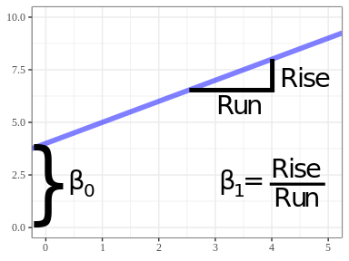

```{r setup, include=FALSE}
set.seed(1)
knitr::opts_chunk$set(echo       = TRUE, 
                      fig.height = 3, 
                      fig.width  = 6,
                      fig.align  = "center")
ggplot2::theme_set(ggplot2::theme_bw())
```

# Learning Objectives

- Simple Linear Regression

# Pattern: Two quantitative variables are associated.

- Before we get started, let's load the packages we'll need.
    ```{r, message=FALSE}
    library(Sleuth3)
    library(tidyverse)
    ```

- Example: The big-bang theory suggests a linear relationship between 
  the recession velocity of a stellar object and its distance from Earth,
  with a y-intercept of 0. Measurements of recession velocity and distance
  were made on 24 extra-galactic nebulae.
    ```{r}
    data("case0701")
    bang <- case0701
    glimpse(bang)
    ```
    
- Observational Units: The nebulae.

- Population: All nebulae.

- Sample: The 24 nebulae that the researches measured.

- Variables: recession velocity (quantitative) and distance (quantitative).
  
- Pattern: Use a scatterplot to see if there is an association.

    ```{r}
    ggplot(bang, aes(x = Velocity, y = Distance)) +
      geom_point()
    ```

- Line Review:

    \ 

- Model: $Y_i = \beta_0 + \beta_1 X_i + noise$, where
    - $Y_i$ is the distance of nebula $i$.
    - $X_i$ is the velocity of nebula $i$.
    - $\beta_0$ is the intercept of the mean line.
    - $\beta_1$ is the slope of the mean line.

- *Given* $X_i$, mean of $Y_i$ is $\beta_0 + \beta_1 X_i$. Points vary
   about this mean.
   
    \    

- Function: `lm()`.
