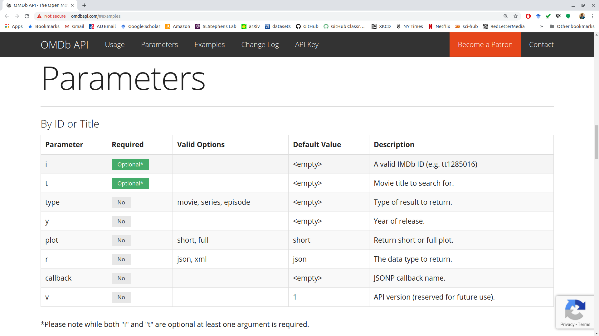

```{r setup, include=FALSE}
set.seed(1)
knitr::opts_chunk$set(echo       = TRUE, 
                      fig.height = 3, 
                      fig.width  = 6,
                      fig.align  = "center")
ggplot2::theme_set(ggplot2::theme_bw())
```

# Learning Objectives

- APIs and R.
- [Chapter 1, 2, and 3 from An Introduction to APIs](https://zapier.com/learn/apis/).
- [Chapter 40 from STAT 545](https://stat545.com/diy-web-data.html).
- [API Package Best Practices](https://httr.r-lib.org/articles/api-packages.html).
- [Rectangling](https://tidyr.tidyverse.org/articles/rectangle.html)

# Data on the Web

- There are at least 4 ways people download data on the web:
    1. Click to download a csv/xls/txt file.
    2. Use a package that interacts with an API.
    3. Use an API directly.
    4. Scrape from directly from the HTML file.
    
- We know how to do 1.

- This lesson is about doing 2 and 3.

- Let's load the tidyverse:
    
    ```{r, message = FALSE}
    library(tidyverse)
    ```

# R Package API Wrappers

- API: Application Programming Interface
    - A description of how you can request data
      from a particular software, and a description of what 
      type of response you get after the request.
    - Usually, the data you get back are [XML](https://en.wikipedia.org/wiki/XML) 
      or [JSON](https://en.wikipedia.org/wiki/JSON) files.
    - API's are an abstraction and can be implemented in many languages.
    - Think of it like a user interface for a computer program. You click a button and expect 
      the user interface to do something. An API let's a program click a metaphorical 
      "button" and expect to get something back.
    - There are lots of free and public APIs: <https://github.com/public-apis/public-apis>

- Many of the most popular databases/websites have an R package that 
  wraps the API through R functions. 
    - I.e.: You can use an R function to request data.
    
- If an R package exists for an API, you should use it.
    
- Examples:
    - tidycensus: U.S. Census data API. 
        
        <https://walkerke.github.io/tidycensus/>
        
    - twitteR: Twitter API.
    
        <http://geoffjentry.hexdump.org/twitteR.pdf>
        
    - gh: GitHub API.
    
        <https://github.com/r-lib/gh#readme>
        
    - wbstats: World Bank data.
    
        <https://cran.r-project.org/web/packages/wbstats/vignettes/Using_the_wbstats_package.html>

    - rebird: Ebird dataset for bird sitings.
    
        <https://cran.r-project.org/web/packages/rebird/vignettes/rebird_vignette.html>
        
    - geonames: Dataset containing unique names for geographic locations.
    
        <https://docs.ropensci.org/geonames/>
        
    - rplos: The PLoS journal articles.
    
        <https://cran.r-project.org/web/packages/rplos/vignettes/rplos_vignette.html>
        
    - WikipediR: Wikipedia API:
    
        <https://cran.r-project.org/web/packages/WikipediR/vignettes/WikipediR.html>
        
- Each package will be entirely unique, and you have to read its documentation
  to know how to download data. So we won't cover any of them.

- Example: The following will find all of the
  PLoS journal articles that contain the word "polyploid" in the abstract.
    ```{r, eval = FALSE}
    library(rplos)
    plout <- plosabstract("polyploid", limit = 1000)
    plout
    ```
  
# Use API's directly with httr

- The goal of this section is not to provide a comprehensive lesson on 
  HTTP and extracting data using API's. Rather, this is just to point you
  to some resources and give you some examples.
  
- Each API is different, and so you'll always have to figure out how to interact
  with a new API.

- API's always have documentation on what parameters you can send,
  how you can send them, and what data you would get back based on the 
  values of those parameters.
  
- E.g.: OMDB (an open-source version of IMDB) has a simple API <http://www.omdbapi.com/>

# Authentication

- Some API's are public and you just have at them (though, be congnizent that you are not making too many requests). 

- Others require authentication to access the API.

- There are three ways that apps authenticate: Using an API key, using "basic" authentication, and using OAuth.

## API keys
- In order to access an API, you usually have to obtain an API key. 

- To obtain a free key from OMDB and access it in R:
    1. Sign up for a free key: <https://www.omdbapi.com/apikey.aspx>
    2. Open up your .Renviron file using the usethis package.
        ```{r, eval = FALSE}
        library(usethis)
        edit_r_environ()
        ```
    3. Add the key OMDB sent you by email to the .Renviron package. You can
       call it `OMDB_API_KEY`, for example. In which case you would write
       the following in .Renviron:
       
        ```
        OMDB_API_KEY = <your-private-key>
        ```

        Where "`<your-private-key>`" is the private key OMDB sent you by email.
    4. Restart R.
    5. You can now always access your private key by
        ```{r}
        movie_key <- Sys.getenv("OMDB_API_KEY")
        ```

- It is important to never save or display your private key in a file you could share. 
  You are responsible for all behavior associated with your key. That is
  why we saved it to our .Renviron and are only accessing it secretly through
  `Sys.getenv()`.
  
- It is still not great that your key is in a plain text environment. You
  can add a layer of security by using the keyring package: <https://github.com/r-lib/keyring>
  
    ```{r, eval = FALSE}
    library(keyring)
    key_set("OMDB_API_KEY_SECURE") ## do this once to save the key
    movie_key_2 <- key_get("OMDB_API_KEY_SECURE") ## do this each time you need the key
    ```
    
    A person with access to your computer who knows R and the keyring package
    could still get to your key. But it is more secure than placing your
    key in a plain text file (which is what .Renviron is). There are
    more secure ways to access keys in R.
    
## Basic Authentication

- This is the easiest one.

- "Basic" authentication, where you just provide a username and password. The basic syntax for this is:
  
    ```{r, eval = FALSE}
    GET("url", authenticate("username", "password"))
    ```

- You should already have a username and password set up. Again, I would suggest keeping your password secure using your .Renviron file or via `{keyring}`.
  
## OAuth: 

- This is the hardest one.

- This section is based on <https://blog.r-hub.io/2021/01/25/oauth-2.0/>
  
- OAuth ("Open Autherization) generates a session-specific token that is used for subsequent requests in a single session.

- The idea is that your software asks the user if it can use the user's autherization to access the API. It does this each time it needs to access the API. This is commonly used in big API's, like that of Google, Twitter, or Facebook.

- Consider the [ORCID API](https://info.orcid.org/documentation/features/public-api/). Compare to <https://github.com/ropensci-archive/rorcid/blob/afa74daabf18499841e843a755b182c73ab545ea/R/auth.R#L106-L108>
  
# httr

- Most API's on the web use HTTP (Hyper-Text Transfer Protocol). It's a 
  language for querying and obtaining data.

- We won't learn HTTP, but we will use R's interface for HTTP through the
  httr package.
  
    ```{r}
    library(httr)
    ```

- The major function we will use is `GET()`, which fetches data.

- There are many other function in httr used to interact with API's.
    - E.g. `DELETE()` for deleting stuff at a target, `PUT()` for adding stuff to a target, etc..
    
- API's typically use the following to modify requests. 
  See <https://httr.r-lib.org/articles/api-packages.html#first-steps>
  
    1. URL path: the `path` argument in `GET()` or `modify_url()`.
    2. Query arguments: The `query` argument in `GET()` or `modify_url()`.
    3. HTTP headers: `add_headers()`

- Some API's only modify the URL path, some only modify the query, etc... Let's go through each of these in turn.

## URL Path

- Every API has a URL that you modify.

- Some API's only modify the URL *path* to obtain the endpoint.

- Consider the [Wizard World API](https://wizard-world-api.herokuapp.com/swagger/index.html)

- The documentation says that the base URL is "https://wizard-world-api.herokuapp.com".
    ```{r}
    baseurl <- "https://wizard-world-api.herokuapp.com"
    ```

- The documentation just says that we modify this URL to obtain the different objects. E.g., to obtain a list of all elixirs that occur in Harry Potter, we just add "/Elixirs" at the end. We can do this with a simple `paste0()` call.

    ```{r}
    eurl <- paste0(baseurl, "/Elixirs")
    ```

- We then just pass this URL to `GET()`.

    ```{r}
    eout <- GET(url = eurl)
    eout
    ```

- We would then clean this output (see rectangling below). But as a preview, we would do
    ```{r}
    tibble(elixir = content(eout)) |>
      unnest_wider(col = elixir)
    ```


## Queries

- Some APIs require you to modify the URL via *queries*. Queries occur after a question mark and are of the form
    ```
    http://www.url.com/?query1=arg1&query2=ar2&query3=arg3
    ```

- The [OMDB API](https://www.omdbapi.com/) requires you to provide queries. The documentation says 

    > Send all data requests to: http://www.omdbapi.com/?apikey=[yourkey]&
    
    But that documentation already has a query as a part of it (apikey=[yourkey]).
    
- You add queries via the `query` argument in `modify_url()`. The query argument should be a named list, where the names are the parameters that you get from the API documentation.

- The documentation has a table called "Parameters", where they list the possible queries.

- Let's fetch information on the film [The Lighthouse](https://en.wikipedia.org/wiki/The_Lighthouse_(2019_film)), obtaining a short plot in json format.

- This is what the URL looks like without my API key:
    ```{r}
    baseurl <- "http://www.omdbapi.com/"
    modify_url(url = baseurl, 
               query = list(t = "The Lighthouse",
                            plot = "short", 
                            r = "json"))
    ```

- Here is the GET call:
    ```{r}
    omdburl <- modify_url(url = baseurl, 
                          query = list(t = "The Lighthouse",
                                       plot = "short", 
                                       r = "json",
                                       apikey = movie_key))
    mout <- GET(url = omdburl)
    mout
    ```
  
- Output is just a list:
    ```{r}
    content(mout) |>
      str()
    ```

  
- In the API documentation:

    \ 
    
## Headers

- Headers supply additional options for the return type.

- Common headers are described by Wikipedia: <https://en.wikipedia.org/wiki/List_of_HTTP_header_fields>

- You supply headers in `GET()` via the `add_headers()`, which takes a named character vector as input.

- Consider the [icanhazdadjoke](https://icanhazdadjoke.com/api) API. One option is to include a header to specify plain text returns, rather than JSON returns.

    ```{r}
    dadout <- GET(url = "https://icanhazdadjoke.com/search", 
                  add_headers(Accept = "text/plain"))
    dadout
    ```
    
- This is different than a JSON output
    ```{r}
    GET(url = "https://icanhazdadjoke.com/search")
    ```
    
## Output:
    
- The *status code* describes whether your request was successful.
    - List of codes: <https://www.flickr.com/photos/girliemac/sets/72157628409467125>
    - Use `status_code()` to get the code for our request:
        ```{r}
        status_code(mout)
        ```
        
- *Headers* provide infromation on the request. Use the `headers()` function
  to see what headers we got in our request.
  
    ```{r, eval = FALSE}
    headers(mout)
    ```
  
- The *body* contains the data you are probably most interested in. Use
  `content()` to access the body:
  
    ```{r, eval = FALSE}
    content(mout)
    ```
  
- Background: The body comes in the form of either a JSON or XML data structure.
  `content()` will parse this into an R object (usually a list). You can see
  the raw JSON data structure here with the `as = "text"` argument:
  
    ```{r}
    content(mout, as = "text")
    ```

# Rectangling

- The format for the data you typically get from an API is a list of lists.

- The `repurrrsive` package contains a few examples.

    ```{r}
    library(repurrrsive)
    ```

- The dataset `gh_users` contains information from 6 users, obtained using GitHub's API: <https://developer.github.com/v3/users/#get-a-single-user>

    ```{r}
    data("gh_users")
    typeof(gh_users)
    length(gh_users)
    names(gh_users[[1]])
    ```

- There are a few functions from `tidyr` package that can be used to "unnest" a list into a data frame.

    - `unnest_wider()`: Each list element becomes its own column
    - `hoist()`: Similar as `unnest_wider()`, but you can choose what elements to extract to their own columns.
    - `unnest_longer()`: Each list element becomes its own row.

- Because this is the tidyverse, your list needs to be a column in a data frame:

    ```{r}
    df <- tibble(users = gh_users)
    df
    ```

- In which case, you can consider the unnest functions via:

    - `unnest_wider()` preserves the rows, but changes the columns.
    - `unnest_longer()` preserves the columns, but changes the rows
    
- Use `unnest_wider()` to make each of those list elements their own column.

    ```{r}
    unnest_wider(df, users)
    ```

- Graphic:

    ```{r, echo=FALSE}
    knitr::include_graphics(path = "./cartoons/unnest_wider.png")
    ```
    
- Use `hoist()` to only extract some elements of a list:

    ```{r}
    df2 <- hoist(df, users, 
                 login = "login",
                 follows = "follows")
    df2
    ```
    
- Notice that the new data frame still has a list column, but each each list now only has 28 elements instead of 30. That's because `hoist()` has removed the `login` and `follows` elements from each list in the list column.

    ```{r}
    df2$users[[1]]$login
    df2$users[[1]]$follows
    ```

- Graphic:

    ```{r, echo=FALSE}
    knitr::include_graphics(path = "./cartoons/hoist.png")
    ```

- Let's look at the list `gh_repos`, which was also obtained using the GitHub API: <https://developer.github.com/v3/repos/#list-user-repositories>

    ```{r}
    data("gh_repos")
    typeof(gh_repos)
    length(gh_repos)
    df <- tibble(repo = gh_repos)
    df
    ```

- This list is very complicated!

    ```{r, echo=FALSE, out.width="40%"}
    knitr::include_graphics(path = "./cartoons/github_repos.png")
    ```
    
- Ideally, each repo would be its own row (since the repositories are the observational units). We can do this with `unnest_longer()`.

    ```{r}
    df2 <- unnest_longer(df, repo)
    df2
    ```

- Graphic:

    ```{r, echo=FALSE, out.width="40%"}
    knitr::include_graphics(path = "./cartoons/unnest_longer.png")
    ```

- We can then use `unnest_wider()` or `hoist()` on this new data frame to get a tidy dataset.

    ```{r}
    df3 <- unnest_wider(df2, repo)
    df3
    ```

- Graphic:

    ```{r, echo=FALSE, out.width="20%"}
    knitr::include_graphics(path = "./cartoons/unnest_wider_2.png")
    ```

- **Exercise**: Clean up the `sw_people` list from the `repurrrsive` package:

    ```{r}
    library(repurrrsive)
    data("sw_people")
    ```
    
    ```{r, echo = FALSE, eval = FALSE}
    tibble(people = sw_people) %>%
      unnest_wider(people)
    ```
  
- **Exercise**: Clean up the `got_chars` list from the `repurrrsive` package

    ```{r}
    library(repurrrsive)
    data("got_chars")
    ```
    
    ```{r, echo = FALSE, eval = FALSE}
    tibble(chars = got_chars) %>%
      unnest_wider(chars)
    ```

# NASA Exercise

Consider the [NASA API](https://api.nasa.gov/)

1. Generate an API key and save it as `NASA_API_KEY` in your R environment file.

2. Read about the APOD API and obtain all images from January of 2022. Your response should look like this:

    ```{r, echo = FALSE, eval = TRUE}
    nasa_key <- Sys.getenv("NASA_API_KEY")
    nasa_url <- modify_url(url = "https://api.nasa.gov/planetary/apod", 
                           query = list(start_date = "2022-01-01",
                                        end_date = "2022-01-31",
                                        api_key = nasa_key))
    nout <- GET(url = nasa_url)
    nout
    ```
    
3. Clean the output into a data frame, like this:

    ```{r, echo = FALSE, eval = TRUE}
    tibble(img = content(nout)) %>%
      unnest_wider(img)
    ```


    
    
    
