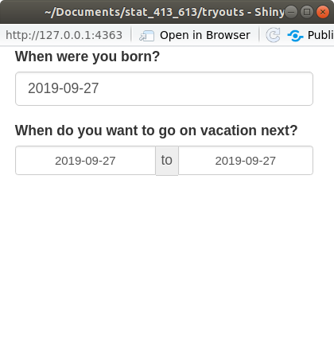
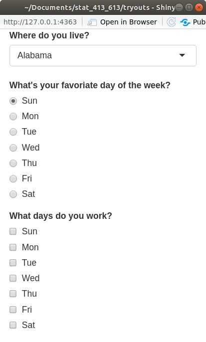
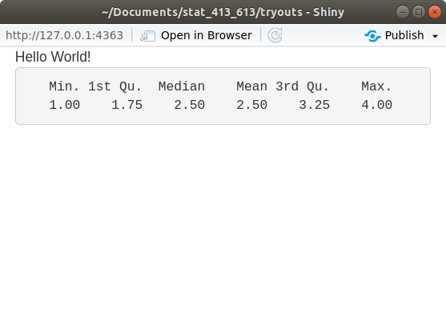

```{r setup, include=FALSE}
set.seed(1)
knitr::opts_chunk$set(echo       = TRUE, 
                      fig.height = 3, 
                      fig.width  = 6,
                      fig.align  = "center")
ggplot2::theme_set(ggplot2::theme_bw())
```

```{r klippy, echo=FALSE, include=TRUE}
klippy::klippy()
```

# Learning Objectives

- Learn the basics of Shiny Apps.
- Chapters 1 through 3 of [Mastering Shiny](https://mastering-shiny.org/).
    - Most content discretely stolen from Hadley's book.
- [Shiny Cheatsheet](https://github.com/rstudio/cheatsheets/blob/master/shiny.pdf).
- Optional Resources
  - [Shiny Tutorial](https://stat545.com/shiny00_index.html).
  - [Shiny Video, Part 1](https://vimeo.com/rstudioinc/review/131218530/212d8a5a7a/#t=0m0s)
  - [Shiny Examples](https://github.com/rstudio/shiny-examples).

# Motivation

- As a data scientist, you will collaborate with researchers / managers / 
  customers who do not know R.
  
- You either want them to explore the data themselves, or you want
  to interactively explore the data together.
  
- Shiny lets you build an app that will run R using a graphical user interface.
  You write shiny apps in R.
  
    \ 

- Folks showcase some pretty sophisticated interactive data visualizations:
  <https://shiny.rstudio.com/gallery/>.

- If you get really good at Shiny, you can make sophisticated websites with it: 
  <http://letsrun.com/shoes>.

- This can all be accomplished *without learning HTML, CSS, or JavaScript*.


# Format of a Shiny App.

- All code for shiny apps lives in a file called "app.R".

- The format of every app.R file looks like this:

    ```{r, eval = FALSE}
    library(shiny)
    
    # Define UI for application
    ui <- fluidPage(
        ## Stuff for defining user-interface
        ## e.g. Title,
        ##      Table of contents
        ##      Location of inputs (sliders and buttons)
    )
    
    # Define server logic
    server <- function(input, output) {
        ## Stuff for running R code
        ## e.g. Run a linear model.
        ##      Manipulate a data frame
        ##      Make a plot.
    }
    
    # Run the application
    shinyApp(ui = ui, server = server)
    ```

- The elements of this file are:
  1. We first load the shiny library.
  2. Then we define the user interface using the `fluidPage()` function. We 
     save the output of this function to some variable (called `ui` above).
      - The user interface defines things like page layout (title, headers,
        table of contents), and sources of input (number sliders and buttons)
  3. Then we define the server function which will run R code using the input
     you obtain from the user interface.
      - This is just regular R code wrapped in some special Shiny functions. 
        You can manipulate data frames, fit statistical models, or make plots.
  4. Finally, we call the `shinyApp()` function, telling it what objects we
     defined as the user interface and the server function.
     
# Your First Shiny App

- You can create a basic Shiny app by clicking "Shiny Web App...":

  \ 

- A prompt will begin asking for the application name. The name needs to
  follow the conventions of variable naming and will create a new
  directory in the directory that you specify. Let's call our shiny app
  "my_first_app".
  
  \ 
  
- R Studio provides a nice template which should look like this:

    ```{r, eval = FALSE}
    #
    # This is a Shiny web application. You can run the application by clicking
    # the 'Run App' button above.
    #
    # Find out more about building applications with Shiny here:
    #
    #    http://shiny.rstudio.com/
    #
    
    library(shiny)
    
    # Define UI for application that draws a histogram
    ui <- fluidPage(
    
        # Application title
        titlePanel("Old Faithful Geyser Data"),
    
        # Sidebar with a slider input for number of bins 
        sidebarLayout(
            sidebarPanel(
                sliderInput("bins",
                            "Number of bins:",
                            min = 1,
                            max = 50,
                            value = 30)
            ),
    
            # Show a plot of the generated distribution
            mainPanel(
               plotOutput("distPlot")
            )
        )
    )
    
    # Define server logic required to draw a histogram
    server <- function(input, output) {
    
        output$distPlot <- renderPlot({
            # generate bins based on input$bins from ui.R
            x    <- faithful[, 2]
            bins <- seq(min(x), max(x), length.out = input$bins + 1)
    
            # draw the histogram with the specified number of bins
            hist(x, breaks = bins, col = 'darkgray', border = 'white')
        })
    }
    
    # Run the application 
    shinyApp(ui = ui, server = server)
    ```

- With this app.R file open, click on "Run App" at the top right of your 
  text panel.
  
- Notice that your console is busy. You cannot run R code in the console
  while the Shiny App is running.
  
- It should say something like "`Listening on http://127.0.0.1:4489`", but
  the url will be different. You can put that URL into your web browser
  and see the running Shiny App.
    - Don't worry, it's still on your computer. The URL just points to 
      a location on your machine.
      
- Exit out of the Shiny App by
  1. Clicking the stop sign on your console.
  2. Hitting CTRL + C while you are in the console.
  3. Closing the Shiny App window.
  
# Input UI Elements

- In this section we'll describe how to format the user interface. This i
  is the stuff that goes within the `fluidPage()` call.
  
- To do this, start up a new app called "`tryouts`" and make it 
  bare-bones:
    ```{r, eval = FALSE}
    library(shiny)
    
    ui <- fluidPage(
      
    )
    
    server <- function(input, output, session) {
      
    }
    
    shinyApp(ui, server)
    ```  

- The above code "snippet" will we be populated if you start typing "shinyapp"
  in R Studio and select it from the auto-complete list.
    
- I would recommend using the above as a template for all future Shiny apps.
  It is the minimal amount of coded needed to start a Shiny app.
    
- Running this app should just produce a blank HTML page.

- You place function calls within `fluidPage()`, with each call separated
  by a comma.
  
- The most basic arguments are calls for input functions, such as
  `sliderInput()`, `selectInput()`, `textInput()`, and `numericInput()`.

- Each of these input calls take at least three arguments:
    - `inputID`: The name of the input. The `server()` function will
      access user inputs through `inputID`, so it needs to follow
      the conventions of variable naming.
    - `label`: The name displayed on the web-app to the user.
    - `value`: A default input.

- Each input function will also take many more arguments specific to that
  type of input.
  
## Text Inputs

- Use `textInput()` to collect one line of text.

- Use `passwordInput()` to collect one line of text which is not 
  displayed on the screen as it is entered. \
    - **NOTE**: This is not a secure way to collect passwords by itself.
    
- Use`textAreaInput()` to collect multiple lines of text.
  
- Add this element to your `tryouts` app:
  
    ```{r, eval = FALSE}
    library(shiny)    
    
    ui <- fluidPage(
      textInput("name", "What's your name?"),
      passwordInput("password", "What's your password?"),
      textAreaInput("story", "Tell me about yourself")
    )
    
    server <- function(input, output) {
    
    }
    
    shinyApp(ui = ui, server = server)
    ```
    
- Running the app, you should get something like this:

    
  
- Later on, we'll demonstrate how to access these inputs in the `server()` 
  function.
  
- **Exercise**: Change the `width` and `height` arguments in `textAreaInput()`.
  What does it do?

    ```{block, eval = FALSE, echo = FALSE}
    It changes the default width and height of the text box.
    ```

- **Exercise**: Change the `value` argument in `textInput()`. What does it do?

    ```{block, eval = FALSE, echo = FALSE}
    It changes the default text in the text box.
    ```


## Numeric Inputs

- Use `numericInput()` to create a text box that only accepts numeric values.

- Use `sliderInput()` to create a number slider. 
    - Giving the `value` argument one number will result in a one-sided slider.
    - Giving the `value` argument a vector of two numbers will result in
      a two-sided slider.
      
    ```{r, eval = FALSE}
    library(shiny)
    
    ui <- fluidPage(
      numericInput("num", "Number one", value = 0, min = 0, max = 100),
      sliderInput("num2", "Number two", value = 50, min = 0, max = 100),
      sliderInput("rng", "Range", value = c(10, 20), min = 0, max = 100)
    )
    
    server <- function(input, output) {
    
    }
    
    shinyApp(ui = ui, server = server)
    ```
      
- Running the app, you should get something like this:

      
  
- Only use sliders for small ranges where the exact number is not important.

- **Exercise**: What does the `animate` option do when you set it to `TRUE`?

    ```{block, eval = FALSE, echo = FALSE}
    If you push play, the slider slowly slides up until it reaches the
    maximum value.
    ```

- You can see more on sliders at <https://shiny.rstudio.com/articles/sliders.html>.


## Date Inputs

- Use `dateInput()` to collect a single date.

- Use `dateRangeInput()` to collect two dates.

    ```{r, eval = FALSE}
    library(shiny)
    
    ui <- fluidPage(
      dateInput("dob", "When were you born?"),
      dateRangeInput("holiday", "When do you want to go on vacation next?")
    )
    
    server <- function(input, output) {
    
    }
    
    shinyApp(ui = ui, server = server)
    ```
    
- Running the app, you should get something like this:

      
    
- **Exercise**: In `dateInput()`, try to disable the selection of Sundays,
  Mondays, Fridays, and Saturdays.
  
    ```{r, eval = FALSE, echo = FALSE}
    dateInput("dob", "When were you born?", daysofweekdisabled = c(0, 1, 5, 6))
    ```
  

## Multiple Choice

- Use `selectInput()` to provide the user with a drop-down menu.

- Use `radioButtons()` to have a multiple choice button selection where only
  selection is possible.
  
- Use `checkboxGroupInput()` to have a multiple choice button selection where
  multiple selections are possible.
  
    ```{r, eval = FALSE}
    library(shiny)
    
    weekdays <- c("Sun", "Mon", "Tue", "Wed", "Thu", "Fri", "Sat")
    ui <- fluidPage(
      selectInput("state", "Where do you live?", choices = state.name),
      radioButtons("weekday", "What's your favorite day of the week?", choices = weekdays),
      checkboxGroupInput("weekday2", "What days do you work?", choices = weekdays)
    )
    
    server <- function(input, output) {
    
    }
    
    shinyApp(ui = ui, server = server)
    ```
 
- Running the app, you should get something like this:

       
    
- **Exercise**: What does `multiple = TRUE` do in in `selectInput()`?

    ```{block, eval = FALSE, echo = FALSE}
    It allows for multiple inputs.
    ```

## Columns of a Data Frame

- For a data frame already in R, use `varSelectInput()` for a user to select
  a column.
  
    ```{r, eval = FALSE}
    library(shiny)
    
    ui <- fluidPage(
      varSelectInput("carcol", "Which Column?", data = mtcars)
    )
    
    server <- function(input, output) {
    
    }
    
    shinyApp(ui = ui, server = server)
    ```

- Running the app, you should get something like this:

       
    
- **Exercise**: What does the `selected` argument do? Change it.

    ```{block, eval = FALSE, echo = FALSE}
    It changes the default column.
    ```
    ```{r, echo = FALSE, eval = FALSE}
    varSelectInput("carcol", "Which Column?", data = mtcars, selected = "disp")
    ```
    
    
### Using `varSelectInput()`

- `varSelectInput()` gives the server access to a 
  `name` object, which we haven't encountered before.
  
- You can read about it using `help(name)`.

- The biggest impact on you is that to use it in the tidyverse, you need
  to prefex the input with `!!`. We'll do an example of this in the
  "Putting Inputs and Outputs Together" section.

## Binary Inputs

- Use `checkboxInput()` to get a `TRUE`/`FALSE` or Yes/No answer.

    ```{r, eval = FALSE}
    library(shiny)
    
    ui <- fluidPage(
      checkboxInput("startrek", "Like Star Trek?")
    )
    
    server <- function(input, output) {
    
    }
    
    shinyApp(ui = ui, server = server)
    ```

- Running the app, you should get something like this:

       

- **Exercise**: What are the possible values for the `value` argument? Change it.

    ```{block, eval = FALSE, echo = TRUE}
    It can be either `TRUE` (so the box is checked) or `FALSE`
    (so the box is unchecked).
    ```
    
    ```{r, echo = FALSE, eval = FALSE}
    checkboxInput("startrek", "Like Star Trek?", value = TRUE)
    ```

## File Inputs

- Use `fileInput()` to have a user input a file name.

- Running the app, you should get something like this:

     

- **Exercise**: What does the `buttonLabel` argument do? Change it.

    ```{block, eval = FALSE, echo = FALSE}
    It changes the name on the button from "Browse".
    ```
    
    ```{r, eval = FALSE, echo = FALSE}
    fileInput("upload_file", "Please Select a File", buttonLabel = "Look Up")
    ```

## Action Buttons

- Use `actionButton()` to create a clickable button, or `actionLink()` to
  create a clickable link.
  
    ```{r, eval = FALSE}
    library(shiny)
    
    ui <- fluidPage(
      actionButton("click", "Click me!"),
      actionLink("Link", "No, click me!")
    )
    
    server <- function(input, output) {
    
    }
    
    shinyApp(ui = ui, server = server)
    ```
  
- Running the app, you should get something like this:

     


# Output UI Elements

- Output functions are placeholders for things created in the `server()` 
  function (like plots and tables).
  
- Each output function has a label as its first argument. The `server()`
  can access this element as an element of the `output` list. 
    - For example, if the label is `"plot"`, then the server function can
      insert a plot into `output$plot`.
      
- Each output function in the UI is associated with a *render* function in the 
  `servor()`.
    - A render function basically creates HTML code given an expression.
    - An expression is just R code surrounded by curly braces `{}`.
  
## Text Output

- Use `textOutput()` to display text.
  
- Use `verbatimTextOutput()` to display code.

- You create text in the `server()` function by either `renderText()` or
  `renderPrint()`.

- `renderText()` will display text *returned* by code. Functions can only return
  one thing.
  
- `renderPrint()` will display text *printed* by code. Functions can print 
  multiple things.


    ```{r, eval = FALSE}
    library(shiny)
    
    ui <- fluidPage(
      textOutput("text"),
      verbatimTextOutput("code")
    )
    
    server <- function(input, output, session) {
      output$text <- renderText({
        "Hello World!"
      })
    
      output$code <- renderPrint({
        summary(c(1, 2, 3, 4))
      })
    }
    
    shinyApp(ui = ui, server = server)
    ```

- Running the app, you should get something like this:

     

- **Exercise**: Change the label from "text" to something else. Make sure
  the Shiny App still works.
  
## Output Tables

- Use `tableOutput()` to print an entire table created 
  in the server by `renderTable()`.
    - Should only be used for small tables.
        
    ```{r, eval = FALSE}
    library(shiny)
    
    ui <- fluidPage(
      tableOutput("static")
    )
    
    server <- function(input, output, session) {
      output$static <- renderTable({
        head(mtcars)
        })
    }
    
    shinyApp(ui = ui, server = server)
    ```

- Running the app, you should get something like this:

     
    
    
- Use `dataTableOutput()` to output a dynamic table created 
  in the server by `renderDataTable()`.
  
    ```{r, eval = FALSE}
    library(shiny)
    
    ui <- fluidPage(
      dataTableOutput("dynamic")
    )
    
    server <- function(input, output, session) {
      output$dynamic <- renderDataTable({
        mtcars
        })
    }
    
    shinyApp(ui = ui, server = server)
    ```
  
- Running the app, you should get something like this:

     
    
- You can change the appearance of `dataTableOutput()` by passing arguments
  as a list to the `options` argument in `renderDataTable()`.
    - You can find these options at: <https://datatables.net/reference/option/>
    ```{r, eval = FALSE}
    renderDataTable({ mtcars }, options = list(pageLength = 5))
    ```

## Output Plots

- Use `plotOutput()` to output plots created by `renderPlot()` in the
  `server()` function.
  
    ```{r, eval = FALSE}
    library(shiny)
    library(ggplot2)
    
    ui <- fluidPage(
      plotOutput("plot")
    )
    
    server <- function(input, output, session) {
      output$plot <- renderPlot({
        ggplot(mpg, aes(x = displ, y = hwy)) +
          geom_point() +
          theme_bw() +
          xlab("Displacement") +
          ylab("Highway MPG")
        })
    }
    
    shinyApp(ui = ui, server = server)
    ```
  
- Running the app, you should get something like this:

     

- **Exercise**: Change the height and width of the plot by changing the
  argument values in `renderPlot()`.

- **Exercise**: Change the height and width of the plot by changing the
  argument values in `plotOutput()`.


# Putting Inputs and Outputs Together

- Let's build a very simple shiny app that let's the user choose
  two variables from `mtcars` and then plots them.
      
    ```{r, eval = FALSE, echo = TRUE}
    library(shiny)
    library(ggplot2)
    
    ui <- fluidPage(
        varSelectInput("var1", "Variable 1", data = mtcars),
        varSelectInput("var2", "Variable 2", data = mtcars),
        plotOutput("plot")
    )
    
    server <- function(input, output) {
        output$plot <- renderPlot({
            ggplot(mtcars, aes(x = !!input$var1, y = !!input$var2)) +
                geom_point()
        })
    }
    
    shinyApp(ui = ui, server = server)
    ```
  
- Running the app, you should get something like this:

     
    
- In the `server()` function, notice that we accessed the inputs via
  the `input` variable.
    - These inputs must be used *inside* a render function in order to 
      obtain reactivity.
  
- In the `server()` function, notice that we set the outputs to the `output()`
  variable.
  
- Notice that I used `!!` in front of `input$var1` and `input$var2`. This
  is called the "bang-bang operator" and you have
  to do this to use variable names in the tidyverse (ggplot, dplyr, tidyr, etc).

- The `!!` is only necessary if you are requesting the names of variables 
  in a data frame in the tidyverse.
  
- **Exercise**: Let the user choose whether they want red points or blue points.

    ```{r, eval = FALSE, echo = FALSE}
    library(shiny)
    library(ggplot2)
    
    ui <- fluidPage(
        varSelectInput("var1", "Variable 1", data = mtcars),
        varSelectInput("var2", "Variable 2", data = mtcars),
        radioButtons("color", "What Color?",
                     choiceNames = c("Red", "Blue"),
                     choiceValues = c("red", "blue")),
        plotOutput("plot")
    )
    
    server <- function(input, output) {
        output$plot <- renderPlot({
            ggplot(mtcars, aes(x = !!input$var1, y = !!input$var2)) +
                geom_point(color = input$color)
        })
    }
    
    shinyApp(ui = ui, server = server)
    ```
    
## Alternative pipeline to `!!`

- This content is from Chapter 11 of [Mastering Shiny](https://mastering-shiny.org/).

- If you use `varSelectInput()`, you need to use `!!`.

- But you can use `selectInput()` for variable selection, in which case you
  can use the `.data` object.
  
    ```{r, eval = FALSE, echo = TRUE}
    library(shiny)
    library(ggplot2)
    
    ui <- fluidPage(
        selectInput("var1", "Variable 1", choices = names(mtcars)),
        selectInput("var2", "Variable 2", choices = names(mtcars)),
        plotOutput("plot")
    )
    
    server <- function(input, output) {
        output$plot <- renderPlot({
            ggplot(mtcars, aes(x = .data[[input$var1]], y = .data[[input$var2]])) +
                geom_point()
        })
    }
    
    shinyApp(ui = ui, server = server)
    ```

- Compare UI:
  - Way 1: `varSelectInput("var1", "Variable 1", data = mtcars)`
  - Way 2: `selectInput("var1", "Variable 1", choices = names(mtcars))`
- Compare Server:
  - Way 1: `x = !!input$var1`
  - Way 2: `x = .data[[input$var1]]`

