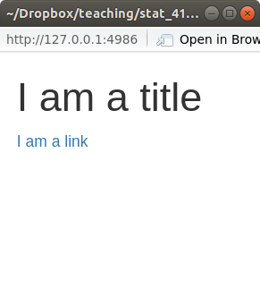
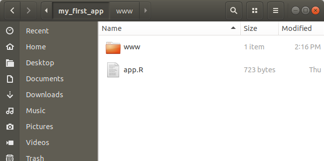
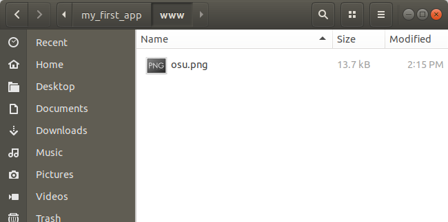

```{r setup, include=FALSE}
set.seed(1)
knitr::opts_chunk$set(echo       = TRUE, 
                      fig.height = 3, 
                      fig.width  = 6,
                      fig.align  = "center")
ggplot2::theme_set(ggplot2::theme_bw())
```

```{r klippy, echo=FALSE, include=TRUE}
klippy::klippy()
```

# Learning Objectives

- Edit style of Shiny App with HTML elements.
- Chapter 13 of [Mastering Shiny](https://mastering-shiny.org/).
- [Shiny Cheatsheet](https://github.com/rstudio/cheatsheets/blob/master/shiny.pdf).
- Optional Resources
  - [Shiny Tutorial](https://stat545.com/shiny00_index.html).
  - [Shiny Examples](https://github.com/rstudio/shiny-examples).

# HTML

- HTML (Hypertext Markup Language) is a coding language like markdown used
  to style web documents.
  
- When you look at a webpage, that is a browser interpreting HTML code.

- The user interface in all Shiny Apps is basically just a way to write
  HTML code using R.
  
    ```{r}
    library(shiny)
    ui <- fluidPage(
        titlePanel("Hello"),
        textInput("text", "What Text?")
    )
    ui
    ```
  
- Elements surounded by "`<>`" are called HTML "tags". For example:
  - `<strong>...</strong>`: Makes text bold.
  
    ```html
    <strong>Sesquipedalian</strong>
    ```
    
    > <strong>Sesquipedalian</strong>
  
  - `<u>...</u>`: Makes text underlined.
  
    ```html
    <u>Sesquipedalian</u>
    ```
    
     > <u>Sesquipedalian</u>
  
  
  - `<s>...</s>`: Makes text strikeout.
  
    ```html
    <s>Sesquipedalian</s>
    ```
    
     > <s>Sesquipedalian</s>
  
  
  - `<code>...</code>`: Makes text monospaced.
  
    ```html
    <code>Sesquipedalian</code>
    ```
    
     > <code>Sesquipedalian</code>
  
  
  - `<h1>...</h1>`, `<h2>...</h2>`, `<h3>...</h3>`: Creates headings, 
    subheadings, subsubheadings.
  
    ```html
    <h3>Sesquipedalian</h3>
    ```
    
     > <h3>Sesquipedalian</h3>
  
  
  - `<p>...</p>`: Makes paragraphs.
  
    ```html
    <strong>Sesquipedalian</strong>
    ```
    
     > <p>Sesquipedalian</p>
  
  - The following creates an itemized list:
    ``` html
    <ul>
    <li>Item 1</li>
    <li>Item 2</li>
    </ul>
    ```
    
    > <ul>
    > <li>Item 1</li>
    > <li>Item 2</li>
    > </ul>
    
  - `<br></br>`: Inserts a line break.

    ``` html
    Some text
    <br></br>
    More text
    ```
    
    > Some text
    > <br></br>
    > More text


  - `<hr></hr>`: Inserts a horizontal "rule" (line).
  
    ``` html
    <hr></hr>
    ```
    
    > <hr></hr>
  
  - `</img>`: Inserts images (see below).
    
  - `<a>...</a>`: The "anchor" tag. Creates hyperlinks (see below).

  - Tag arguments are called "attributes" and are placed after the tag name
    in the first `<>`. For example, for hyperlinks you need to give it the
    URL with the `href` attribute:
  
    ``` html
    <a href="https://www.youtube.com/watch?v=dQw4w9WgXcQ">Click Me!</a>
    ```
    
    > <a href="https://www.youtube.com/watch?v=dQw4w9WgXcQ">Click Me!</a>

- Another example with images:

    ``` html
    
    </img>
    ```
    
    
    </img>

  
# HTML in R

- When you load the `shiny` library, it will load a list of functions called
  `tags`.
  
- Each function in `tags` is an HTML tag. For example, to create an anchor
  tag use:
  
    ```{r, eval = FALSE}
    tags$a("Click Me!", href = "https://www.youtube.com/watch?v=dQw4w9WgXcQ")
    ```
    ```{r, eval = TRUE, echo = FALSE, comment = ""}
    writeLines(as.character(tags$a("Click Me!", href = "https://www.youtube.com/watch?v=dQw4w9WgXcQ")))
    ```
    
    > <a href="https://www.youtube.com/watch?v=dQw4w9WgXcQ">Click Me!</a>
    
- Any *named* argument becomes an HTML attribute.

- Any *unnamed* argument is placed between the tags.

- You can put tags inside tags.

    ```{r, eval = FALSE}
    tags$a(tags$h1("Click Me!"), "Now!",
           href = "https://www.youtube.com/watch?v=dQw4w9WgXcQ")
    ```
    ```{r, eval = TRUE, echo = FALSE, comment = ""}
    writeLines(as.character(tags$a(tags$h1("Click Me!"), "Now!", 
                                   href = "https://www.youtube.com/watch?v=dQw4w9WgXcQ")))
    ```
    
    > <a href="https://www.youtube.com/watch?v=dQw4w9WgXcQ">
    >    <h1>Click Me!</h1>
    >    Now!
    > </a>


- **Exercise**: Create an itemized list using function elements from `tags`.

    ```{r, eval = FALSE, echo = FALSE}
    tags$ul(
      tags$li("Item1"),
      tags$li("Item2")
    )
    ```

# Using HTML in a Shiny App

- Just put these HTML elements inside the `fluidPage()` call.

    ```{r, eval = FALSE}
    library(shiny)
    
    ui <- fluidPage(
      tags$h1("I am a title"),
      tags$a("I am a link", href = "https://www.youtube.com/watch?v=dQw4w9WgXcQ")
    )
    
    server <- function(input, output, session) {
      
    }
    
    shinyApp(ui, server)
    ```

    \ 
    
- **Exercise**: Use the `img` tag to insert the Ohio State logo into a
  Shiny App. The url can be found here: 

    <https://upload.wikimedia.org/wikipedia/commons/c/c1/Ohio_State_Buckeyes_logo.svg>
    
    ```{r, eval = FALSE, echo = FALSE}
        library(shiny)
        
        ui <- fluidPage(
          tags$img(src = "https://upload.wikimedia.org/wikipedia/commons/c/c1/Ohio_State_Buckeyes_logo.svg")
        )
        
        server <- function(input, output, session) {
          
        }
        
        shinyApp(ui, server)
    ```

- To add an image not from a webpage, add a "www" folder inside your Shiny app.
  Add all images into that folder. Reference to those images *by name only* 
  (not by the path) in the `img` tag.
  
    \ 
    
    \ 
  
    ```{r, eval = FALSE}
    library(shiny)
    
    ui <- fluidPage(
      tags$img(src = "osu.png")
    )
    
    server <- function(input, output, session) {
    
    }
    
    shinyApp(ui, server)
    ```
    
    \ 
  
    
    
    
  
