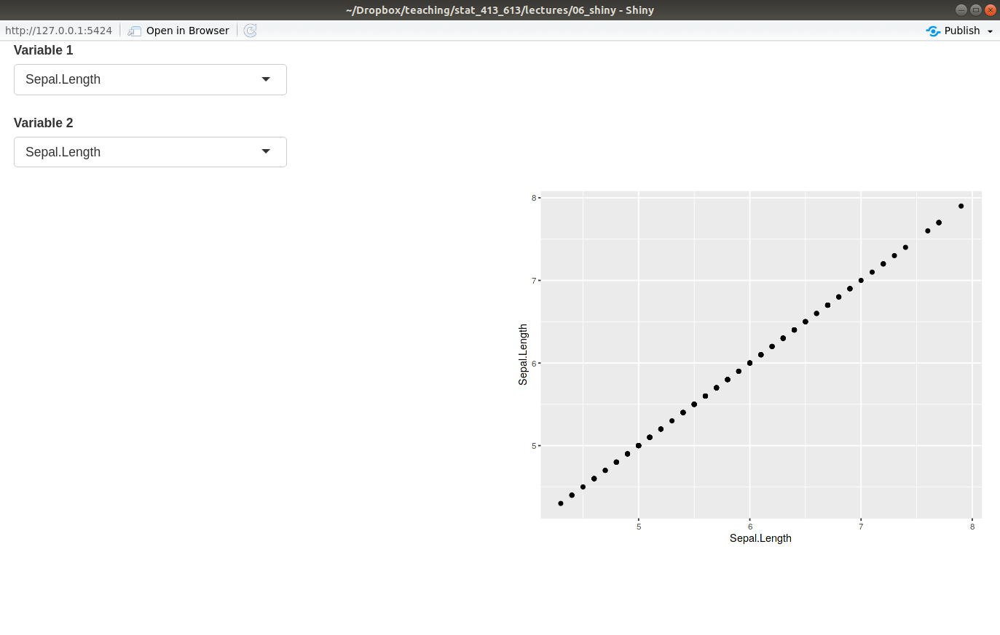
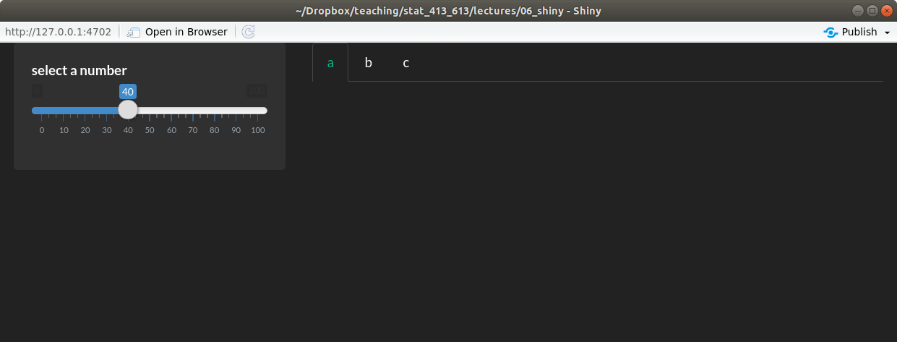

```{r setup, include=FALSE}
set.seed(1)
knitr::opts_chunk$set(echo       = TRUE, 
                      fig.height = 3, 
                      fig.width  = 6,
                      fig.align  = "center")
ggplot2::theme_set(ggplot2::theme_bw())
```

```{r klippy, echo=FALSE, include=TRUE}
klippy::klippy()
```

# Learning Objectives

- Learn the basics layouts.
- [Application Layout Guide](http://shiny.rstudio.com/articles/layout-guide.html).
- [Shiny Cheatsheet](https://github.com/rstudio/cheatsheets/blob/master/shiny.pdf).
- Optional Resources
  - [Shiny Tutorial](https://stat545.com/shiny00_index.html).
  - [Shiny Video, Part 3](https://vimeo.com/rstudioinc/review/131218530/212d8a5a7a/#t=1h32m41s).
  - [Shiny Examples](https://github.com/rstudio/shiny-examples).

# Motivation

- Let's start with a blank Shiny app

    ```{r, eval = FALSE}
    library(shiny)
    
    ui <- fluidPage(
    
    )
    
    server <- function(input, output) {
    
    }
    
    shinyApp(ui = ui, server = server)
    ```

- You learned in [The Basics of Shiny Apps](https://data-science-master.github.io/lectures/06_shiny/06_basic_shiny.html)
  how to add input and output elements to the user interface of an app.
  
- But the way we added elements was ugly.

    ```{r, eval = FALSE}
    library(shiny)
    library(ggplot2)
    
    ui <- fluidPage(
        varSelectInput("var", "Which Variable?", data = mtcars),
        plotOutput("plot")
    )

    server <- function(input, output) {
        output$plot <- renderPlot({
            ggplot(mtcars, aes(x = !!input$var)) +
                geom_histogram(bins = 20)
        })
    }
    
    shinyApp(ui = ui, server = server)
    ```

    \ 
    
- Today, we will learn how to make your layout more sophisticated than
  a list of items.
  
# Basic Layouts

- The most basic layouts are created by adding arguments to the 
  `fluidPage()` function.
    - You add arguments to `fluidPage()` to specify the layout of your app.

- We'll also talk about grid layouts later, but to see more advanced layouts try out:
    - `navbarPage()`.
    - `dashboardPage()`: <https://rstudio.github.io/shinydashboard/>
  
## Title Panel

- Add a title to your app using the `titlePanel()` function.

    ```{r, eval = FALSE}
    library(shiny)
    
    ui <- fluidPage(
        titlePanel("My First Title")
    )
    
    server <- function(input, output) {
    
    }
    
    shinyApp(ui = ui, server = server)
    ```

- Running the app, you should get something like this:

    \   

## Sidebar Layout

- The most basic layout is to have inputs in a left column and outputs in 
  a right column. You use `sidebarLayout()` to specify that you want
  this structure.
  
- *Inside* `sidebarLayout()`, you define the left column inputs 
  via `sidebarPanel()` and the right column outputs via `mainPanel()`.
  
- Let's create an app that plots random normal draws:

    ```{r, eval = FALSE}
    library(shiny)
    library(ggplot2)
    
    ui <- fluidPage(
      titlePanel("Random Normal Histogram"),
      sidebarLayout(
        sidebarPanel(
          sliderInput("nobs", "Number of Observations", min = 1, max = 500, value = 100)
        ),
        mainPanel(
          plotOutput("hist")
        )
      )
    )

    server <- function(input, output) {
      output$hist <- renderPlot({
        rout <- data.frame(x = rnorm(n = input$nobs))
        ggplot(rout, aes(x = x)) +
          geom_histogram(bins = 30) +
          theme_bw()
      })
    }
    
    shinyApp(ui = ui, server = server)
    ```

- Running the app, you should get something like this:

    \ 
    
- `sidebarPanel()`:
    - An argument of `sidebarLayout()`.
    - Takes as input an input element (such as `sliderInput()`, `textInput()`, etc).
    - You can include multiple input elements by separating them by a comma.

- `mainPanel()`:
    - An argument of `sidebarLayout()`.
    - Takes as input an output element (such as `plotOutput()`, `textOutput()`, etc).
    - You can include multiple output elements by separating them by a comma.
    
- Hadley's Graphic:

    \ 
    
- If you put input elements in `mainPanel()` and output elements in
  `sidebarPanel()`, then the app won't die (but it won't look as nice).
  
- **Exercise**: Create a Shiny app with the sidebar layout. The inputs
  should be the number of bins, the plot title, and which variable to plot
  from `mtcars`. The output should be a histogram. Add a nice shiny app
  title.
    ```{r, eval = FALSE, echo = FALSE}
    library(shiny)
    library(ggplot2)
    
    ui <- fluidPage(
      titlePanel("Histograms of mtcars Variables"),
      sidebarLayout(
        sidebarPanel(
          textInput("title", "What should the title be?", value = "Title"),
          sliderInput("bins", "How many bins?", min = 1, max = 50, value = 25),
          varSelectInput("var", "Which variable?", data = mtcars)
        ),
        mainPanel(
          plotOutput("plot")
        )
      )
    )

    server <- function(input, output) {
      output$plot <- renderPlot({
        ggplot(mtcars, aes(x = !!input$var)) +
          geom_histogram(bins = input$bins) +
          ggtitle(input$title) +
          theme_bw()
      })
    }
    
    shinyApp(ui = ui, server = server)
    ```
    
    Your final Shiny App should look like this:
    
    \     
    
    
## Grid Layout

- To create a general layout, use the `fluidRow()` and `column()` functions.

- `fluidRow()` 
    - Creates a new row of panels.
    - Takes `column()` calls as input.
    - You place as many `column()` calls as you want columns.
    - It can have a title.
    
- `column()`
    - Used as an argument in `fluidRow()`.
    - The first argument should be a number between 1 and 12 (the `width`).
    - All `column()` calls should have `width`s that sum to 12.
    - The rest of the arguments are input/output elements to include in that
      column.
    
- Hadley's Graphic:

    \ 
    
    
- Let's make a shiny app with two input columns in one row, and three plot
  columns in a second row.
    ```{r, eval = FALSE}
    library(shiny)
    library(ggplot2)
    
    ui <- fluidPage(
      fluidRow(title = "Inputs",
               column(6,
                      varSelectInput("var1", "Variable 1", data = mtcars),
                      varSelectInput("var2", "Variable 2", data = mtcars)
               ),
               column(6,
                      sliderInput("bins", "Number of Bins", min = 1, max = 50, value = 20)
               )
      ),
      fluidRow(title = "Outputs",
               column(4,
                      plotOutput("plot1")
               ),
               column(4,
                      plotOutput("plot2")
               ),
               column(4,
                      plotOutput("plot3")
               )
      )
    )

    server <- function(input, output) {
      output$plot1 <- renderPlot({
        ggplot(mtcars, aes(x = !!input$var1, y = !!input$var2)) +
          geom_point()
      })
      
      output$plot2 <- renderPlot({
        ggplot(mtcars, aes(x = !!input$var1)) +
          geom_histogram(bins = input$bins)
      })
      
      output$plot3 <- renderPlot({
        ggplot(mtcars, aes(x = !!input$var2)) +
          geom_histogram(bins = input$bins)
      })
    }
    
    shinyApp(ui = ui, server = server)
    ```

- Running the app, you should get something like this:

    \     

- Note: You can nest `fluidRow()`'s inside `fluidRow()`'s. It can get quite
  complicated.
  
  
- **Exercise**: Create a grid layout of four squares where the top left square
  takes as input the variables of the `iris` dataset to include in a 
  scatterplot and the bottom right contains the resulting scatterplot,
  color-coded by species. The top right square and bottom left squares should
  remain empty.
  
    ```{r, eval = FALSE, echo = FALSE}
    library(shiny)
    library(ggplot2)
    
    ui <- fluidPage(
      fluidRow(title = "Inputs",
               column(6,
                      varSelectInput("var1", "Variable 1", data = iris),
                      varSelectInput("var2", "Variable 2", data = iris)
               ),
               column(6
               )
      ),
      fluidRow(title = "Outputs",
               column(6
               ),
               column(6,
                      plotOutput("plot")
               )
      )
    )

    server <- function(input, output) {
      output$plot <- renderPlot({
        ggplot(iris, aes(x = !!input$var1, y = !!input$var2)) +
          geom_point()
      })
    }
    
    shinyApp(ui = ui, server = server)
    ```

    Your final app should look like this:
    
    \ 
  
## Tabsets

- You can have outputs subdivided by tabs with `tabsetPanel()` and `tabPanel()`.

- `tabsetPanel()`
    - Takes as input `tabPanel()` calls.
    - You place it as an argument in either `mainPanel()` in the sidebar layout,
      or in one of the `column()` calls in the grid layout.

- `tabPanel()`
    - Takes as input different input/output elements, separated by a comma.
      Each element will get its own tab.
    - Needs to be placed in `tabsetPanel()`.
    
    
- Here is an example from the `mtcars` dataset, where the tabs have different
  plots for the variables we select.
  
    ```{r, eval = FALSE}
    library(shiny)
    library(ggplot2)
    
    ui <- fluidPage(
      sidebarLayout(
        sidebarPanel(
          varSelectInput("var1", "Variable 1", data = mtcars),
          varSelectInput("var2", "Variable 2", data = mtcars),
          sliderInput("bins", "Number of Bins", min = 1, max = 50, value = 20)
        ),
        mainPanel(
          tabsetPanel(
            tabPanel("Scatterplot",
                     plotOutput("plot1")
            ),
            tabPanel("Histogram of Variable 1",
                     plotOutput("plot2")
            ),
            tabPanel("Histogram of Variable 2",
                     plotOutput("plot3")
            )
          )
        )
      )
    )

    server <- function(input, output) {
      output$plot1 <- renderPlot({
        ggplot(mtcars, aes(x = !!input$var1, y = !!input$var2)) +
          geom_point()
      })
      
      output$plot2 <- renderPlot({
        ggplot(mtcars, aes(x = !!input$var1)) +
          geom_histogram(bins = input$bins)
      })
      
      output$plot3 <- renderPlot({
        ggplot(mtcars, aes(x = !!input$var2)) +
          geom_histogram(bins = input$bins)
      })
    }
    
    shinyApp(ui = ui, server = server)
    ```
    
- Running the app, you should get something like this:

    \ 
    
- **Exercise**: Create a basic Shiny app that has a tab for a density plot,
  a histogram, and a boxplot for a variable from the `iris` dataset. The user
  should get to choose the variable plotted, the the number of bins for
  the histogram, and the bandwidth for the density plot (see the help
  page of `geom_smooth()`). A good default value for the bandwidth might
  be 0.25 in this case.
  
    ```{r, echo = FALSE, eval = FALSE}
    library(shiny)
    library(ggplot2)
    
    ui <- fluidPage(
      sidebarLayout(
        sidebarPanel(
          varSelectInput("var", "Variable", data = iris),
          sliderInput("bins", "Bin Width", min = 1, max = 50, value = 20),
          sliderInput("bw", "Band Width", min = 0.01, max = 0.5, value = 0.25)
          ), 
        mainPanel(
          tabsetPanel(
            tabPanel("Histogram",
              plotOutput("hist")
              ),
            tabPanel("Density",
              plotOutput("density")
            ),
            tabPanel("Boxplot",
              plotOutput("box")
            )
          )
          )
      )
    )
    
    server <- function(input, output) {
      
      output$hist <- renderPlot({
        ggplot(iris, aes(x = !!input$var)) +
          geom_histogram(bins = input$bins)
      })
      
      output$density <- renderPlot({
        ggplot(iris, aes(x = !!input$var)) +
          geom_density(bw = input$bw)
      })
      
      output$box <- renderPlot({
        ggplot(iris, aes(y = !!input$var)) +
          geom_boxplot()
      })
      
    }
    
    shinyApp(ui = ui, server = server)
    ```
    
    Your app should look like this:
    
    \ 
    
# Group Elements Together

- You can group elements together in a slightly inset border with
  `wellPanel()`.
  
    ```{r, eval = FALSE}
    library(shiny)
    library(ggplot2)
    
    ui <- fluidPage(
      wellPanel(
        sliderInput("bins", "How many bins?", min = 1, max = 50, value = 20),
        plotOutput("hist")
      )
    )
    
    server <- function(input, output, session) {
      output$hist <- renderPlot({
        ggplot(mtcars, aes(x = mpg)) +
          geom_histogram(bins = input$bins)
      })
    }
    
    shinyApp(ui, server)
    ```

    \ 
    
- There are many other visual styles for groupings.

# Other Panels

- Here are some other panels you can look at to group elements together.
  - `absolutePanel()`.
  - `conditionalPanel()`.
  - `fixedPanel()`.
  - `headerPanel()`.
  - `inputPanel()`.
  - `navlistPanel()`.
  
# Shiny Themes

- For extreme customizability on the look of your Shiny App, you'll have to 
  learn [CSS](https://en.wikipedia.org/wiki/Cascading_Style_Sheets).
  
- We will not learn CSS.

- But the shinythemes package allows you to access many different 
  themes available in [Bootstrap](https://en.wikipedia.org/wiki/Bootstrap_(front-end_framework)).
  
- Inside `fluidPage()`, list the `theme` argument to be `shinytheme("theme_name")`,
  where `"theme_name"` is one of the themes that comes with shinythemes.
  
- The full list of available themes can be found by

    ```{r, eval = FALSE}
    help("shinythemes")
    ```

- Example:
    ```{r, eval = FALSE}
    library(shiny)
    library(shinythemes)
    
    ui <- fluidPage(theme = shinytheme("darkly"),
                    sidebarLayout(
                      sidebarPanel(
                        sliderInput("number", "select a number", 0, 100, 40)
                        ), 
                      mainPanel(
                        tabsetPanel(
                          tabPanel("a"),
                          tabPanel("b"),
                          tabPanel("c")
                          )
                        )
                    )
    )
    
    server <- function(input, output, session) {
      
    }
    
    shinyApp(ui, server)
    ```
  
    \ 

# Shiny Dashboards

- The shinydashboard package lets you obtain more proffesional looking Shiny apps.

- The only thing that changes in a shinydashboard is the user interface.

- The structure of a shinydashboard looks like this:
    ```{r, eval = FALSE}
    library(shiny)
    library(shinydashboard)
    
    ui <- dashboardPage(
      dashboardHeader(),
      dashboardSidebar(),
      dashboardBody()
    )
    
    server <- function(input, output, session) {
      
    }
    
    shinyApp(ui, server)
    ```
    
- `dashboardHeader()` just changes the title of the Shiny app.

- `dashboardSidebar()` is where you place a menu.

- `dashboardBody()` is where you place content.

- Use `fluidRow()` and `box()` (or `column()`) to add content to `dashboardBody()`.

    ```{r, eval = FALSE}
    library(shiny)
    library(shinydashboard)
    library(ggplot2)
    
    ui <- dashboardPage(
      dashboardHeader(),
      dashboardSidebar(),
      dashboardBody(
        fluidRow(
          box(
            plotOutput("hist")
          ),
          
          box(
            sliderInput("nobs", "Number of observations", min = 1, max = 100, value = 50),
            title = "Controls"
          )  
        )
        )
    )
    
    server <- function(input, output, session) {
      output$hist <- renderPlot({
        x <- rnorm(input$nobs)
        qplot(x, bins = 10)
      })
    }
    
    shinyApp(ui, server)
    ```
    
- Create tabs by:
  - using `sidebarMenu()` and `menuItem()` in `dashboardSidebar()`.
  - using `tabItems()` and `tabitem()` in `dashboardBody()`.
  
    ```{r, eval = FALSE}
    library(shiny)
    library(shinydashboard)
    library(ggplot2)
    
    ui <- dashboardPage(
      dashboardHeader(),
      dashboardSidebar(
        sidebarMenu(
          menuItem(text = "Histogram", tabName = "tabhist"),
          menuItem(text = "Scatterplot", tabName = "tabscat")
        )
        ),
      dashboardBody(
        tabItems(
          tabItem(tabName = "tabhist",
            fluidRow(
              box(
                plotOutput("hist")
              ),
              
              box(
                sliderInput("nobs", "Number of observations", 
                            min = 1,
                            max = 100, 
                            value = 50),
                title = "Controls"
              )
            )
          ),
          tabItem(tabName = "tabscat",
            fluidRow(
              box(
                plotOutput("scatter")
              ),
              box(
                sliderInput("nobs2", "Number of observations",
                            min = 1, 
                            max = 100, 
                            value = 50),
                sliderInput("corr", "Correlation",
                            min = 0, 
                            max = 1, 
                            value = 0,
                            step = 0.1),
                title = "Controls"
                )
            )
          )
        )
      )
    )
    
    server <- function(input, output, session) {
      output$hist <- renderPlot({
        x <- rnorm(input$nobs)
        qplot(x, bins = 10)
      })
      
      output$scatter <- renderPlot({
        x <- rnorm(n = input$nobs2)
        y <- rnorm(n    = input$nobs2, 
                   mean = input$corr * x, 
                   sd   = sqrt(1 - input$corr^2))
        qplot(x, y)
      })
    }
    
    shinyApp(ui, server)
    ```
    
    
- Use the `skin` argument in `dashboardPage()` to change the appearence 
  of your dashboard.
  
- For more information on shinydashboards, see: <https://rstudio.github.io/shinydashboard/index.html>
