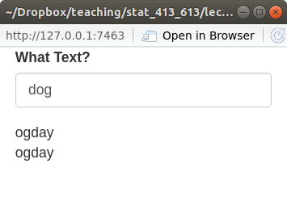

```{r setup, include=FALSE}
set.seed(1)
knitr::opts_chunk$set(echo       = TRUE, 
                      fig.height = 3, 
                      fig.width  = 6,
                      fig.align  = "center")
ggplot2::theme_set(ggplot2::theme_bw())
```

```{r klippy, echo=FALSE, include=TRUE}
klippy::klippy()
```

# Learning Objectives

- Learn the basics reactivity and the the server() function in Shiny Apps.
- Chapter 4 of [Mastering Shiny](https://mastering-shiny.org/).
- [Shiny Cheatsheet](https://github.com/rstudio/cheatsheets/blob/master/shiny.pdf).
- Optional Resources
  - [Shiny Tutorial](https://stat545.com/shiny00_index.html).
  - [Shiny Video, Part 2](https://vimeo.com/rstudioinc/review/131218530/212d8a5a7a/#t=42m2s)
  - [Shiny Examples](https://github.com/rstudio/shiny-examples).

# The Server Function

- Recall, the server function should always look like this:

    ```{r, eval = FALSE}
    server <- function(input, output) {
      
    }
    ```

- `input`:
    - A list-like object. These are elements that you access from the UI.
    - Each element should have been created by an input function in the UI.
    - Can only be accessed in either a `render*()` function or in 
      a `reactive()` call. E.g. the following will throw an error:
      
        ```{r, eval = FALSE}
        library(shiny)
        
        ui <- fluidPage(
          textInput("text", "What Text", value = "Default Text")
        )
        
        server <- function(input, output) {
          paste("The value text is", input$text) ## Don't do this!
        }
        
        shinyApp(ui = ui, server = server)
        ```

- `output`:
    - A list-like object. You modify the elements of `output` to send them
      to the UI.
    - You always use a `render*()` function to modify elements of `output`.
      You'll get an error if you don't use a `render*()` function.
      
        ```{r, eval = FALSE}
        library(shiny)
        
        ui <- fluidPage(
          textOutput("text")
        )
        
        server <- function(input, output) {
          output$text <- "Hello World" ## Don't do this!
        }
        
        shinyApp(ui = ui, server = server)
        ```

## Render Functions

- You've already seen render functions. They are of the form:
    ```{r, eval = FALSE}
    render*({
      ## Code goes here.
    })
    ```
    
- The curly braces allow you to write multiple lines of code and submit that
  as the argument.
    
- Always save output of render function as an element of the output list.

- Any input elements inside the `render*()` function will trigger
  the render code to be re-evaluated when those input elements change.
  
- When an input element changes, it is said to be "invalidated". This
  triggers the reactive elements.
  
- When *any* input in a code chunk is invalidated, then Shiny will rerun
  the *entire* code chunk (not just the portion that was invalidated).
  
- **Exercise**: Create a Shiny App that asks for a person's name and prints
  "Hello" followed by the person's name.
  
    ```{r, echo = FALSE, eval = FALSE}
    library(shiny)
    
    ui <- fluidPage(
      textInput("name", "What is your name?"),
      textOutput("greetname")
    )
    
    server <- function(input, output) {
      output$greetname <- renderText({
        paste("Hello", input$name)
      })
    }
    
    shinyApp(ui = ui, server = server)
    ```
  
  
## Reactive Expressions

- You can create variables via `reactive()` (technically not variables but
  "reactive elements"). They can then be used in different `render*()` functions.
  
    ```{r, eval = FALSE}
    library(shiny)
    library(stringr)
    
    ui <- fluidPage(
      textInput("text", "What Text?", value = "dog"),
      textOutput("pigtext1"),
      textOutput("pigtext2")
    )
    
    server <- function(input, output) {
      
      x <- reactive({
        str_replace(input$text, "([^aeiouAEIOU]*)(.*)", "\\2\\1ay")
        })
      output$pigtext1 <- renderText(x())
      output$pigtext2 <- renderText(x())
    }
    
    shinyApp(ui = ui, server = server)
    ```
    
    \ 
    
- The variables you create this way are called "reactive elements".

- You can use them in `render*()` functions, but include a "()" after
  them (like they are function calls, because they technically are).
  
- That is, we defined `x` by
    ```{r, eval = FALSE}
    x <- reactive({ str_replace(input$text, "([^aeiouAEIOU]*)(.*)", "\\2\\1ay") })
    ```

    But when we call it later, we need to use
    
    ```{r, eval = FALSE}
    x()
    ```
    
  
- If you didn't use `reactive()`, you would get an error (because you would be 
  calling `input$text` outside of a `render*()` or `reactive()` call).
  
- An example with simulation data
    
    ```{r, eval = FALSE}
    library(shiny)
    library(tidyverse)
    library(broom)
    
    ui <- fluidPage(
      numericInput("nsamp", "Number of samples", value = 50, step = 1),
      numericInput("diff", "Effect size", value = 0.5, step = 0.1),
      plotOutput("plot"),
      verbatimTextOutput("text")
    )
    
    server <- function(input, output) {
      x1 <- reactive({
        rnorm(n = input$nsamp, mean = 0, sd = 1)
      })
      
      x2 <- reactive({
        rnorm(n = input$nsamp, mean = input$diff, sd = 1)
      })
      
      output$plot <- renderPlot({
        data.frame(`1` = x1(), `2` = x2()) %>%
          gather(key = "Group", value = "y") %>%
          ggplot(aes(x = Group, y = y)) +
          geom_boxplot() +
          theme_bw()
      })
      
      output$text <- renderPrint({
        t.test(x1(), x2()) %>%
          tidy() %>%
          select(estimate, `P-value` = p.value, Lower = conf.low, Higher = conf.high)
      })
    }
    
    shinyApp(ui = ui, server = server)
    ```

    \   
    
- **Exercise**: Create a Shiny App that takes as input the sample size, then
  simulates a sample of that size from a standard normal distribution. It
  gives a histogram of the data and the output of `summary()`.
  
    ```{r, eval = FALSE, echo = FALSE}
    library(shiny)
    library(ggplot2)
    
    ui <- fluidPage(
      sliderInput("nsamp", "Sample Size", value = 50, min = 1, max = 200),
      plotOutput("plot"),
      verbatimTextOutput("summary")
    )
    
    server <- function(input, output, session) {
      samp <- reactive({
        rnorm(input$nsamp)
      })
      
      output$plot <- renderPlot({
        qplot(samp(), bins = 20)
      })
      
      output$summary <- renderPrint({
        summary(samp())
      })
    }
    
    shinyApp(ui, server)
    ```
    
  
## Notes Reactivity

- Shiny only runs reactive code in the `server()` function when the inputs
  have changed.

- In usual R, the order of operations is defined by the order of the lines of 
  code. This is a form of "imperative" programming.
  
- In Shiny, the order of operations is defined by the order of when things
  are needed to run. This is a form of "declarative" programming.
  
## Timed Invalidation

- When an input changes, Shiny calls this "invalidation" and it causes the
  `render*()` functions and reactive elements to run.
  
- You can cause invalidation in time intervals (so the reactive elements will
  reevaluate) using `reactiveTimer()`.
  
- `reactiveTimer()`:
  - Creates a reactive element that invalidates in time intervals.
  - You just place this reactive element in a new reactive element to
    invalidate that one in time intervals.
  
- Lets resimulate new data every second

    ```{r, eval = FALSE}
    library(shiny)
    library(tidyverse)
    library(broom)
    
    ui <- fluidPage(
      numericInput("nsamp", "Number of samples", value = 50, step = 1),
      numericInput("diff", "Effect size", value = 0.5, step = 0.1),
      plotOutput("plot"),
      verbatimTextOutput("text")
    )
    
    server <- function(input, output) {
      timer <- reactiveTimer(1000)
      
      x1 <- reactive({
        timer()
        rnorm(n = input$nsamp, mean = 0, sd = 1)
      })
      
      x2 <- reactive({
        timer()
        rnorm(n = input$nsamp, mean = input$diff, sd = 1)
      })
      
      output$plot <- renderPlot({
        data.frame(`1` = x1(), `2` = x2()) %>%
          gather(key = "Group", value = "y") %>%
          ggplot(aes(x = Group, y = y)) +
          geom_boxplot() +
          theme_bw()
      })
      
      output$text <- renderPrint({
        t.test(x1(), x2()) %>%
          tidy() %>%
          select(estimate, `P-value` = p.value, Lower = conf.low, Higher = conf.high)
      })
    }
    
    shinyApp(ui = ui, server = server)
    ```
    
- **Exercise**: Create a Shiny App that takes as input the sample size, then
  simulates a sample of that size from a standard normal distribution. It
  gives a histogram of the data and the output of `summary()`. Make it 
  automatically simulate new data once every two seconds.
  
    ```{r, eval = FALSE, echo = FALSE}
    library(shiny)
    library(ggplot2)
    
    ui <- fluidPage(
      sliderInput("nsamp", "Sample Size", value = 50, min = 1, max = 200),
      plotOutput("plot"),
      verbatimTextOutput("summary")
    )
    
    server <- function(input, output, session) {
      
      timer <- reactiveTimer(2000)
      
      samp <- reactive({
        timer()
        rnorm(input$nsamp)
      })
      
      output$plot <- renderPlot({
        qplot(samp(), bins = 20)
      })
      
      output$summary <- renderPrint({
        summary(samp())
      })
    }
    
    shinyApp(ui, server)
    ```
  
    
## On Click

- If an evaluation takes a long time, you might want the user to click a button 
  before implementing it.
  
- Otherwise, Shiny will be trying to catch up to the changes in the inputs.

- Use an `actionButton()` in the UI along with `eventReactive()` in the
  `server()` function to do this.
  
- `eventReactive()`: 
  - Is used in place of `reactive()`.
  - Takes the `actionButtion()` ID as its first argument.
  - Takes the expression to evaluate as its second argument.

    ```{r, eval = FALSE}
    library(shiny)
    library(tidyverse)
    library(broom)
    
    ui <- fluidPage(
      numericInput("nsamp", "Number of samples", value = 50, step = 1),
      numericInput("diff", "Effect size", value = 0.5, step = 0.1),
      actionButton("simulate", "Simulate!"),
      plotOutput("plot"),
      verbatimTextOutput("text")
    )
    
    server <- function(input, output) {
      
      x1 <- eventReactive(eventExpr = input$simulate, 
                          valueExpr = {
        rnorm(n = input$nsamp, mean = 0, sd = 1)
      })
      
      x2 <- eventReactive(eventExpr = input$simulate,
                          valueExpr = {
        rnorm(n = input$nsamp, mean = input$diff, sd = 1)
      })
      
      output$plot <- renderPlot({
        data.frame(`1` = x1(), `2` = x2()) %>%
          gather(key = "Group", value = "y") %>%
          ggplot(aes(x = Group, y = y)) +
          geom_boxplot() +
          theme_bw()
      })
      
      output$text <- renderPrint({
        t.test(x1(), x2()) %>%
          tidy() %>%
          select(estimate, `P-value` = p.value, Lower = conf.low, Higher = conf.high)
      })
    }
    
    shinyApp(ui = ui, server = server)
    ```
    
    \   
    
- **Exercise**: Create a Shiny App that takes as input the sample size, then
  simulates a sample of that size from a standard normal distribution. It
  gives a histogram of the data and the output of `summary()`. Make it 
  it only update simulated data on an action button click.
  
    ```{r, eval = FALSE, echo = FALSE}
    library(shiny)
    library(ggplot2)
    
    ui <- fluidPage(
      sliderInput("nsamp", "Sample Size", value = 50, min = 1, max = 200),
      actionButton("click", "Update"),
      plotOutput("plot"),
      verbatimTextOutput("summary")
    )
    
    server <- function(input, output, session) {
      
      samp <- eventReactive(input$click, 
                            {
        rnorm(input$nsamp)
      })
      
      output$plot <- renderPlot({
        qplot(samp(), bins = 20)
      })
      
      output$summary <- renderPrint({
        summary(samp())
      })
    }
    
    shinyApp(ui, server)
    ```

## Observe

- Use `observeEvent()` instead of `eventReactive()` if you want to run 
  code that does not need to be saved to some output.
    - Note: You *cannot* save the output of a call to `observeEvent()`.
  
- This could be saving data to a file, or printing to the console, or 
  downloading a prespecified file from the internet.
  
    ```{r, eval=FALSE}
    library(shiny)
    
    ui <- fluidPage(
      actionButton("greet", "Comfort Me")
    )
    
    server <- function(input, output) {
      observeEvent(input$greet,
                   {
                   print("You are loved and special!")
                   })
    }
    
    shinyApp(ui = ui, server = server)
    ```
  
## Prevent Reactions

- You can use `isolate()` to prevent inputs from invalidating outputs.

    ```{r, eval = FALSE}
    library(shiny)
    library(ggplot2)
    
    ui <- fluidPage(
      sliderInput("bins", "Bins", min = 1, max = 50, value = 20),
      textInput("title", "Title", value = "Histogram of MPG"),
      plotOutput("plot")
    )
    
    server <- function(input, output) {
      output$plot <- renderPlot({
        ggplot(mtcars, aes(x = mpg)) +
          geom_histogram(bins = input$bins) +
          ggtitle(isolate( {input$title} ))
      })
    }
    
    shinyApp(ui = ui, server = server)
    ```

- `isolate()`:
  - Will just make sure a chunk of code does not invalidate the output.
  - If other parts of the chunk (outside of `isolate()`) invalidate the output,
    then it will still update the input elements inside `isolate()`.
    
- In the example above, this means that changing the title won't change the 
  plot. But when we move the slider, it will update the bin width and the
  plot title.
  
  
- You can use `req()` to require an input before evaluating (so if there is no input provided, the code chunk will not be invalidated.

    ```{r, eval = FALSE}
    library(shiny)
    
    ui <- fluidPage(
      textInput(inputId = "text", label = "Give me a word"),
      textOutput(outputId = "newtext")
    )
    
    server <- function(input, output, session) {
      
      output$newtext <- renderText({
        paste0("Your word is ", req(input$text), "!")
      })
      
    }
    
    shinyApp(ui, server)
    ```

  
- **Exercise**: Create an app where the user chooses the variable to plot from `mtcars` and the number of bins, it then outputs a histogram. However, the histogram is not displayed until the user clicks an action button. The variable selection and the number of bins should not make the plot change. The plot should only change when the user clicks the action button.

    ```{r, echo = FALSE, eval = FALSE}
    library(shiny)
    library(ggplot2)
    data("mtcars")
    
    ui <- fluidPage(
      selectInput(inputId = "var", label = "Variable", choices = names(mtcars)),
      sliderInput(inputId = "bins", label = "Bins", min = 1, max = 50, value = 20),
      actionButton(inputId = "click", label = "Plot Me!"),
      plotOutput(outputId = "hist")
    )
    
    server <- function(input, output, session) {
      
      output$hist <- renderPlot({
        
        ## Require a click before plotting
        req(input$click)
        
        ## do not react to var or bins
        x <- isolate(input$var)
        binnum <- isolate(input$bins)
        
        ggplot(mtcars, aes(x = .data[[x]])) +
                              geom_histogram(bins = binnum)
      })
    }
    
    shinyApp(ui, server)
    ```
