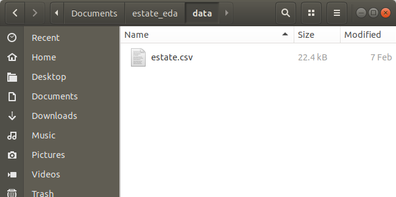

```{r setup, include=FALSE}
set.seed(1)
knitr::opts_chunk$set(echo       = TRUE, 
                      fig.height = 3, 
                      fig.width  = 6,
                      fig.align  = "center")
ggplot2::theme_set(ggplot2::theme_bw())
```

```{r klippy, echo=FALSE, include=TRUE}
klippy::klippy()
```

# Learning Objectives

- Learn how to upload and download datasets for use in the Shiny App.
- Chapter 8 of [Mastering Shiny](https://mastering-shiny.org/).
- [Shiny Cheatsheet](https://github.com/rstudio/cheatsheets/blob/master/shiny.pdf).
- Optional Resources
  - [Shiny Tutorial](https://stat545.com/shiny00_index.html).
  - [Shiny Examples](https://github.com/rstudio/shiny-examples).
  
# Static Dataset Upload

- If your Shiny app is designed to analyze only a single dataset (which might
  contain multiple files), then you should upload it at the start of the app.
    1. Create a new "data" folder in your app.
    2. Place all data files in the "data" folder.
    3. Read in these data at the start of the app.
    
- New data folder:

    \ 
    
- Put data in data folder:

    \ 
    
- Load data at beginning of app:

    ```{r, eval = FALSE}
    library(shiny)
    library(readr)
    estate <- read_csv("./data/estate.csv")
    
    ui <- fluidPage(
      tableOutput("estate")
    )
    
    server <- function(input, output, session) {
      output$estate <- renderTable({
        head(estate)
      })
    }
    
    shinyApp(ui, server)
    ```

- When a Shiny app is run, the location of "app.R" is the location of the 
  working directory, so all file upload/download must be done from 
  that location as a reference point.
  
# Interactive File Upload

- Use the `fileInput()` function in the UI to allow users to choose the
  source of the dataset.
  
    ```{r, eval = FALSE}
    library(shiny)
    
    ui <- fluidPage(
      fileInput("file", "Where is the file?")
    )
    
    server <- function(input, output, session) {
      
    }
    
    shinyApp(ui, server)
    ```
  
    \ 
    
- In the `server()` function, the element in `input` 
  (in this case `input$file`) is a data frame with the following columns:
    - `name`: The name of the file on the user's computer.
    - `size`: The size of the file in bytes. Shiny only accepts files up to
      5 MB. To increase it to 10 MB, type the following somewhere
      in "app.R":
      ```{r, eval = FALSE}
      options(shiny.maxRequestSize = 10 * 1024^2)
      ```
    - `type`: The file extension (text/csv, text/plain etc)
    - `datapath`: A temporary path file.
    
- Useful arguments:
  - `accept`: What file extensions are acceptable (`".csv"`, `".txt"`, etc).
  - `buttonLabel`: Customize label of button.
  - `multiple`: Can the user upload multiple files?
    
    
- Example Shiny App

    ```{r, eval = FALSE}
    library(shiny)
    
    ui <- fluidPage(
      fileInput("upload", NULL, buttonLabel = "Upload...", multiple = TRUE),
      tableOutput("files")
    )
    
    server <- function(input, output, session) {
      output$files <- renderTable(input$upload)
    }
    
    shinyApp(ui = ui, server = server)
    ```

- General strategies:'
    - Place code to read in files inside a `reactive()` call.
    - Inside the reactive call, always use `req()` to wait to read in data
      until the path is available.
    - Save the read-in files as reactive elements.
    - In the server function, you use the `datapath` value as the `path` argument
      in `read_csv()`, `read_tsv()`, `readRDS()`, etc.
      
    ```{r, eval = FALSE}
    library(shiny)
    library(readr)
    
    ui <- fluidPage(
      fileInput("file", "What file?", accept = "text/csv"),
      tableOutput("head")
    )
    
    server <- function(input, output, session) {
      data <- reactive({
        req(input$file)
        read_csv(input$file$datapath)
      })
      
      output$head <- renderTable({
        head(data(), 5)
      })
    }
    
    shinyApp(ui, server)
    ```

    
  
  

