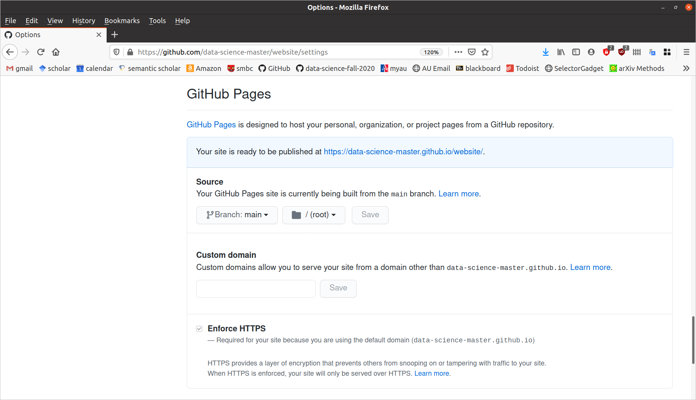

```{r setup, include=FALSE}
set.seed(1)
knitr::opts_chunk$set(echo       = TRUE, 
                      fig.height = 3, 
                      fig.width  = 6,
                      fig.align  = "center")
ggplot2::theme_set(ggplot2::theme_bw())
```

# Learning Objectives

- Learn how to create a website with R Markdown.
- Create a personal or project website.
- Chapters 1 and 2, and section 3.1 of [blogdown: Creating Websites with R Markdown](https://bookdown.org/yihui/blogdown/)
- Alternative method:
    - [Setting up a GitHub Pages site with Jekyll](https://docs.github.com/en/free-pro-team@latest/github/working-with-github-pages/setting-up-a-github-pages-site-with-jekyll)

# Motivation

- **You should have a personal website**
    - Makes you stand out compared to a LinkedIn page that only boring HR folks
      seem to care about.
    - You can post links to class projects and research projects so future
      employers can tell that you're legit.
    - My website is a little outdated (I made it back in grad school), but
      it has still helped me during my career: <https://dcgerard.github.io/>
  
- You can create a project website:
    - This facilitates open-source collaboration between researchers.
    - E.g. I used such a website for notekeeping and collaborating with
      my PI during my postdoc: <http://dcgerard.github.io/succotash_sims/analysis/index.html>

- Other uses:
    - Advertise specific software/papers <https://dcgerard.github.io/updog/>.
    - Create a blog (say, on data science projects) <https://dcgerard.github.io/research/2018/03/16/updog.html>.
    
# Installation

- We'll use the blogdown R package to build a website, so make sure you have
  it installed:
  
    ```{r, eval = FALSE}
    install.packages("blogdown")
    ```

- [Hugo](https://gohugo.io/) is a software that builds a website for you. 
  Blogdown uses Hugo to make clean-looking websites. You can install it via:
    ```{r, eval = FALSE}
    blogdown::install_hugo()
    ```

# Getting started

1. Set your working directory to the location on your local machine
   where you want to save your website. Do this via 
   
    > Session > Set Working Directory > Choose Directory...
2. Run the following in your R consul:

    ```{r, eval = FALSE}
    blogdown::new_site()
    ```

- This will populate a bunch of folders containing the contents of your website.

- The `public/` folder contains the contents of your website. You will be able to upload everything in the `public/` folder to a host to publish your website online.

- The other folders contain files used to make the files

- You can view your website via 

    > Addins > Serve Site
    
    A window with a preview of the website will pop up.
    
- If you don't want to use the R Studio addins, you can always just run the following to build your site:
    
    ```{r, eval = FALSE}
    blogdown::build_site()
    ```
    
## Choosing a Theme

- There are tons of themes available on the Hugo website: <https://themes.gohugo.io/>

- The steps to installing a theme are:
    1. Find the GitHub username/reponame for for a theme you are interested in. On the hugo themes website you can usually find this by clicking on "homepage".
    2. While creating your site, instead of just running `blogdown::new_site()`, run `blogdown::new_site(theme = "username/reponame")`.

- For example:
    - Suppose I want to use the Fuji theme: <https://themes.gohugo.io/hugo-theme-fuji/>
    - I need to go to its homepage: <https://github.com/amzrk2/hugo-theme-fuji/>
    - Then, when I create my website, I run 
    
        ```{r, eval = FALSE}
        blogdown::new_site(theme = "amzrk2/hugo-theme-fuji")
        ```
        
- Note that the more complicated the theme, the more difficult it is to maintain.
        
- The blogdown folks recommend first trying out these simple themes:
    - [Xmin](https://themes.gohugo.io/hugo-xmin/)
    - [Tanka](https://github.com/road2stat/hugo-tanka)
    - [Cupper](https://themes.gohugo.io/cupper-hugo-theme/)
    - [simple-a](https://themes.gohugo.io/simple-a/)
    - [ghostwriter](https://themes.gohugo.io/ghostwriter/)
    
# Editing your website

- When you are using "Addins > Serve Site", everytime you make an edit to an R Markdown file and save that file, the website will reload with the changes. So there is no need to continuously reload the website.

- Blogdown uses [Hugo](https://gohugo.io/) to build a website.

- Each hugo directory consists of three things that you need to consider
  - A configuration file, `config.toml`
  - A series of Markdown files in the "content" folder.
  - A public folder, which is the website that hugo generates. You can upload the public folder to any static website host to publish your website.

## Content

- To add a new page click on

    > Addins > New Post
    
- You can then choose the name of the file, whether you are working with a Markdown file (no R, just formatted text) or an R Markdown file, and make some additonal formatting options for the page.

## config.toml

## content/

- This folder is where you place R Markdown files. These R Markdown files will be converted to HTML files.

# Publishing your website

- We will discuss how to publish your website using Netlify.

- Sign up for a new account on Netlify through your GitHub login: <https://app.netlify.com/signup>


<!-- - To build your website in the "public" folder, first **restart R**, then run -->
<!--     ```{r, eval = FALSE} -->
<!--     blogdown::hugo_build() -->
<!--     ``` -->

<!-- - To publish your website on GitHub, follow these steps: -->
<!--     1. Create a public repo on GitHub. If this is your personal website, make sure your repo is named "username.github.io" where "username" is your GitHub username. -->
<!--     2. Add an empty file called ".nojekyll" in the "public" folder. You can do this by running the following in the public folder. -->
<!--         ``` bash -->
<!--         touch .nojekyll -->
<!--         ``` -->

<!--         This is so that GitHub doesn't use [jekyll](https://jekyllrb.com/) to build your website. -->

<!--     3. Initialize a git repo **in the public folder**. -->
<!--         ``` bash -->
<!--         cd public -->
<!--         git init -->
<!--         ``` -->
<!--         Commit all of the files in the public folder. -->

<!--     4. Link and push this git repo to GitHub. -->
<!--     5. On GitHub, under "Settings > GitHub Pages", make sure the "Source" says "Branch: main" -->

<!--         \  -->


