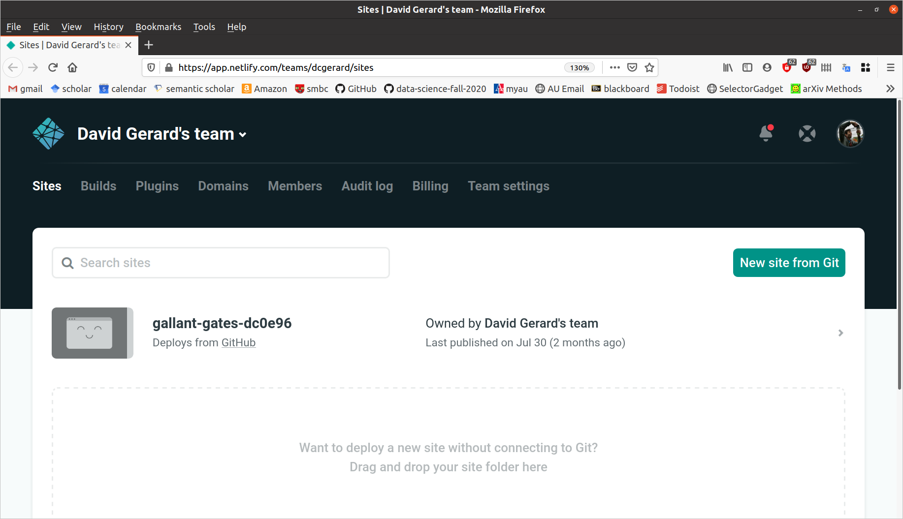
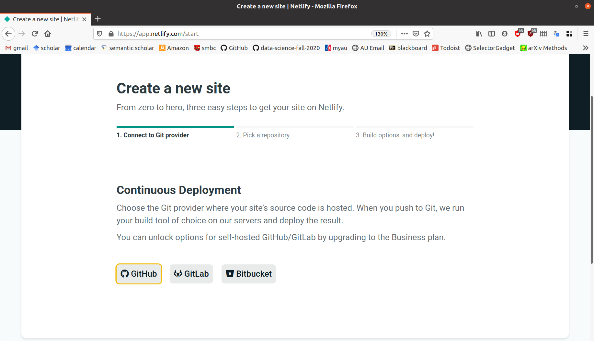
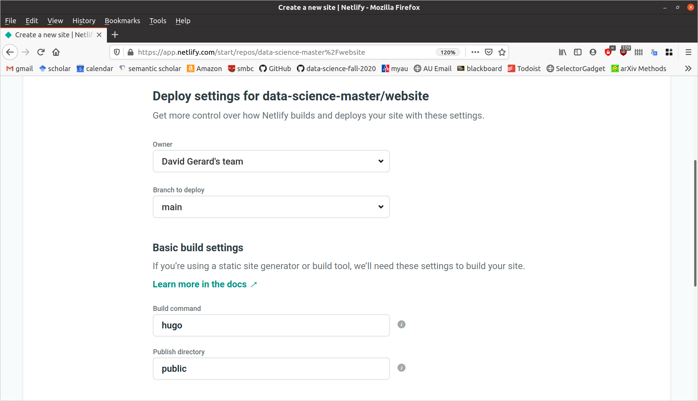

```{r setup, include=FALSE}
set.seed(1)
knitr::opts_chunk$set(echo       = TRUE, 
                      fig.height = 3, 
                      fig.width  = 6,
                      fig.align  = "center")
ggplot2::theme_set(ggplot2::theme_bw())
```

# Learning Objectives

- Learn how to create a website with R Markdown.
- Create a personal or project website.
- Chapters 1 and 2, and section 3.1 of [blogdown: Creating Websites with R Markdown](https://bookdown.org/yihui/blogdown/)

# Motivation

- **You should have a personal website**
    - Makes you stand out compared to a LinkedIn page that only boring HR folks
      seem to care about.
    - You can post links to class projects and research projects so future
      employers can tell that you're legit.
    - My website is a little outdated (I made it back in grad school), but
      it has still helped me during my career: <https://dcgerard.github.io/>
  
- You can create a project website:
    - This facilitates open-source collaboration between researchers.
    - E.g. I used such a website for notekeeping and collaborating with
      my PI during my postdoc: <http://dcgerard.github.io/succotash_sims/analysis/index.html>

- Other uses:
    - Advertise specific software/papers <https://dcgerard.github.io/updog/>.
    - Create a blog (say, on data science projects) <https://dcgerard.github.io/research/2018/03/16/updog.html>.
    
# Installation

- We'll use the blogdown R package to build a website, so make sure you have
  it installed:
  
    ```{r, eval = FALSE}
    install.packages("blogdown")
    ```

- [Hugo](https://gohugo.io/) is a software that builds a website for you. 
  Blogdown uses Hugo to make clean-looking websites. You can install it by 
  running the following in R:
    ```{r, eval = FALSE}
    blogdown::install_hugo()
    ```

# Getting started

1. Set your working directory to the location on your local machine
   where you want to save your website. Do this via 
   
    > Session > Set Working Directory > Choose Directory...
2. Run the following in your R consul:

    ```{r, eval = FALSE}
    blogdown::new_site()
    ```

- This will populate a bunch of folders containing the contents of your website.

- The `public/` folder contains the contents of your website. You will be able to upload everything in the `public/` folder to a host to publish your website online.

- The other folders contain files used to make the files in `public/`

- You can view your website via 

    > Addins > Serve Site
    
    A window with a preview of the website will pop up.
    
- If you don't want to use the R Studio addins, you can always just run the following to build your site:
    
    ```{r, eval = FALSE}
    blogdown::build_site()
    ```
    
## Choosing a Theme

- There are tons of themes available on the Hugo website: <https://themes.gohugo.io/>

- The steps to installing a theme are:
    1. Find the GitHub username/reponame for for a theme you are interested in. On the hugo themes website you can usually find this by clicking on "homepage".
    2. While creating your site, instead of just running `blogdown::new_site()`, run `blogdown::new_site(theme = "username/reponame")`.

- For example:
    - Suppose I want to use the Fuji theme: <https://themes.gohugo.io/hugo-theme-fuji/>
    - I need to go to its homepage: <https://github.com/amzrk2/hugo-theme-fuji/>
    - Then, when I create my website, I run 
    
        ```{r, eval = FALSE}
        blogdown::new_site(theme = "amzrk2/hugo-theme-fuji")
        ```
        
- Note that the more complicated the theme, the more difficult it is to maintain.
        
- The blogdown folks recommend first trying out these simple themes:
    - [Xmin](https://themes.gohugo.io/hugo-xmin/)
    - [Tanka](https://github.com/road2stat/hugo-tanka)
    - [Cupper](https://themes.gohugo.io/cupper-hugo-theme/)
    - [simple-a](https://themes.gohugo.io/simple-a/)
    - [ghostwriter](https://themes.gohugo.io/ghostwriter/)
    
# Editing your website

- When you are using "Addins > Serve Site", everytime you make an edit to an R Markdown file and save that file, the website will reload with the changes. So there is no need to continuously reload the website.

- Blogdown uses [Hugo](https://gohugo.io/) to build a website.

- Each hugo directory consists of three things that you need to consider
  - A configuration file, `config.toml`
  - A series of Markdown files in the "content" folder.
  - A public folder, which is the website that hugo generates. You can upload the public folder to any static website host to publish your website.

## config.toml

- Most Hugo sites contain a `config.toml` file, where "toml" stands for ["Tom’s Obvious, Minimal Language"](https://en.wikipedia.org/wiki/TOML)

- TOML files consist of `key = value` pairs, where the `key` is the variable and the `value` is the assigned variable. For example

    ```
    author = "David Gerard"
    ```

- You can usually just edit the TOML file of the theme that you have downloaded.

- The double brackets in a TOML file are used in Hugo to denote a menu. So, for example

    ```
    [[menu.main]]
        name = "Home"
        url = "https://nanx.me"
        weight = 1
    [[menu.main]]
        name = "GitHub"
        url = "https://github.com/nanxstats"
        weight = 2
    ```
    
    is used to define the items in the default main menu of the Tanka theme.
    
- The single brackets in a TOML file are used in Hugo to denote a collection of related options. E.g.

    ``` 
    [params]
        author = "David Gerard"
        dateFormat = "2020/10/10"
    ```
    
    will set options under `[params]`

## content/

- This folder is where you place R Markdown files. These R Markdown files will be converted to HTML files.

- To add a new page to "content", click on

    > Addins > New Post
    
- You can then choose the name of the file, whether you are working with a Markdown file (no R, just formatted text) or an R Markdown file, and make some additonal formatting options for the page.

- You can change the page name to something different from the default.

- For example, if you choose the name "resume", then the default is that the location of the HTML file in the "public" folder will be "resume/index.html".

    - This is **instead** of what you would assume to be the case, e.g. "resume.html" (NOT DONE).
    
    
    \ 
    
- The big thing for you is when you are linking to a particular page, you need to link to the location "resume/index.html", **not** to "resume.html". E.g.

# Publishing your website

- In principal, you can upload your "public" folder to any host to deploy your webiste.

- We will discuss how to publish your website using Netlify. Netlify will generate the "public" folder from your source, so you do not need to upload it.

- Initialize a git repository in your website directory. Add all of the files not in the "public" folder and commit them. You can exclude all files in "public" by adding a file called ".gitignore" in your website directory that contains the following code:

    ```
    public
    ```
    
    You can automatically create this file via running the following in the terminal
    
    ```{bash, eval = FALSE}
    echo "public" > .gitignore
    ```
    
    You can add everything then to the stage via
    
    ```{bash, eval = FALSE}
    git add --all
    ```
    
- Create a repo on GitHub that will contain the source for your website. Make sure this is a public repository.

- Link the remote to your local and push your changes to the remote.

- Sign up for a new account on Netlify through your GitHub login: <https://app.netlify.com/signup>

- On the netflify homepage, then click on "New Site from Git"

    
    
- Click on "GitHub" when it asks where to create a new site from

    
    
- Follow the prompts to choose the repository where the website source exists, authorizing Netlify at the appropriate prompt.

- Your build settings should look something like this:

    
    
- Click on "Deploy Site"

- Netlify should give you an automatically generated URL where you website is deployed. E.g. mine is deployed to <https://loving-haibt-448d60.netlify.app/>

- You can set up a custom domain by following the links on Netlify. A custom domain name is only about \$10--\$15 per year.

- You can also get a free subdomain from rbind: <https://support.rbind.io/about/>

- After setting up Netlify and linking it to your GitHub repo, whenever you push changes to GitHub, Netlify will automatically deploy those changes.
