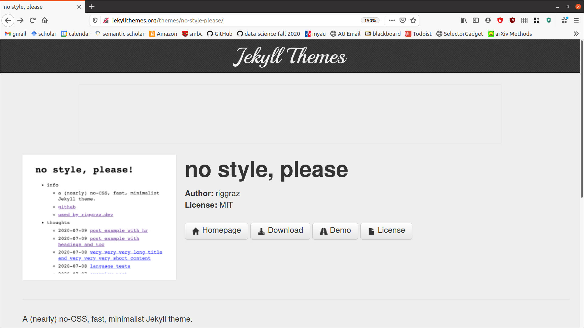
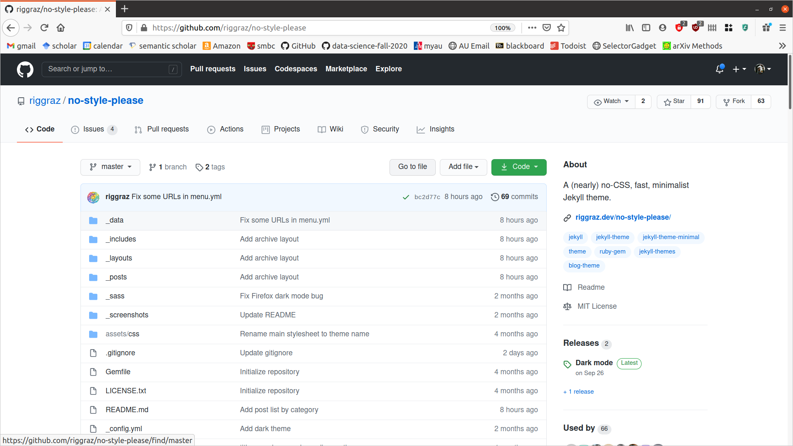
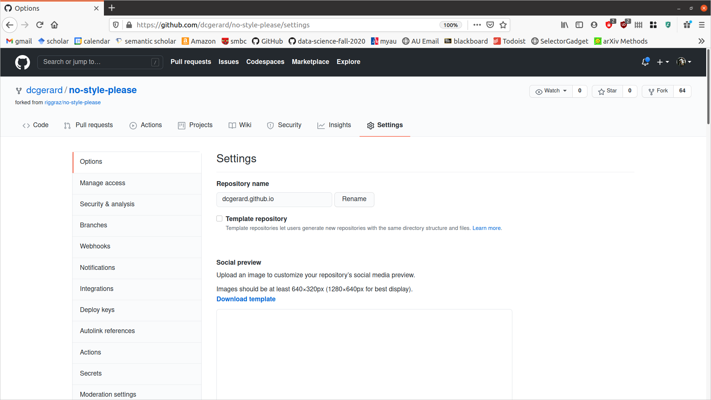
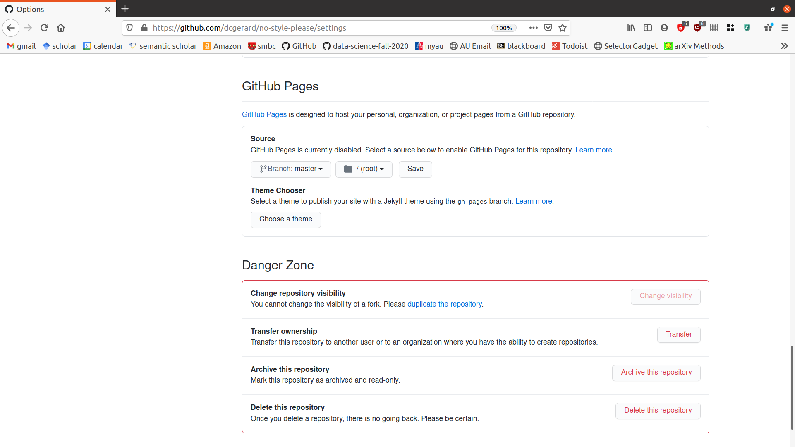
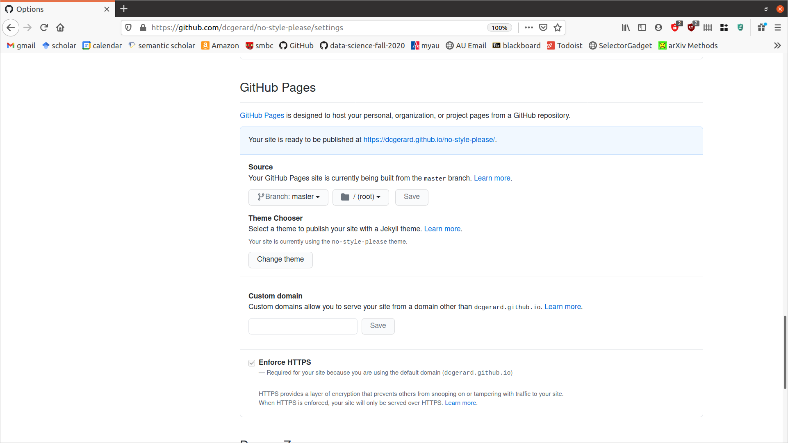
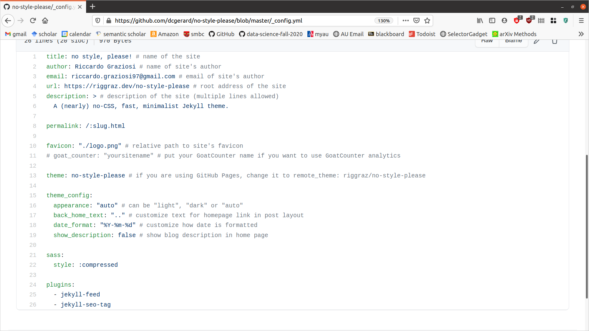
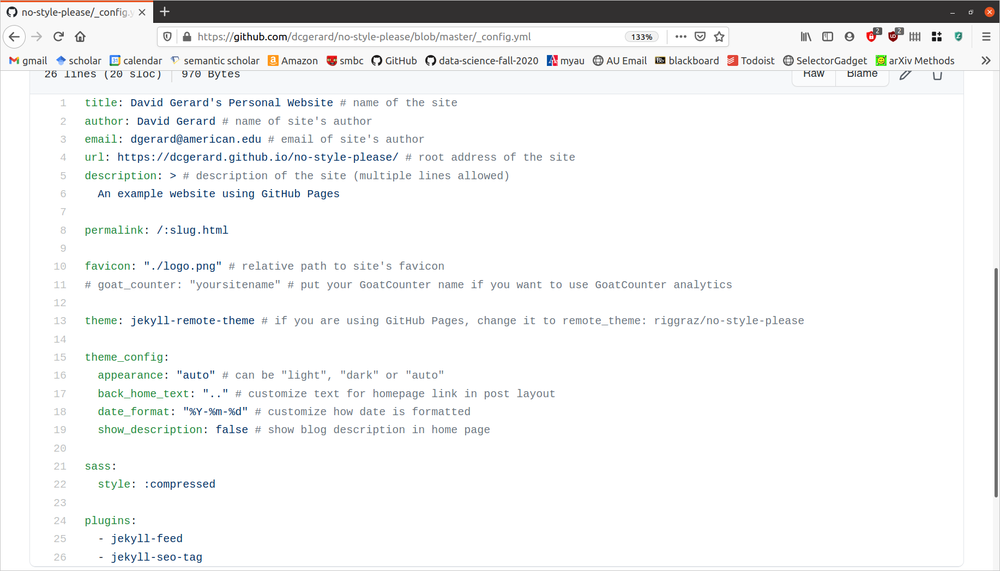

```{r setup, include=FALSE}
set.seed(1)
knitr::opts_chunk$set(echo       = TRUE, 
                      fig.height = 3, 
                      fig.width  = 6,
                      fig.align  = "center")
ggplot2::theme_set(ggplot2::theme_bw())
```

# Learning Objectives

- Create your own personal website using GitHub pages.
- [Setting up a GitHub Pages site with Jekyll](https://docs.github.com/en/free-pro-team@latest/github/working-with-github-pages/setting-up-a-github-pages-site-with-jekyll).
    - In particular, the page on [adding content](https://docs.github.com/en/free-pro-team@latest/github/working-with-github-pages/adding-content-to-your-github-pages-site-using-jekyll).
- [Jekyll Themes](http://jekyllthemes.org/)

# Build your own website

- The easiest way to build your own website on GitHub is to 

    1. Choose a Jekyll theme: <http://jekyllthemes.org/>
    2. Click on the "Homepage" button to go to the GitHub page.
    3. Fork the website to your own repo.
    4. Deploy your website.
    5. Edit the source to suit your needs.
    
# Choose a Jekyll Theme and Fork.

- We will demo how to create a personal webiste using the `no-style-please` theme: <http://jekyllthemes.org/themes/no-style-please/>

    \
    
- Click on "Homepage" to go to the repo, which is here: <https://github.com/riggraz/no-style-please>

    \ 
    
- Go ahead and fork it so that you have a copy in your own account. My fork is here: <https://github.com/dcgerard/no-style-please>

# Make it your homepage

- You only need to do the following step if you want this website to be your homepage. You can have non-homepage websites by keeping the repo name as is.

- If you want this to be your homepage, then go to `Settings` and change the repository name to "yourusername.github.io", where "yourusername" is your GitHub username. For example, for me this would be "dcgerard.github.io"/
    
    \     

# Deploy your website

- In `Settings`, scroll down to `GitHub Pages`, and change `Source` to be `master`. Then click `Save`.

    \ 
    
- When you scroll back down to `GitHub Pages`, GitHub will tell you where your website is located. Mine says <https://dcgerard.github.io/no-style-please/>

    \ 

- You can now head over to that URL to see the website deployed.

# Edit your website.

- The websites I am having you build use [Jekyll](https://jekyllrb.com/), a static website generator that supports writing websites using just Markdown, which you are used to.

## Configuring your website

- Most of the configuration settings are in "_config.yml". 

- Most of these settings are self explanatory, and you can edit them to suit your needs. For example, here is the original "_config.yml" file:

  \ 
  
- And here is the one I did after I edited it:

  \ 
  
- More info on Configurations: <https://jekyllrb.com/docs/configuration/>

## Adding content to your website

- The main types of content of a Jekyll website are **pages** and **posts**.
    - A **page** contains standalone content not associated with a particular date. For example, the home page, an "about" page, or a license.
        - Information on pages: <https://jekyllrb.com/docs/pages/>
    - A **post** is a blog post, that is associated with a particular date.
        - Information on posts: <https://jekyllrb.com/docs/posts/>
    
- To add a page, just include a markdown file (ends with ".md").
    
- Each markdown file has a YAML header (just like in R Markdown files) and what goes into this header depends on the theme you chose. Just look at a few examples from that theme.
    - More information on the YAML header: <https://jekyllrb.com/docs/front-matter/>
    
- You can edit the homepage by editing "index.md"

- All posts go in the `_posts` directory. These are also markdown files (ends in ".md"). Your theme will have a default way of displaying posts on the homepage that I would not mess with until you get more experience.

## My Website

- After playing around with the source, this is what I came up with:
  - <https://github.com/dcgerard/no-style-please>
  - <https://dcgerard.github.io/no-style-please/>
  
  Which I think looks pretty good!
